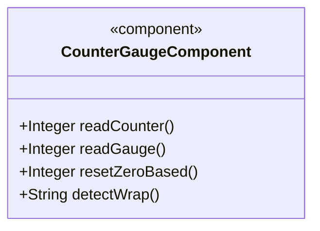
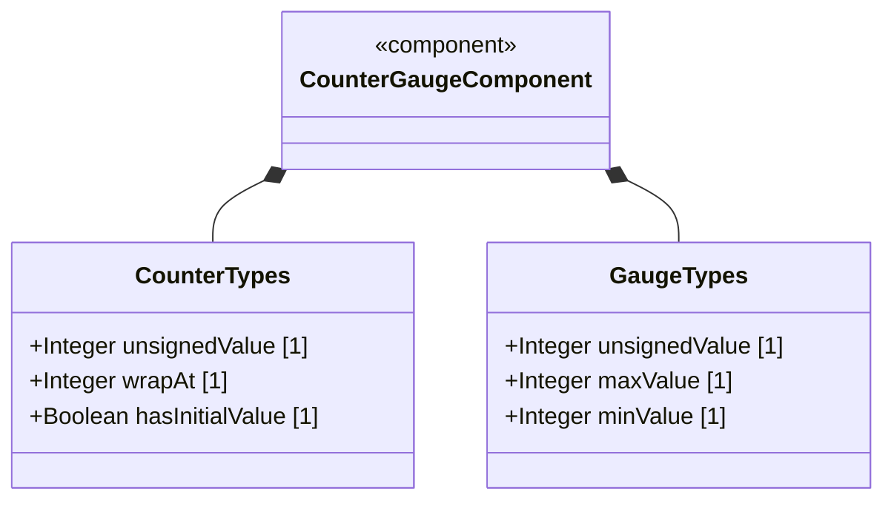
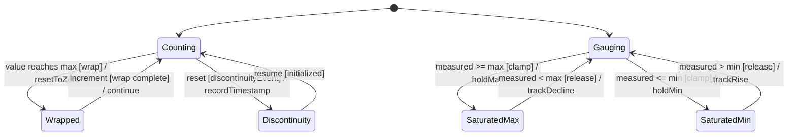

# Epic: Common YANG Data Types: Counter and Gauge Measurement Types

## 1. Context
This epic covers the YANG data types for representing monotonically increasing counters and bounded gauge values as defined in the "ietf-yang-types" module of RFC 9911. These types model measurement accumulations (counters) and instantaneous values (gauges) commonly used in network management and telemetry. All types have equivalent SMIv2 types.

## 2. Requirements & Checklist
- [ ] #21 - [Represent Monotonic Counter Values with Wrap-Around](https://github.com/gintatkinson/3dgs-011/blob/main/docs/features/feat-01-monotonic-counter-values.md) (counter32, zero-based-counter32, counter64, zero-based-counter64 monotonic wrap semantics)
- [ ] #22 - [Represent Bounded Gauge Values with Rising and Falling Range](https://github.com/gintatkinson/3dgs-011/blob/main/docs/features/feat-02-bounded-gauge-values.md) (gauge32, gauge64 bounded value semantics)

### Associated Use Cases & User Stories

#### Associated Use Cases
*(To be populated in Phases 2-3)*

#### Associated User Stories
*(To be populated in Phases 2-3)*

## 3. Architecture and System Interaction Diagrams

### Subsystem Component Definition

## System-Level UML Class Diagram

## 4. State Machine Definitions

## System State Machine Diagram

## 5. Specification Context
This epic covers the counter and gauge type definitions in the "ietf-yang-types" YANG module of RFC 9911 (Section 3). These types include counter32, zero-based-counter32, counter64, zero-based-counter64, gauge32, and gauge64. All types have equivalent SMIv2 types.

## 6. Source References
Structural Schema: ietf-yang-types.yang
Normative Specification: RFC 9911
