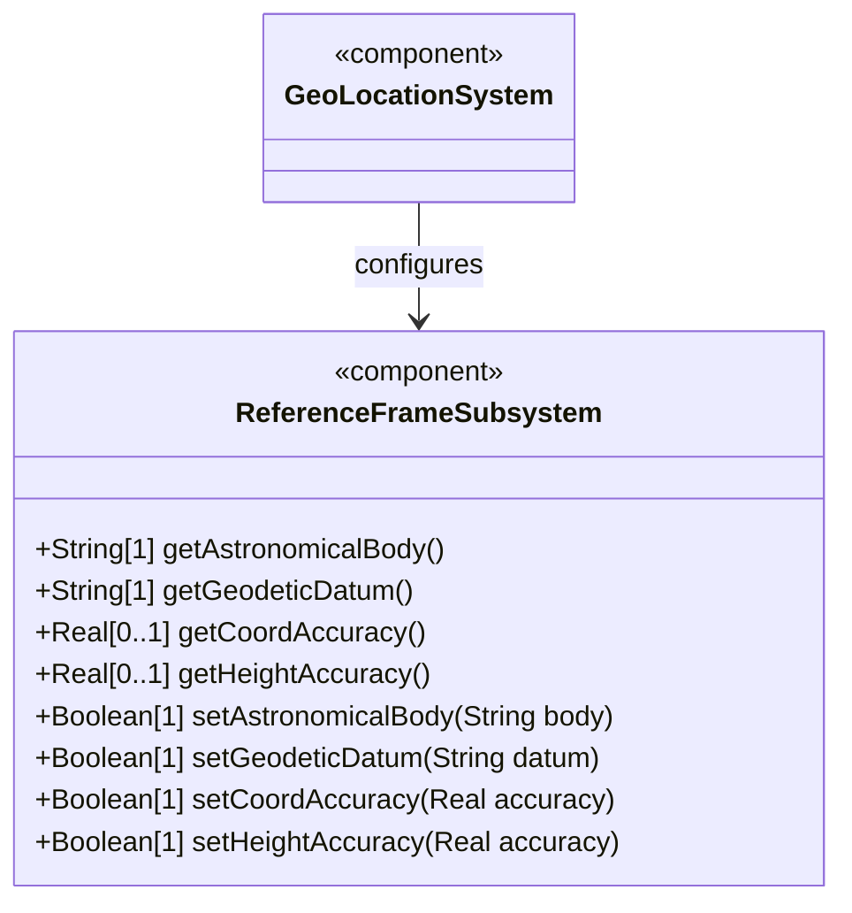
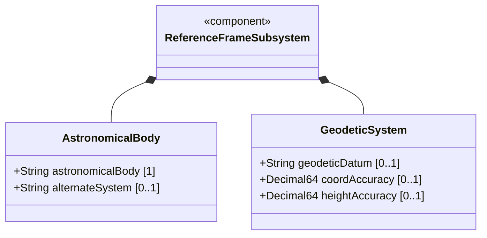
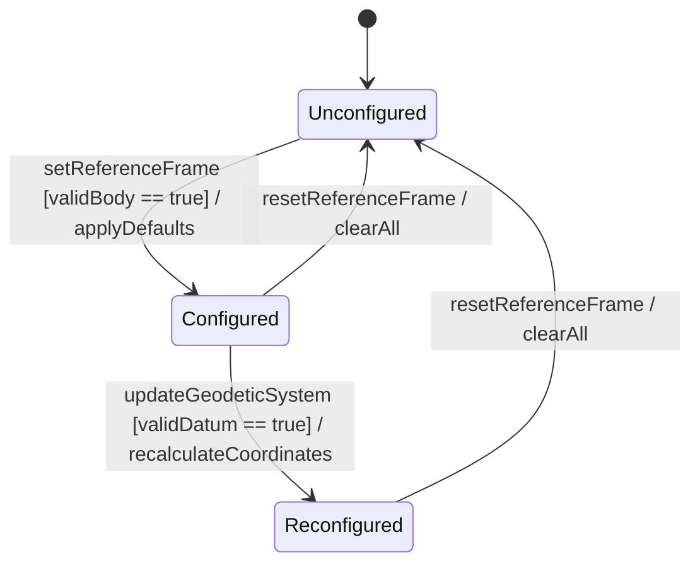

# Epic: Geographic Location: Reference Frame and Geodetic System Definition

## 1. Context
Define the coordinate reference frame and geodetic system for geographic location data on any astronomical body. This Epic covers identifying the celestial body (e.g., earth, moon, mars), optionally specifying an alternate coordinate system (e.g., virtual realities), and configuring the geodetic datum with coordinate and height accuracy parameters. These elements establish the contextual foundation for all location coordinate values.

## 2. Requirements & Checklist
- [ ] [#1](https://github.com/gintatkinson/3dgs-011/blob/main/docs/features/feat-01-celestial-body-alternate-system.md) - Define Celestial Body and Alternate System Reference (semantic linkage: identifies the astronomical body and optional alternate frame)
- [ ] [#2](https://github.com/gintatkinson/3dgs-011/blob/main/docs/features/feat-02-geodetic-datum-accuracy.md) - Configure Geodetic Datum and Coordinate Accuracy (semantic linkage: defines geodetic datum, coordinate accuracy, and height accuracy within the reference frame)

### Associated Use Cases & User Stories

#### Associated Use Cases
- [ ] [#20](https://github.com/gintatkinson/3dgs-011/blob/main/docs/use-cases/uc-02-configure-reference-frame.md) - Configure Reference Frame and Geodetic System (semantic linkage: configures the reference frame within this epic)

#### Associated User Stories
- [ ] [#9](https://github.com/gintatkinson/3dgs-011/blob/main/docs/user-stories/us-01-register-reference-frame.md) - Register Geographic Location Reference Frame (semantic linkage: registers the reference frame)
- [ ] [#16](https://github.com/gintatkinson/3dgs-011/blob/main/docs/user-stories/us-08-configure-geodetic-accuracy.md) - Configure Coordinate Accuracy and Height Accuracy (semantic linkage: configures accuracy within this epic)

## 3. Architecture and System Interaction Diagrams

### Subsystem Component Definition

### System-Level UML Class Diagram

## 4. Operational Considerations
The reference-frame is designed to be inherited from containing objects when locations are nested (e.g., a building location housing routers with locations), allowing the reference-frame to not be repeated in every instance. The alternate-system feature is optional and requires the `alternate-systems` feature flag. The geodetic-datum uses the IANA "Geodetic System Values" registry for standard values. When coord-accuracy or height-accuracy are specified, they override the default accuracy implied by the geodetic-datum. These accuracy values accommodate measurement uncertainty from experimental determinations.

## 5. Security & Governance
All data nodes in this module are writable/creatable/deletable (config true). None are considered inherently more sensitive than standard configuration. Access control is governed by NETCONF access control model (RFC 8341) or equivalent. Read access to location data may have privacy implications (customer device locations) and SHOULD be controlled. The alternate-systems feature should be governed by the device's capability advertisement.

## System State Machine Diagram

### Specification Context
The reference-frame container defines what the location values refer to and their meaning. The referred-to object can be any astronomical body. The geodetic-datum defines the meaning of latitude, longitude, and height. Default for Earth is 'wgs-84' (GPS). Coordinate and height accuracy override defaults implied by the geodetic-datum.

## 6. Source References
Structural Schema: ietf-geo-location@2022-02-11.yang — `reference-frame` container
Normative Specification: RFC 9179 Sections 1, 2.1, 6.1
