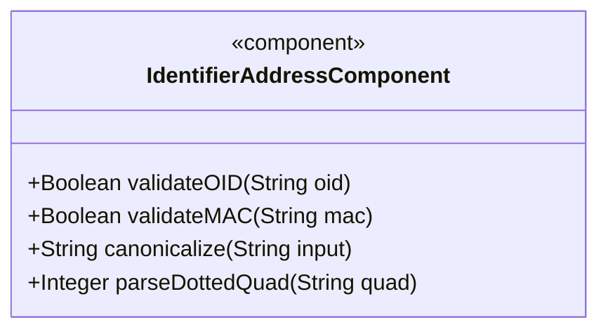
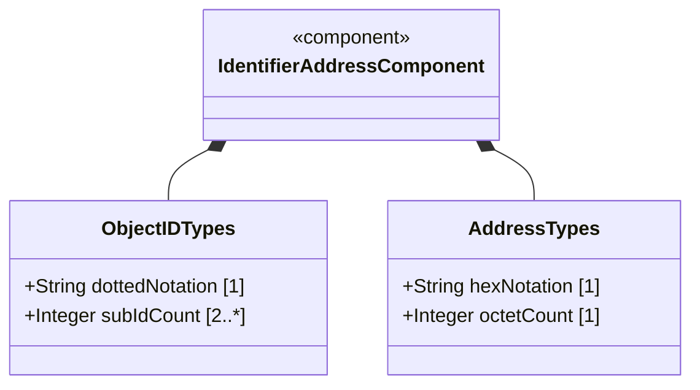
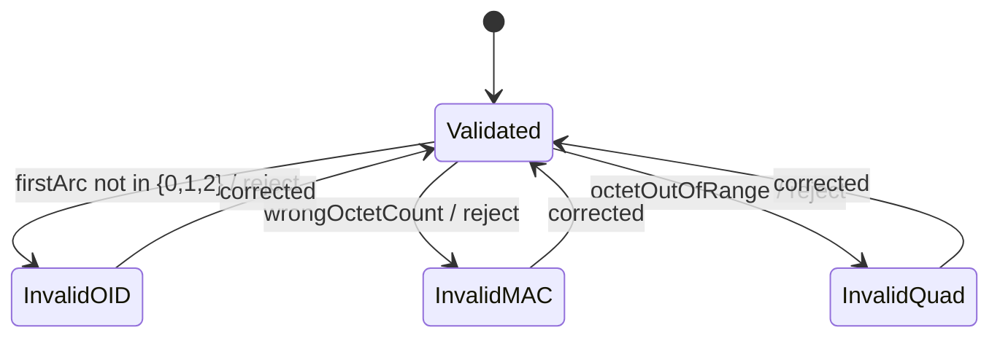

# Epic: Common YANG Data Types: Object Identifier and Network Address Types

## 1. Context
This epic covers YANG types for object identifiers in registration-hierarchical name trees, physical/MAC address representations, and dotted-quad network notation as defined in the "ietf-yang-types" module of RFC 9911. These types model administrative identifiers and network-level addresses used in management information bases.

## 2. Requirements & Checklist
- [ ] #23 - [Represent Object Identifier Registration Hierarchy](https://github.com/gintatkinson/3dgs-011/blob/main/docs/features/feat-03-object-identifier-hierarchy.md) (object-identifier, object-identifier-128 sub-identifier hierarchy)
- [ ] #24 - [Represent Physical and MAC Address Values](https://github.com/gintatkinson/3dgs-011/blob/main/docs/features/feat-04-physical-mac-address.md) (phys-address, mac-address octet notation)
- [ ] #25 - [Represent Dotted-Quad Network Notation Values](https://github.com/gintatkinson/3dgs-011/blob/main/docs/features/feat-05-dotted-quad-notation.md) (dotted-quad IPv4-style notation)

### Associated Use Cases & User Stories
*(To be populated in Phases 2-3)*

## 3. Architecture and System Interaction Diagrams

### Subsystem Component Definition

## System-Level UML Class Diagram

## 4. State Machine Definitions

## System State Machine Diagram

## 5. Specification Context
This epic covers the object-identifier, object-identifier-128, phys-address, mac-address, and dotted-quad type definitions in the "ietf-yang-types" YANG module of RFC 9911 (Section 3).

## 6. Source References
Structural Schema: ietf-yang-types.yang
Normative Specification: RFC 9911
