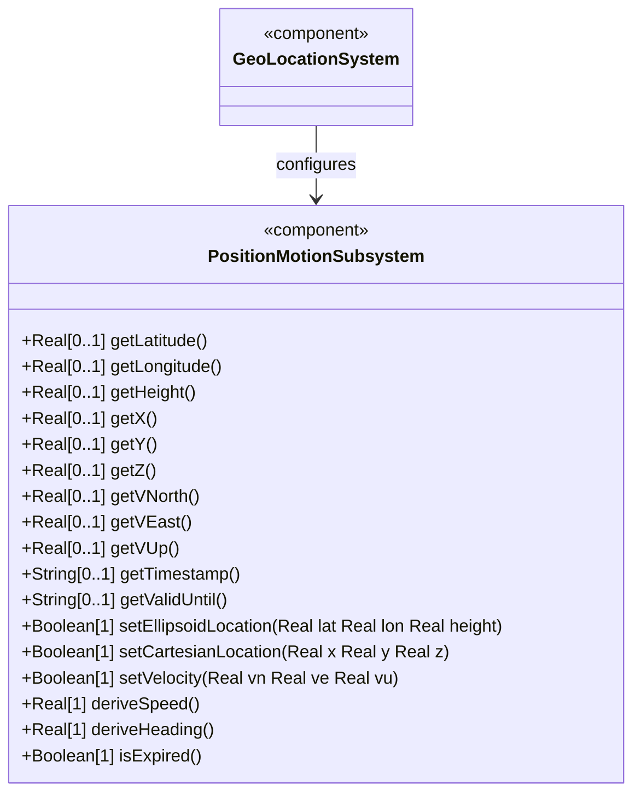
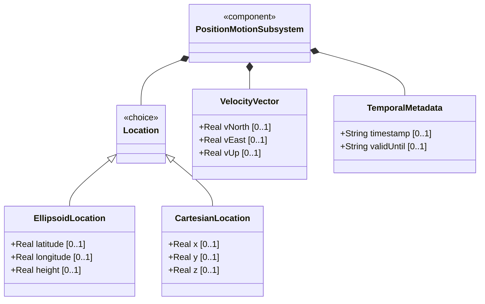
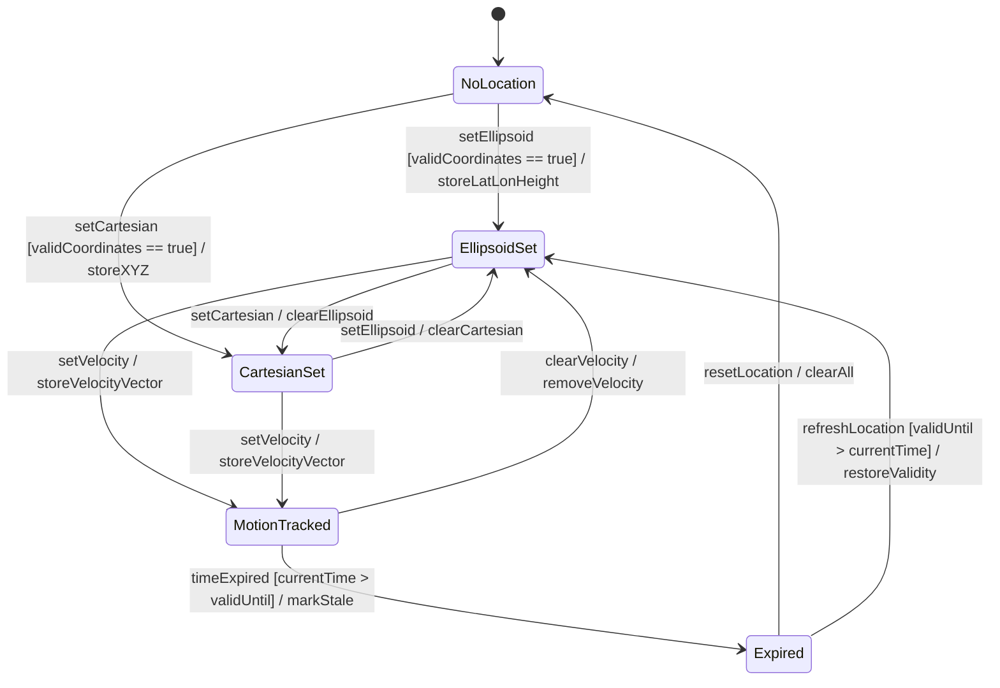

# Epic: Geographic Location: Position Coordinates and Motion Tracking

## 1. Context
Provide geographic position coordinates and motion tracking for objects located on or relative to an astronomical body. This Epic covers two coordinate representations (ellipsoidal latitude/longitude/height and Cartesian X/Y/Z), a three-dimensional velocity vector for moving objects, and temporal metadata (recording timestamp and validity expiration). Together these elements describe where an object is, how it is moving, and when the data was recorded or expires.

## 2. Requirements & Checklist
- [ ] [#3](https://github.com/gintatkinson/3dgs-011/blob/main/docs/features/feat-03-ellipsoid-coordinate-positioning.md) - Specify Ellipsoid Geodetic Coordinates (semantic linkage: provides latitude/longitude/height ellipsoidal positioning)
- [ ] [#4](https://github.com/gintatkinson/3dgs-011/blob/main/docs/features/feat-04-cartesian-coordinate-positioning.md) - Specify Cartesian Spatial Coordinates (semantic linkage: provides X/Y/Z Cartesian positioning alternative)
- [ ] [#5](https://github.com/gintatkinson/3dgs-011/blob/main/docs/features/feat-05-velocity-vector-tracking.md) - Track Velocity Vector for Moving Objects (semantic linkage: captures v-north/v-east/v-up velocity components with speed and heading derivation)
- [ ] [#6](https://github.com/gintatkinson/3dgs-011/blob/main/docs/features/feat-06-temporal-location-lifecycle.md) - Manage Temporal Location Lifecycle and Expiration (semantic linkage: provides timestamp and valid-until temporal metadata)

### Associated Use Cases & User Stories

#### Associated Use Cases
*(to be populated during Phase 3)*

#### Associated User Stories
*(to be populated during Phase 2)*

## 3. Architecture and System Interaction Diagrams

### Subsystem Component Definition

### System-Level UML Class Diagram

## 4. Operational Considerations
When locations are nested (e.g., a building containing routers), the reference-frame may be inherited from the containing object. For objects in non-simple motion (frequently changing), the data model can either add additional motion data or require more frequent location queries. The velocity vector is designed for relatively stable motion and can track slow movement like continental drift. Valid-until enables stale data detection for temporal data lifecycle management.

## 5. Security & Governance
Location data may be sensitive (customer device locations, infrastructure positions). Read access SHOULD be controlled. The timestamp and valid-until fields could be used to audit when location data was recorded. Expired location data (past valid-until) SHOULD be clearly indicated to consumers. Writable data nodes are governed by NETCONF/RESTCONF access control models.

## System State Machine Diagram

### Specification Context
Location is specified using two or three coordinate values: latitude/longitude/height (ellipsoid) or X/Y/Z (Cartesian), with their exact meanings defined by the geodetic-datum. For objects in relatively stable motion, a three-dimensional velocity vector (v-north, v-east, v-up in m/s) is provided. The timestamp records when location was measured; valid-until defines expiration.

## 6. Source References
Structural Schema: ietf-geo-location@2022-02-11.yang — `location` choice, `velocity` container, `timestamp` leaf, `valid-until` leaf
Normative Specification: RFC 9179 Sections 2.2, 2.3, 2.4, 2.5
