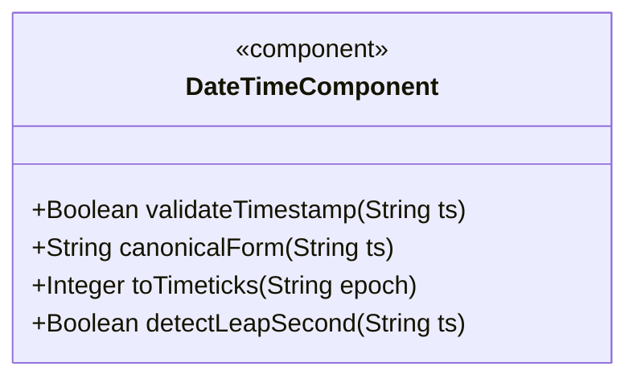
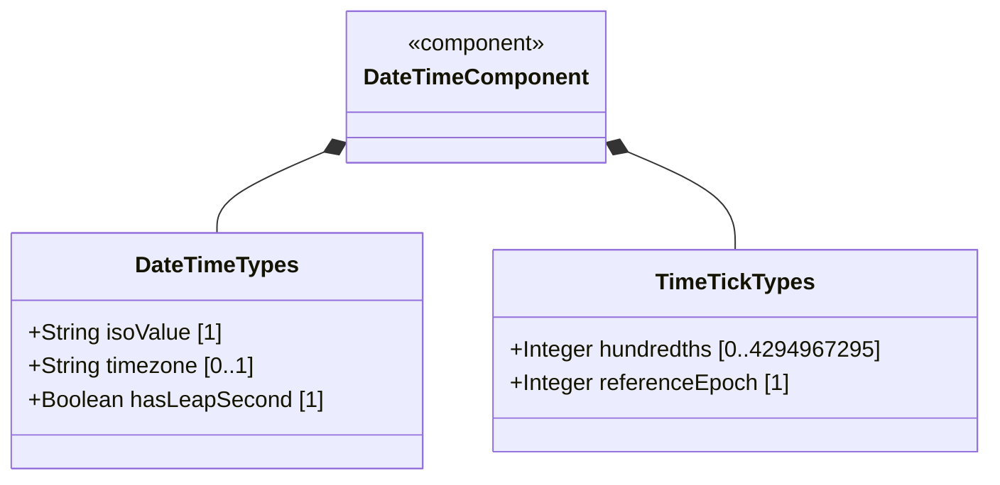
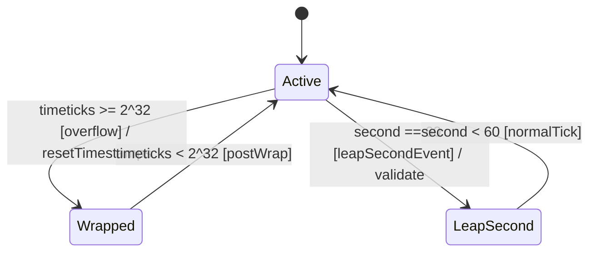

# Epic: Common YANG Data Types: Date-Time and Timestamp Types

## 1. Context
This epic covers YANG types for representing date-time instants, calendar dates, daily recurring times, and system clock timeticks/timestamps as defined in the "ietf-yang-types" module of RFC 9911. These types provide ISO 8601/RFC 3339/RFC 9557-compliant timestamp handling with time zone support, leap second handling, and system uptime measurement with modulo wrap semantics.

## 2. Requirements & Checklist
- [ ] #26 - [Represent Date and Time Values with Time Zone Offset](https://github.com/gintatkinson/3dgs-011/blob/main/docs/features/feat-06-date-time-with-timezone.md) (date-and-time, date, time with timezone)
- [ ] #27 - [Represent Date and Time Values Without Time Zone](https://github.com/gintatkinson/3dgs-011/blob/main/docs/features/feat-07-date-time-no-zone.md) (date-no-zone, time-no-zone)
- [ ] #28 - [Represent System Timeticks and Epoch Timestamps](https://github.com/gintatkinson/3dgs-011/blob/main/docs/features/feat-08-system-timeticks-timestamp.md) (timeticks, timestamp with wrap)

### Associated Use Cases & User Stories
*(To be populated in Phases 2-3)*

## 3. Architecture and System Interaction Diagrams

### Subsystem Component Definition

## System-Level UML Class Diagram

## 4. State Machine Definitions

## System State Machine Diagram

## 5. Specification Context
This epic covers the date-and-time, date, date-no-zone, time, time-no-zone, timeticks, and timestamp type definitions in the "ietf-yang-types" YANG module of RFC 9911 (Section 3).

## 6. Source References
Structural Schema: ietf-yang-types.yang
Normative Specification: RFC 9911
