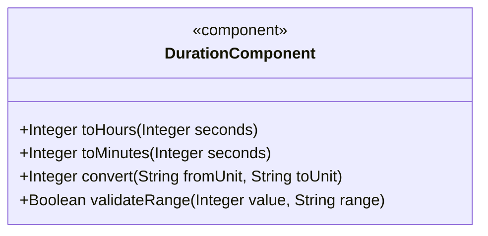
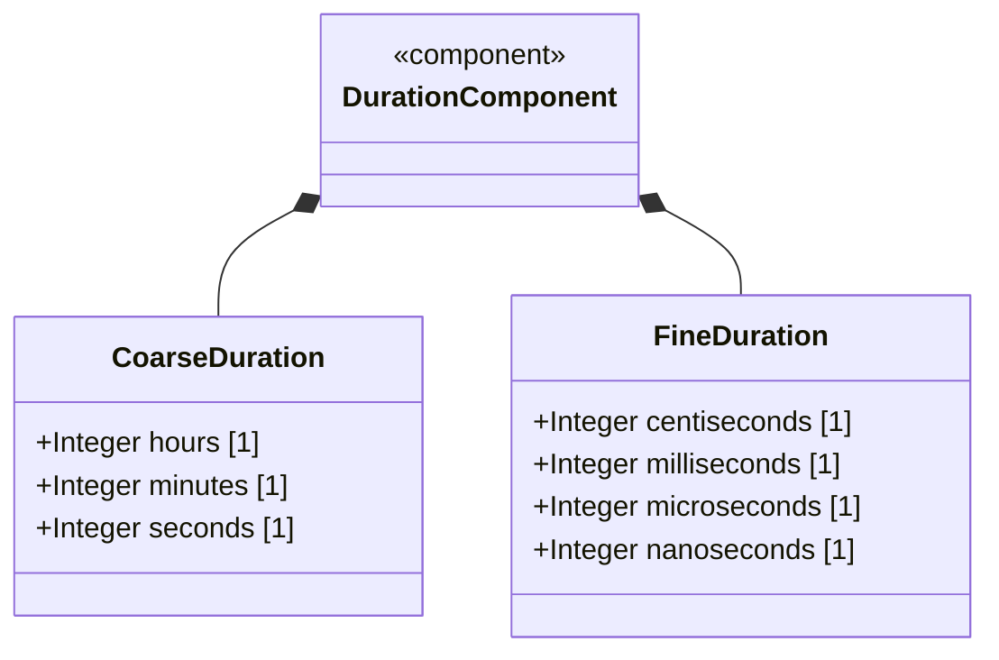
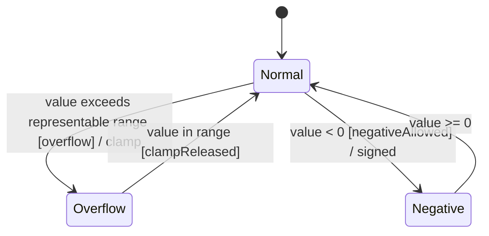

# Epic: Common YANG Data Types: Time Duration Measurement Types

## 1. Context
This epic covers YANG types for representing periods of time measured in various units from hours down to nanoseconds as defined in the "ietf-yang-types" module of RFC 9911. These types provide int32 and int64-based signed duration representations suitable for time intervals, delays, timeouts, and high-precision measurement. All types recommend range restriction for non-negative contexts.

## 2. Requirements & Checklist
- [ ] #29 - [Represent Coarse Time Duration Values](https://github.com/gintatkinson/3dgs-011/blob/main/docs/features/feat-09-coarse-time-duration.md) (hours32, minutes32, seconds32)
- [ ] #30 - [Represent Sub-Second Time Duration Values](https://github.com/gintatkinson/3dgs-011/blob/main/docs/features/feat-10-subsecond-time-duration.md) (centiseconds32, milliseconds32, microseconds32, microseconds64)
- [ ] #31 - [Represent High-Resolution Nanosecond Duration Values](https://github.com/gintatkinson/3dgs-011/blob/main/docs/features/feat-11-nanosecond-duration.md) (nanoseconds32, nanoseconds64)

### Associated Use Cases & User Stories
*(To be populated in Phases 2-3)*

## 3. Architecture and System Interaction Diagrams

### Subsystem Component Definition

## System-Level UML Class Diagram

## 4. State Machine Definitions

## System State Machine Diagram

## 5. Specification Context
This epic covers the hours32, minutes32, seconds32, centiseconds32, milliseconds32, microseconds32, microseconds64, nanoseconds32, and nanoseconds64 type definitions in the "ietf-yang-types" YANG module of RFC 9911 (Section 3).

## 6. Source References
Structural Schema: ietf-yang-types.yang
Normative Specification: RFC 9911
