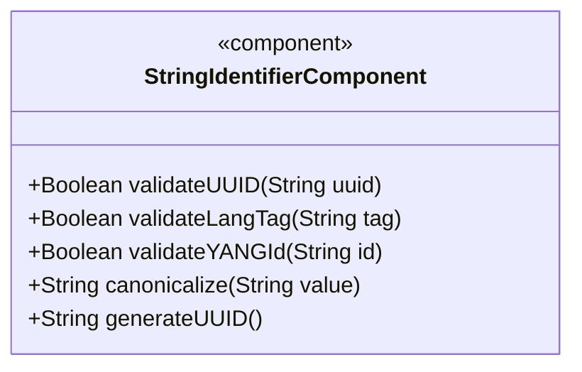
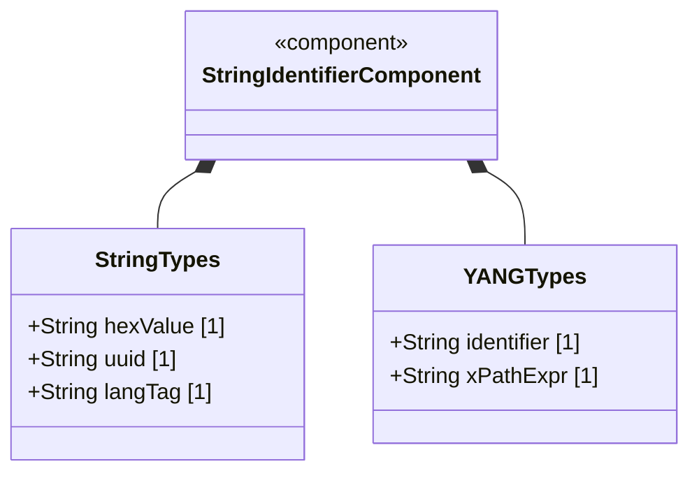
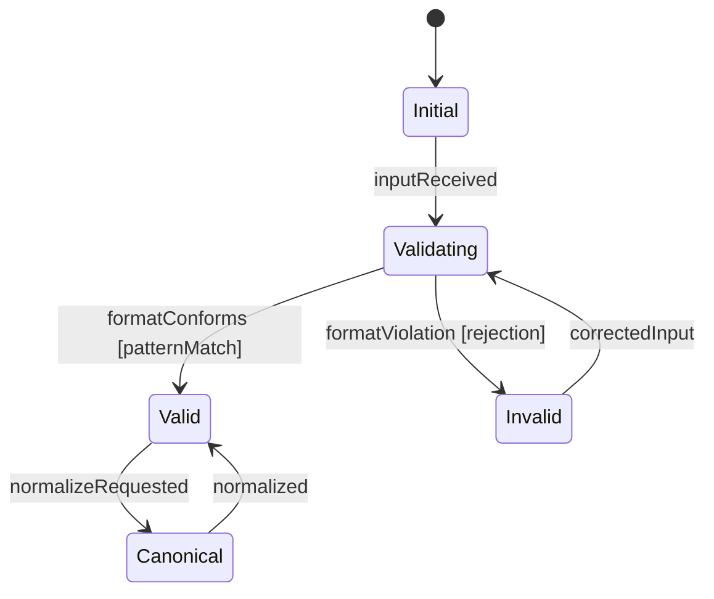

# Epic: Common YANG Data Types: String and Identifier Types

## 1. Context
This epic covers YANG types for representing special-purpose string values as defined in the "ietf-yang-types" module of RFC 9911. These include hexadecimal string encoding (hex-string), universally unique identifiers (uuid), BCP 47 language tags (language-tag), YANG identifiers (yang-identifier), and XPath 1.0 expressions (xpath1.0). These types enable standardized representation of common identifier and encoding patterns across YANG models.

## 2. Requirements & Checklist
- [ ] #32 - [Represent Hexadecimal String Octet Sequences](https://github.com/gintatkinson/3dgs-011/blob/main/docs/features/feat-12-hex-string-representation.md) (hex-string colon-separated hex pairs)
- [ ] #33 - [Represent Universal Unique Identifier Values](https://github.com/gintatkinson/3dgs-011/blob/main/docs/features/feat-13-uuid-values.md) (uuid RFC 9562 format)
- [ ] #34 - [Represent Language Tag Values](https://github.com/gintatkinson/3dgs-011/blob/main/docs/features/feat-14-language-tag-values.md) (language-tag BCP 47/RFC 5646)
- [ ] #35 - [Represent YANG Identifier and XPath Expression Values](https://github.com/gintatkinson/3dgs-011/blob/main/docs/features/feat-15-yang-identifier-xpath.md) (yang-identifier, xpath1.0)

### Associated Use Cases & User Stories
*(To be populated in Phases 2-3)*

## 3. Architecture and System Interaction Diagrams

### Subsystem Component Definition

## System-Level UML Class Diagram

## 4. State Machine Definitions

## System State Machine Diagram

## 5. Specification Context
This epic covers the hex-string, uuid, dotted-quad, language-tag, yang-identifier, and xpath1.0 type definitions in the "ietf-yang-types" YANG module of RFC 9911 (Section 3).

## 6. Source References
Structural Schema: ietf-yang-types.yang
Normative Specification: RFC 9911
