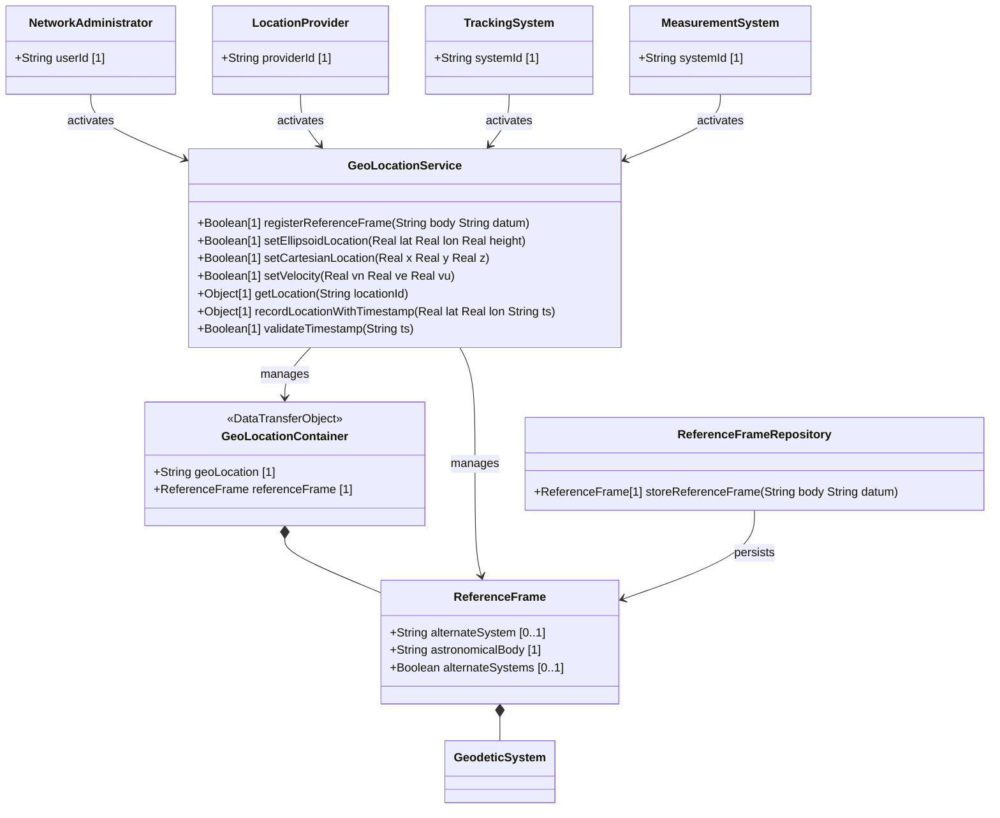

# Feature: Define Celestial Body and Alternate System Reference

## Parent Epic
- [ ] #7 - Geographic Location: Reference Frame and Geodetic System Definition (semantic linkage: this feature defines the astronomical body and optional alternate system that form the top-level reference frame context for all location data)

## Description
The system MUST support defining which astronomical body a geographic location refers to (e.g., earth, moon, mars) and optionally an alternate coordinate system (e.g., virtual reality systems). The astronomical-body identifies the celestial object per IAU naming conventions. The alternate-system, when present, overrides the default "natural universe" frame. These values establish the outer context for all geodetic and location data that follows.

## UML Class Diagram


## Interface Requirements
### 1. Payload Schema (JSON Example)
```json
{
  "geo-location": {
    "reference-frame": {
      "alternate-system": "virtual-reality-sim-alpha",
      "astronomical-body": "earth"
    }
  }
}
```

### 2. Validation & Constraints
- `astronomical-body`: String, pattern `[ -@\[-\^_-~]*`, default "earth". SHOULD convert uppercase to lowercase. MUST NOT include control characters (ASCII values 0..31, 127). MUST NOT include preceding "the". Values defined by IAU naming (e.g., "sun", "earth", "moon", "enceladus", "ceres", "67p/churyumov-gerasimenko").
- `alternate-system`: String, no constraints beyond type. Only present when `alternate-systems` feature is enabled. Modifies the definition of all other reference frame values.

### 3. Logical Operations & Interface Messages
- **POST/PUT geo-location**: Set the reference-frame including astronomical-body and optional alternate-system.
- **GET geo-location**: Retrieve the reference-frame configuration.
- **Default Resolution**: When astronomical-body is not explicitly set, default to "earth". When alternate-system is absent, the natural universe is implied.

### 4. Logical Exception States & Validation Failures
- Invalid astronomical-body pattern: payload fails pattern validation, return validation error.
- alternate-system set without feature flag: if-feature `alternate-systems` not enabled, leaf is not present in schema, request rejected.
- Control characters in astronomical-body: pattern violation, request rejected.

## Given-When-Then Acceptance Criteria
1. Given an empty geo-location configuration, When the system reads astronomical-body, Then it returns the default value "earth".
2. Given a valid astronomical-body value "mars", When the system stores the geo-location, Then the reference-frame reflects "mars" as the astronomical body.
3. Given a payload containing alternate-system "sim-1" with the alternate-systems feature enabled, When the system processes the reference-frame, Then the alternate-system value is stored and modifies the coordinate interpretation.
4. Given a payload containing alternate-system without the alternate-systems feature enabled, When the system validates the payload, Then the leaf is rejected as an unknown element.
5. Given an astronomical-body containing control characters (ASCII < 32), When the system validates the string, Then the pattern matching rejects the value with a validation error.
6. Given an astronomical-body value with mixed case "Earth", When the system normalizes the value, Then it SHOULD convert to lowercase "earth".

## Specification Context (Verbatim)
> The frame of reference ('reference-frame') defines what the location values refer to and their meaning. The referred-to object can be any astronomical body. It could be a planet such as Earth or Mars, a moon such as Enceladus, an asteroid such as Ceres, or even a comet such as 1P/Halley. This value is specified in 'astronomical-body' and is defined by the International Astronomical Union <http://www.iau.org>. The default 'astronomical-body' value is 'earth'.

> Finally, we define an optional feature that allows for changing the system for which the above values are defined. This optional feature adds an 'alternate-system' value to the reference frame. This value is normally not present, which implies the natural universe is the system. The use of this value is intended to allow for creating virtual realities or perhaps alternate coordinate systems.

## Schema Coverage
- `geo-location` grouping — covered (top-level grouping for all features)
- `geo-location` container — covered (top-level container for all features)
- `reference-frame` container — covered by this feature
- `alternate-system` leaf — covered by this feature
- `astronomical-body` leaf — covered by this feature
- `alternate-systems` feature — covered (this feature documents the if-feature dependency)

## 4. Source References
Structural Schema: ietf-geo-location@2022-02-11.yang — `reference-frame` container, `alternate-system` leaf, `astronomical-body` leaf
Normative Specification: RFC 9179 Section 2.1

## 5. Logical UI & Layout Bindings
- **Target LUI Component:** PropertyGrid
- **Target Layout Container ID:** components_table
- **Data Source Bindings:** geo-location/reference-frame
