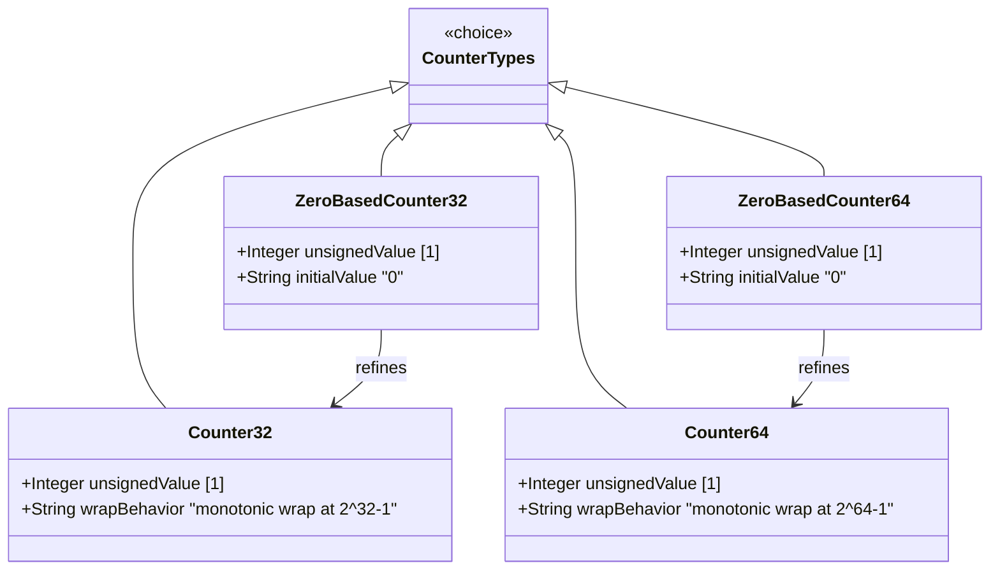

# Feature: Represent Monotonic Counter Values with Wrap-Around

## Parent Epic
- [ ] #36 - Common YANG Data Types: Counter and Gauge Measurement Types (semantic linkage: parent epic for all counter/gauge features)

## Description
The system must support YANG counter types that represent non-negative integers monotonically increasing until reaching a maximum value, then wrapping around to zero. These counters represent accumulated measurements (e.g., packet counts, byte totals) where individual values have no information content — only deltas between observations are meaningful. Support both 32-bit and 64-bit counter variants, and an initialized (zero-based) variant for each.

## UML Class Diagram


## Interface Requirements

### 1. Payload Schema (JSON Example)
```json
{
  "interfaceStats": {
    "inputOctets": 4294967295,
    "inputErrors": 0,
    "outputOctets": 18446744073709551615,
    "inputPackets": 1000
  },
  "zeroBasedCounters": {
    "discardedPacketsSinceReset": 0,
    "queueDropsSinceReset": 500
  }
}
```

### 2. Validation & Constraints
- **counter32**: Base type uint32; range [0, 4294967295]; wraps at 2^32-1; no defined initial value; SHOULD NOT be used for configuration schema nodes; SHOULD NOT have default statement
- **zero-based-counter32**: Based on counter32; explicit initial value 0; wraps at 2^32-1 after counting from 0
- **counter64**: Base type uint64; range [0, 18446744073709551615]; wraps at 2^64-1; no defined initial value; SHOULD NOT be used for configuration schema nodes; SHOULD NOT have default statement
- **zero-based-counter64**: Based on counter64; explicit initial value 0; wraps at 2^64-1 after counting from 0
- All counters must record discontinuity events; if discontinuities occur at times other than re-initialization, a corresponding schema node should indicate the last discontinuity time
- Equivalent to SMIv2 Counter32, ZeroBasedCounter32, Counter64, ZeroBasedCounter64 respectively

### 3. Logical Operations & Interface Messages
- **read (GET)**: Retrieve current counter value
- **reset (zero-based only)**: Reset counter to 0 on data tree node creation
- **discontinuity notification**: Signal when counter wraps or a discontinuity occurs

### 4. Logical Exception States & Validation Failures
- **wrap event**: Counter reaches maximum and wraps to zero; delta computation must account for wrap
- **discontinuity**: Counter value reset or adjusted outside normal monotonic increase; downstream consumers must discard data spanning the discontinuity
- **polling interval too long**: For zero-based counters, if the polling interval exceeds the known minimum wrap time, delta computation becomes unreliable

## Given-When-Then Acceptance Criteria

### Counter32
- Given a schema node of type counter32, When the node is instantiated, Then its initial value has no defined default
- Given a counter32 value at 4294967295, When an increment occurs, Then the value wraps to 0
- Given a counter32 schema node, When it is defined for configuration data, Then the type SHOULD NOT be used

### Zero-Based Counter32
- Given a schema node of type zero-based-counter32, When the node is created, Then its value MUST be initialized to 0
- Given a zero-based-counter32 value at 4294967295, When an increment occurs, Then the value wraps to 0
- Given a new data tree node of type zero-based-counter32, When the minimum wrap time is not discoverable by the management station, Then the management station should discard unreliable delta data

### Counter64
- Given a schema node of type counter64, When the node is instantiated, Then its initial value has no defined default
- Given a counter64 value at 18446744073709551615, When an increment occurs, Then the value wraps to 0
- Given a counter64 value, When a discontinuity occurs, Then the discontinuity must be recorded in an associated timestamp schema node

### Zero-Based Counter64
- Given a schema node of type zero-based-counter64, When the node is created, Then its value MUST be initialized to 0
- Given a zero-based-counter64 value at 18446744073709551615, When an increment occurs, Then the value wraps to 0

## Specification Context (Verbatim)

From RFC 9911, Section 3:

"The counter32 type represents a non-negative integer that monotonically increases until it reaches a maximum value of 2^32-1 (4294967295 decimal), when it wraps around and starts increasing again from zero.

Counters have no defined 'initial' value, and thus, a single value of a counter has (in general) no information content. Discontinuities in the monotonically increasing value normally occur at re-initialization of the management system and at other times as specified in the description of a schema node using this type.

The counter32 type should not be used for configuration schema nodes. A default statement SHOULD NOT be used in combination with the type counter32.

In the value set and its semantics, this type is equivalent to the Counter32 type of the SMIv2."

"The zero-based-counter32 type represents a counter32 that has the defined 'initial' value zero.

A data tree node using this type will be set to zero (0) on creation and will thereafter increase monotonically until it reaches a maximum value of 2^32-1 (4294967295 decimal), when it wraps around and starts increasing again from zero.

Provided that an application discovers a new data tree node using this type within the minimum time to wrap, it can use the 'initial' value as a delta. It is important for a management station to be aware of this minimum time and the actual time between polls, and to discard data if the actual time is too long or there is no defined minimum time."

"The counter64 type represents a non-negative integer that monotonically increases until it reaches a maximum value of 2^64-1 (18446744073709551615 decimal), when it wraps around and starts increasing again from zero."

"The zero-based-counter64 type represents a counter64 that has the defined 'initial' value zero."

## 4. Source References
Structural Schema: ietf-yang-types.yang (typedef counter32, zero-based-counter32, counter64, zero-based-counter64)
Normative Specification: RFC 9911, Section 3

## 5. Logical UI & Layout Bindings
- **Target LUI Component:** PropertyGrid
- **Target Layout Container ID:** yang-type-editor
- **Data Source Bindings:** Counter value type selector, wrap behavior indicator, discontinuity timestamp editor
