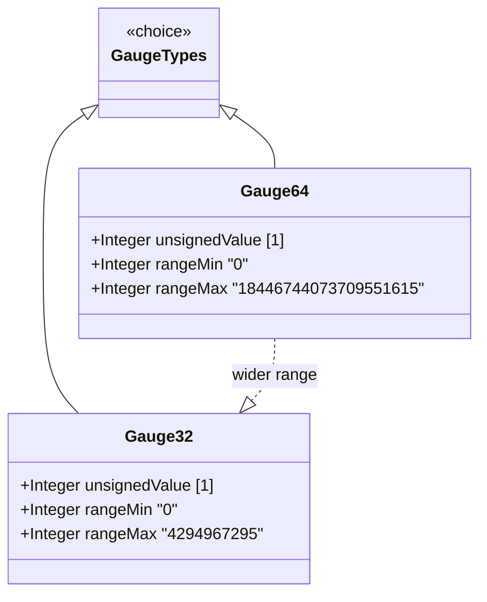

# Feature: Represent Bounded Gauge Values with Rising and Falling Range

## Parent Epic
- [ ] #36 - Common YANG Data Types: Counter and Gauge Measurement Types (semantic linkage: parent epic for all counter/gauge features)

## Description
The system must support YANG gauge types that represent non-negative integers which may increase or decrease but never exceed a defined maximum value or fall below a minimum value. Gauges model instantaneously measured values (e.g., temperature, current connection count) where the value reflects the current state of the information being modeled, clamped at bounds when the measured quantity exceeds the representable range.

## UML Class Diagram


## Interface Requirements

### 1. Payload Schema (JSON Example)
```json
{
  "temperatureGauge": 25,
  "connectionCount": 1024,
  "bufferUtilization": 18446744073709551615
}
```

### 2. Validation & Constraints
- **gauge32**: Base type uint32; range [0, 4294967295]; value increases/decreases but never exceeds max or falls below min; when measured value exceeds max, gauge holds at max; when measured value falls below min, gauge holds at min; gauge decreases when measured value drops below max
- **gauge64**: Base type uint64; range [0, 18446744073709551615]; same behavioral semantics as gauge32 with extended range
- Equivalent to SMIv2 Gauge32 and CounterBasedGauge64 respectively

### 3. Logical Operations & Interface Messages
- **read (GET)**: Retrieve current gauge value
- **monitor**: Observe gauge rising and falling over time

### 4. Logical Exception States & Validation Failures
- **saturation high**: Gauge value locked at maximum when measured quantity exceeds representable range
- **saturation low**: Gauge value locked at minimum when measured quantity falls below representable range

## Given-When-Then Acceptance Criteria

### Gauge32
- Given a gauge32 schema node representing a measured quantity, When the measured quantity is 500 and the gauge current value is 500, Then the gauge reports 500
- Given a gauge32 schema node, When the measured quantity exceeds 4294967295, Then the gauge's value MUST report 4294967295 (maximum saturation)
- Given a gauge32 schema node reporting maximum, When the measured quantity decreases below 4294967295, Then the gauge's value MUST also decrease
- Given a gauge32 schema node, When the measured quantity falls below 0, Then the gauge's value MUST report 0 (minimum saturation)

### Gauge64
- Given a gauge64 schema node representing a measured quantity, When the measured quantity is within [0, 18446744073709551615], Then the gauge reports the actual value
- Given a gauge64 schema node, When the measured quantity exceeds 18446744073709551615, Then the gauge reports 18446744073709551615
- Given a gauge64 schema node, When the measured quantity crosses below the minimum, Then the gauge reports 0

## Specification Context (Verbatim)

From RFC 9911, Section 3:

"The gauge32 type represents a non-negative integer, which may increase or decrease, but shall never exceed a maximum value, nor fall below a minimum value. The maximum value cannot be greater than 2^32-1 (4294967295 decimal), and the minimum value cannot be smaller than 0. The value of a gauge32 has its maximum value whenever the information being modeled is greater than or equal to its maximum value, and has its minimum value whenever the information being modeled is smaller than or equal to its minimum value. If the information being modeled subsequently decreases below the maximum value, the gauge32 also decreases; likewise, if the information increases above the minimum value, the gauge32 also increases."

"The gauge64 type represents a non-negative integer, which may increase or decrease, but shall never exceed a maximum value, nor fall below a minimum value. The maximum value cannot be greater than 2^64-1 (18446744073709551615), and the minimum value cannot be smaller than 0."

## 4. Source References
Structural Schema: ietf-yang-types.yang (typedef gauge32, gauge64)
Normative Specification: RFC 9911, Section 3

## 5. Logical UI & Layout Bindings
- **Target LUI Component:** PropertyGrid
- **Target Layout Container ID:** yang-type-editor
- **Data Source Bindings:** Gauge value display, saturation indicator, instantaneous value history
