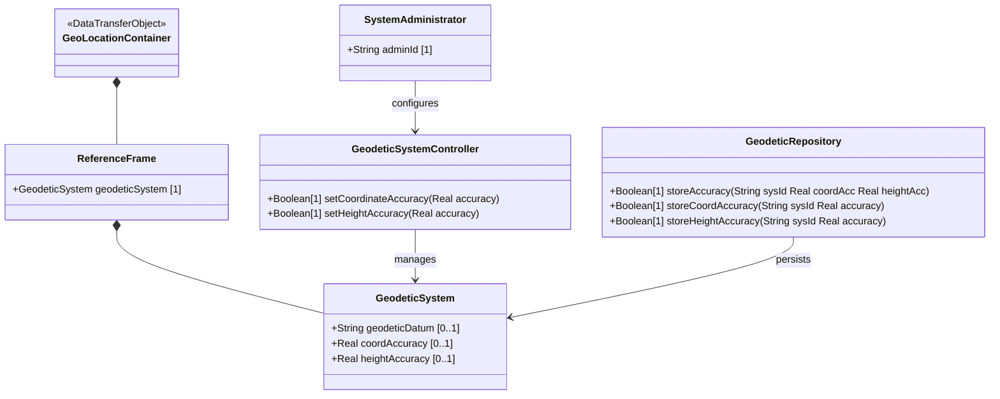

# Feature: Configure Geodetic Datum and Coordinate Accuracy

## Parent Epic
- [ ] #7 - Geographic Location: Reference Frame and Geodetic System Definition (semantic linkage: this feature defines the geodetic datum and accuracy parameters within the reference frame)

## Description
The system MUST support configuring the geodetic system within the reference frame, including the geodetic-datum that defines the meaning of latitude/longitude/height coordinates, the coordinate accuracy indicating how precisely locations are determined, and the height accuracy specifically for ellipsoidal height measurements. The geodetic-datum defaults to "wgs-84" for Earth, which is used by GPS.

## UML Class Diagram


## Interface Requirements
### 1. Payload Schema (JSON Example)
```json
{
  "geo-location": {
    "reference-frame": {
      "geodetic-system": {
        "geodetic-datum": "wgs-84",
        "coord-accuracy": 0.5,
        "height-accuracy": 0.3
      }
    }
  }
}
```

### 2. Validation & Constraints
- `geodetic-datum`: String, pattern `[ -@\[-\^_-~]*`. Default for Earth is "wgs-84". SHOULD convert uppercase to lowercase. MUST NOT include control characters. IANA registry values MUST use dashes instead of spaces. Values registered in IANA "Geodetic System Values" registry (initial: "me", "wgs-84-96", "wgs-84-08", "wgs-84").
- `coord-accuracy`: decimal64, fraction-digits 6. Applies to latitude/longitude pair (ellipsoidal) or X/Y/Z components (Cartesian). No units specified (dimensionless accuracy measure). Optional.
- `height-accuracy`: decimal64, fraction-digits 6, units "meters". Only used with ellipsoidal coordinates (NOT with Cartesian). Optional.

### 3. Logical Operations & Interface Messages
- **GET geo-location/reference-frame/geodetic-system**: Retrieve the geodetic system configuration.
- **PUT geo-location/reference-frame/geodetic-system**: Set or update the geodetic system parameters.
- **Default Resolution**: When astronomical-body is "earth" and geodetic-datum is not set, default to "wgs-84".

### 4. Logical Exception States & Validation Failures
- Invalid geodetic-datum pattern: pattern matching rejects the string.
- coord-accuracy exceeds fraction-digit precision: decimal64 truncation or validation error.
- height-accuracy provided with Cartesian coordinates: field is semantically invalid for this coordinate type (note: schema allows it, but specification states it is "not used with Cartesian coordinates").

## Given-When-Then Acceptance Criteria
1. Given an Earth-based geo-location without explicit geodetic-datum, When the system resolves the reference frame, Then the geodetic-datum defaults to "wgs-84".
2. Given a valid geodetic-datum value "me", When the system stores the geodetic-system, Then the datum is set to "mean earth / polar axis (moon)" per IANA registry.
3. Given a coord-accuracy of 0.5, When the system processes the accuracy value, Then the decimal64 with 6 fraction digits stores the value precisely.
4. Given a height-accuracy of 0.3 meters for ellipsoidal coordinates, When the system stores the value, Then the height accuracy is recorded in meters.
5. Given a height-accuracy value supplied with Cartesian coordinates, When the system interprets the location data, Then the height-accuracy is ignored per specification (not used with Cartesian).
6. Given a geodetic-datum with spaces "wgs 84", When the system validates the IANA registry value, Then it is normalized to "wgs-84" per the registry rules.

## Specification Context (Verbatim)
> In addition to identifying the astronomical body, we also need to define the meaning of the coordinates (e.g., latitude and longitude) and the definition of 0-height. This is done with a 'geodetic-datum' value. The default value for 'geodetic-datum' is 'wgs-84' (i.e., the World Geodetic System [WGS84]), which is used by the Global Positioning System (GPS) among many others. We define an IANA registry for specifying standard values for the 'geodetic-datum'.

> In addition to the 'geodetic-datum' value, we allow overriding the coordinate and height accuracy using 'coord-accuracy' and 'height-accuracy', respectively. When specified, these values override the defaults implied by the 'geodetic-datum' value.

## Schema Coverage
- `reference-frame` container — covered (parent container)
- `geodetic-system` container — covered by this feature
- `geodetic-datum` leaf — covered by this feature
- `coord-accuracy` leaf — covered by this feature
- `height-accuracy` leaf — covered by this feature

## 4. Source References
Structural Schema: ietf-geo-location@2022-02-11.yang — `geodetic-system` container, `geodetic-datum` leaf, `coord-accuracy` leaf, `height-accuracy` leaf
Normative Specification: RFC 9179 Section 2.1, Section 6.1

## 5. Logical UI & Layout Bindings
- **Target LUI Component:** PropertyGrid
- **Target Layout Container ID:** components_table
- **Data Source Bindings:** geo-location/reference-frame/geodetic-system
