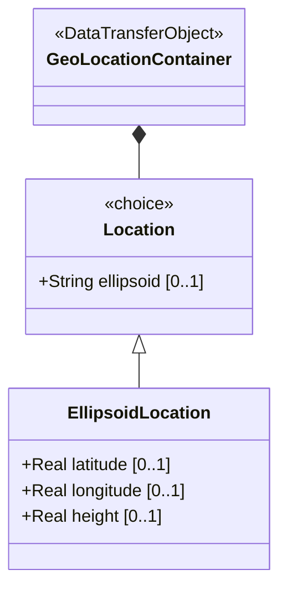

# Feature: Specify Ellipsoid Geodetic Coordinates

## Parent Epic
- [ ] #8 - Geographic Location: Position Coordinates and Motion Tracking (semantic linkage: this feature implements the ellipsoid case of the location choice, providing latitude/longitude/height positioning)

## Description
The system MUST support specifying geographic location using ellipsoidal coordinates consisting of latitude and longitude in decimal degrees, and an optional height in meters. These values are interpreted according to the reference-frame and geodetic-datum defined in the parent context. Latitude and longitude provide 16 decimal digits of fractional precision; height provides 6 decimal digits.

## UML Class Diagram


## Interface Requirements
### 1. Payload Schema (JSON Example)
```json
{
  "geo-location": {
    "location": {
      "latitude": 48.8566,
      "longitude": 2.3522,
      "height": 35.0
    }
  }
}
```

### 2. Validation & Constraints
- `latitude`: decimal64, fraction-digits 16, units "decimal degrees". Value range: typically -90 to +90 (not explicitly constrained in schema, but geodetically defined). Interpreted per reference-frame geodetic-datum.
- `longitude`: decimal64, fraction-digits 16, units "decimal degrees". Value range: typically -180 to +180 (geodetically defined). Interpreted per reference-frame geodetic-datum.
- `height`: decimal64, fraction-digits 6, units "meters". Optional. The precision and "0" value defined by the reference-frame geodetic-datum.
- Only one location case (ellipsoid or cartesian) may be active at a time.

### 3. Logical Operations & Interface Messages
- **PUT geo-location/location**: Set ellipsoid coordinates (latitude, longitude, height).
- **GET geo-location/location**: Retrieve the current location coordinates.
- **Choice Selection**: Setting any ellipsoid leaf (latitude, longitude, height) implicitly selects the ellipsoid case and clears any cartesian case values.

### 4. Logical Exception States & Validation Failures
- Latitude/longitude outside valid geodetic range: schema does not constrain range explicitly; validation is delegated to the geodetic-datum interpretation. Application-level validation may reject extreme values.
- Height provided for geodetic-datum that does not define a height component: behavior depends on the datum interpretation.
- Both ellipsoid and cartesian coordinates provided simultaneously: choice construct enforces mutual exclusivity; setting one case clears the other.

## Given-When-Then Acceptance Criteria
1. Given a valid latitude of 48.8566 and longitude of 2.3522, When the system stores the ellipsoid location, Then the coordinates are recorded with 16-digit fractional precision.
2. Given an ellipsoid location with latitude, longitude, and height 35.0, When the system stores the values, Then all three attributes persist.
3. Given an ellipsoid location with only latitude and longitude (no height), When the system queries the location, Then height is absent/undefined.
4. Given an existing ellipsoid location, When the system receives cartesian coordinates, Then the ellipsoid location values are cleared and replaced by the cartesian case.
5. Given a latitude value exceeding 90 degrees, When the system validates against the geodetic-datum, Then an application-level validation error is returned.

## Specification Context (Verbatim)
> This is the location on, or relative to, the astronomical object. It is specified using two or three coordinate values. These values are given either as 'latitude', 'longitude', and an optional 'height', or as Cartesian coordinates of 'x', 'y', and 'z'. For the standard location choice, 'latitude' and 'longitude' are specified as decimal degrees, and the 'height' value is in fractions of meters.

## Schema Coverage
- `location` choice — covered (parent choice)
- `ellipsoid` case — covered by this feature
- `latitude` leaf — covered by this feature
- `longitude` leaf — covered by this feature
- `height` leaf — covered by this feature

## 4. Source References
Structural Schema: ietf-geo-location@2022-02-11.yang — `choice location`, `case ellipsoid`, `latitude` leaf, `longitude` leaf, `height` leaf
Normative Specification: RFC 9179 Section 2.2

## 5. Logical UI & Layout Bindings
- **Target LUI Component:** PropertyGrid
- **Target Layout Container ID:** components_table
- **Data Source Bindings:** geo-location/location (ellipsoid case)
