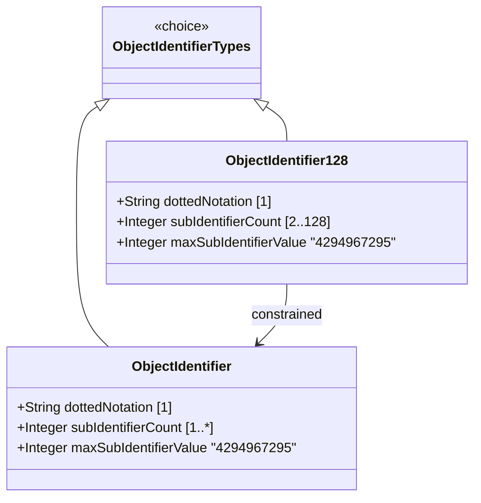

# Feature: Represent Object Identifier Registration Hierarchy

## Parent Epic
- [ ] #37 - Common YANG Data Types: Object Identifier and Network Address Types (semantic linkage: parent epic for all identifier/address features)

## Description
The system must support YANG object identifier types that represent administratively assigned names in a registration-hierarchical-name tree. Values are sequences of numerical non-negative sub-identifier values separated by dots. Support both unlimited sub-identifier count (object-identifier) and the 128 sub-identifier restricted variant (object-identifier-128) that is equivalent to the SMIv2 OBJECT IDENTIFIER type.

## UML Class Diagram


## Interface Requirements

### 1. Payload Schema (JSON Example)
```json
{
  "systemOID": "1.3.6.1.2.1.1",
  "enterpriseOID": "1.3.6.1.4.1.9",
  "limitedOID": "2.25.128.0.1.2.3"
}
```

### 2. Validation & Constraints
- **object-identifier**: Base type string; pattern restricts first sub-identifier to 0, 1, or 2; second sub-identifier restricted to 0-39 if first is 0 or 1; at least two sub-identifiers required; each sub-identifier MUST NOT exceed 2^32-1; no intermediate whitespace
- **object-identifier-128**: Based on object-identifier with pattern limiting to 1-127 additional sub-identifiers (total 2-128); equivalent to SMIv2 OBJECT IDENTIFIER
- object-identifier is a superset of SMIv2 OBJECT IDENTIFIER and SHOULD NOT be used to represent the SMIv2 type — use object-identifier-128 instead
- Canonical representation uses numerical values only (no names)

### 3. Logical Operations & Interface Messages
- **validate**: Verify OID string conforms to ASN.1 value space restrictions
- **parse**: Decompose dotted notation into sub-identifier array
- **compare**: Compare two OIDs for hierarchical prefix matching

### 4. Logical Exception States & Validation Failures
- **invalid first arc**: First sub-identifier not in {0, 1, 2}
- **invalid second arc**: Second sub-identifier > 39 when first is 0 or 1
- **insufficient sub-identifiers**: Fewer than 2 sub-identifiers
- **sub-identifier overflow**: Individual sub-identifier exceeds 2^32-1
- **sub-identifier overflow (128)**: More than 128 total sub-identifiers

## Given-When-Then Acceptance Criteria

### Object Identifier
- Given an object-identifier value "0.0", When validated, Then it is valid (minimum two sub-identifiers)
- Given an object-identifier value "1.3.6.1.2.1.1", When validated, Then it passes pattern constraints
- Given an object-identifier value "2.25.128.0.1", When validated, Then it passes pattern constraints
- Given an object-identifier value "3.0", When validated, Then it fails (first sub-identifier must be 0, 1, or 2)
- Given an object-identifier value "1.40.0", When validated, Then it fails (second sub-identifier > 39 when first is 1)
- Given an object-identifier value "1", When validated, Then it fails (only one sub-identifier)
- Given an object-identifier value with sub-identifier exceeding 2^32-1, When validated, Then it fails

### Object Identifier 128
- Given an object-identifier-128 value, When it has more than 128 sub-identifiers, Then validation fails
- Given an object-identifier-128 value, When it has 2-128 sub-identifiers conforming to OID rules, Then it is valid
- Given a schema node requiring SMIv2 OBJECT IDENTIFIER compatibility, When object-identifier-128 is used, Then the type is semantically equivalent

## Specification Context (Verbatim)

From RFC 9911, Section 3:

"The object-identifier type represents administratively assigned names in a registration-hierarchical-name tree.

Values of this type are denoted as a sequence of numerical non-negative sub-identifier values. Each sub-identifier value MUST NOT exceed 2^32-1 (4294967295). Sub-identifiers are separated by single dots and without any intermediate whitespace.

The ASN.1 standard restricts the value space of the first sub-identifier to 0, 1, or 2. Furthermore, the value space of the second sub-identifier is restricted to the range 0 to 39 if the first sub-identifier is 0 or 1. Finally, the ASN.1 standard requires that an object identifier has always at least two sub-identifiers.

This type is a superset of the SMIv2 OBJECT IDENTIFIER type since it is not restricted to 128 sub-identifiers. Hence, this type SHOULD NOT be used to represent the SMIv2 OBJECT IDENTIFIER type; the object-identifier-128 type SHOULD be used instead."

"The object-identifier-128 type represents object-identifiers restricted to 128 sub-identifiers."

## 4. Source References
Structural Schema: ietf-yang-types.yang (typedef object-identifier, object-identifier-128)
Normative Specification: RFC 9911, Section 3

## 5. Logical UI & Layout Bindings
- **Target LUI Component:** PropertyGrid
- **Target Layout Container ID:** yang-type-editor
- **Data Source Bindings:** OID input field with pattern validation, sub-identifier count display
