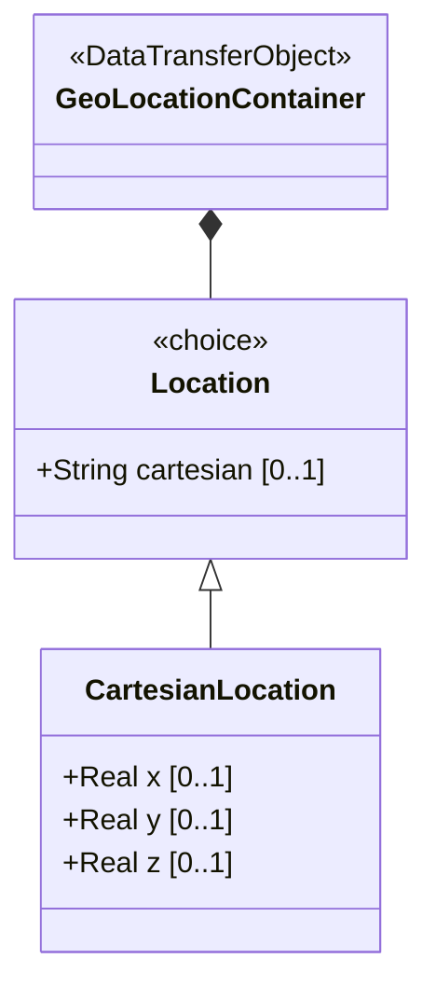

# Feature: Specify Cartesian Spatial Coordinates

## Parent Epic
- [ ] #8 - Geographic Location: Position Coordinates and Motion Tracking (semantic linkage: this feature implements the cartesian case of the location choice, providing X/Y/Z spatial positioning)

## Description
The system MUST support specifying geographic location using Cartesian coordinates consisting of X, Y, and Z values in meters. These values represent a position in three-dimensional space as defined by the reference-frame and geodetic-datum. Each coordinate provides 6 decimal digits of fractional precision.

## UML Class Diagram


## Interface Requirements
### 1. Payload Schema (JSON Example)
```json
{
  "geo-location": {
    "location": {
      "x": 123456.789,
      "y": 987654.321,
      "z": 5000.0
    }
  }
}
```

### 2. Validation & Constraints
- `x`: decimal64, fraction-digits 6, units "meters". The X value as defined by the reference-frame.
- `y`: decimal64, fraction-digits 6, units "meters". The Y value as defined by the reference-frame.
- `z`: decimal64, fraction-digits 6, units "meters". The Z value as defined by the reference-frame.
- Only one location case (ellipsoid or cartesian) may be active at a time. Setting cartesian coordinates clears any ellipsoid values.

### 3. Logical Operations & Interface Messages
- **PUT geo-location/location**: Set cartesian coordinates (x, y, z).
- **GET geo-location/location**: Retrieve the current location coordinates.
- **Choice Selection**: Setting any cartesian leaf (x, y, or z) implicitly selects the cartesian case and clears any ellipsoid case values.

### 4. Logical Exception States & Validation Failures
- Coordinate values exceed precision limits: decimal64 with fraction-digits 6 enforces truncation to 6 decimal places.
- Mixed coordinate system attempt: providing both cartesian and ellipsoid values simultaneously results in the last-written case taking precedence.
- Non-numeric or out-of-range values for decimal64: schema validation rejects the payload.

## Given-When-Then Acceptance Criteria
1. Given valid X, Y, Z cartesian coordinates, When the system stores the cartesian location, Then all three coordinates persist with 6-digit fractional precision in meters.
2. Given an existing ellipsoid location, When the system receives cartesian coordinates, Then the ellipsoid location values are cleared and replaced.
3. Given cartesian coordinates with only X and Y set, When the system queries the location, Then Z is absent/undefined.
4. Given a cartesian X value of 123456.7890123, When the system stores the value, Then it is truncated to 6 fractional digits (123456.789012).
5. Given an existing cartesian location, When the system receives ellipsoid coordinates, Then the cartesian values are cleared.

## Specification Context (Verbatim)
> This is the location on, or relative to, the astronomical object. It is specified using two or three coordinate values. These values are given either as 'latitude', 'longitude', and an optional 'height', or as Cartesian coordinates of 'x', 'y', and 'z'. For the standard location choice, 'latitude' and 'longitude' are specified as decimal degrees, and the 'height' value is in fractions of meters. For the Cartesian choice, 'x', 'y', and 'z' are in fractions of meters.

## Schema Coverage
- `location` choice — covered (parent choice)
- `cartesian` case — covered by this feature
- `x` leaf — covered by this feature
- `y` leaf — covered by this feature
- `z` leaf — covered by this feature

## 4. Source References
Structural Schema: ietf-geo-location@2022-02-11.yang — `choice location`, `case cartesian`, `x` leaf, `y` leaf, `z` leaf
Normative Specification: RFC 9179 Section 2.2

## 5. Logical UI & Layout Bindings
- **Target LUI Component:** PropertyGrid
- **Target Layout Container ID:** components_table
- **Data Source Bindings:** geo-location/location (cartesian case)
