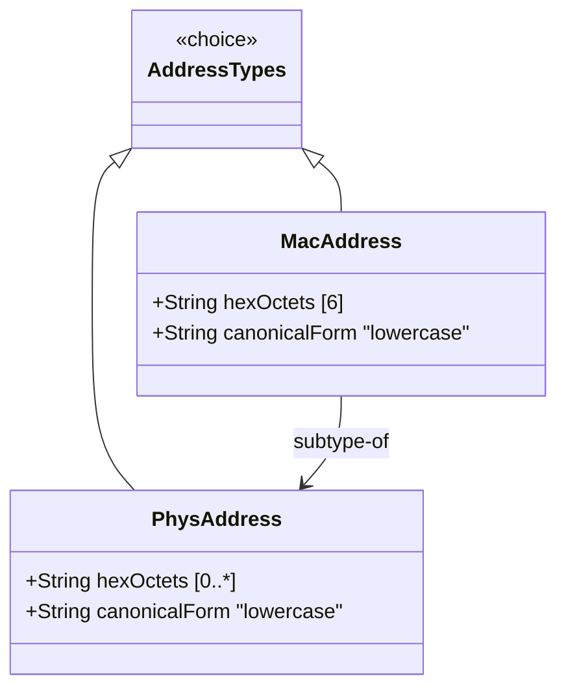

# Feature: Represent Physical and MAC Address Values

## Parent Epic
- [ ] #37 - Common YANG Data Types: Object Identifier and Network Address Types (semantic linkage: parent epic for all identifier/address features)

## Description
The system must support YANG types for representing media-level and physical-level addresses. The phys-address type represents arbitrary-length octet sequences in colon-separated hexadecimal notation. The mac-address type represents 48-bit IEEE 802 MAC addresses with a fixed format of six colon-separated hexadecimal octets.

## UML Class Diagram


## Interface Requirements

### 1. Payload Schema (JSON Example)
```json
{
  "physicalAddress": "00:1a:2b:3c:4d:5e:6f:70",
  "macAddress": "00:1a:2b:3c:4d:5e",
  "emptyPhysicalAddress": ""
}
```

### 2. Validation & Constraints
- **phys-address**: Base type string; pattern `([0-9a-fA-F]{2}(:[0-9a-fA-F]{2})*)?`; empty string allowed; each octet is two hex digits separated by colons; canonical representation uses lowercase characters; equivalent to SMIv2 PhysAddress
- **mac-address**: Base type string; pattern `[0-9a-fA-F]{2}(:[0-9a-fA-F]{2}){5}`; exactly 6 octets; 48-bit IEEE 802 MAC address; canonical representation uses lowercase; cannot represent MAC addresses with different lengths; equivalent to SMIv2 MacAddress

### 3. Logical Operations & Interface Messages
- **validate**: Verify hex string format and octet count
- **canonicalize**: Convert to lowercase canonical form
- **compare**: Compare two address values

### 4. Logical Exception States & Validation Failures
- **invalid hex pair**: Non-hexadecimal characters in octet position
- **odd hex characters**: Octet not represented as exactly 2 hex digits
- **invalid MAC length**: MAC address does not have exactly 6 octets
- **leading/trailing colon**: Colons at start or end of address string

## Given-When-Then Acceptance Criteria

### Physical Address
- Given a phys-address value "00:1a:2b:3c:4d:5e:6f:70", When validated, Then it is valid
- Given a phys-address value "", When validated, Then it is valid (empty string allowed)
- Given a phys-address value "0g:1a:2b", When validated, Then it fails (invalid hex digit 'g')
- Given a phys-address value "00:1a:2", When validated, Then it fails (odd number of hex characters)
- Given a phys-address value "00:1A:2B", When canonicalized, Then it produces "00:1a:2b"

### MAC Address
- Given a mac-address value "00:1a:2b:3c:4d:5e", When validated, Then it is valid
- Given a mac-address value "00:1a:2b:3c:4d", When validated, Then it fails (only 5 octets)
- Given a mac-address value "00:1a:2b:3c:4d:5e:6f", When validated, Then it fails (7 octets)
- Given a mac-address value "00:1A:2B:3C:4D:5E", When canonicalized, Then it produces "00:1a:2b:3c:4d:5e"
- Given a need for variable-length physical address representation, When mac-address cannot represent it, Then phys-address MUST be used instead

## Specification Context (Verbatim)

From RFC 9911, Section 3:

"Represents media- or physical-level addresses represented as a sequence of octets, each octet represented by two hexadecimal numbers. Octets are separated by colons. The canonical representation uses lowercase characters."

"The mac-address type represents a 48-bit IEEE 802 Media Access Control (MAC) address. The canonical representation uses lowercase characters. Note that there are IEEE 802 MAC addresses with a different length that this type cannot represent. The phys-address type may be used to represent physical addresses of varying length."

## 4. Source References
Structural Schema: ietf-yang-types.yang (typedef phys-address, mac-address)
Normative Specification: RFC 9911, Section 3

## 5. Logical UI & Layout Bindings
- **Target LUI Component:** PropertyGrid
- **Target Layout Container ID:** yang-type-editor
- **Data Source Bindings:** Address input field with hex pattern validation, canonical form converter
