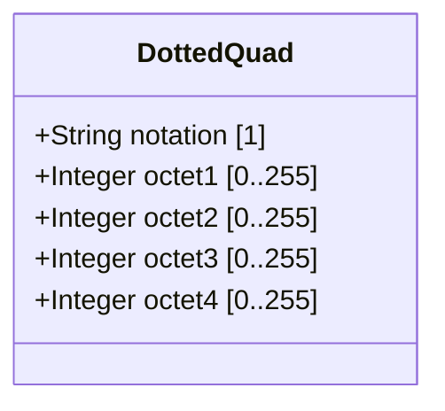

# Feature: Represent Dotted-Quad Network Notation Values

## Parent Epic
- [ ] #37 - Common YANG Data Types: Object Identifier and Network Address Types (semantic linkage: parent epic for all identifier/address features)

## Description
The system must support a YANG type for representing unsigned 32-bit numbers expressed in dotted-quad notation — four octets written as decimal numbers separated by periods. This type is used for representing IPv4 address-like numerical values where the dotted-quad notation provides human-readable octet boundaries.

## UML Class Diagram


## Interface Requirements

### 1. Payload Schema (JSON Example)
```json
{
  "networkAddress": "192.0.2.1",
  "subnetMask": "255.255.255.0",
  "minAddress": "0.0.0.0",
  "maxAddress": "255.255.255.255"
}
```

### 2. Validation & Constraints
- Base type: string
- Pattern: 4 octets, each in range [0, 255], separated by periods
- Octet pattern: `([0-9]|[1-9][0-9]|1[0-9][0-9]|2[0-4][0-9]|25[0-5])`
- No leading zeros on octets (e.g., "001" is invalid)
- Canonical representation: lowercase (no case sensitivity concerns for digits)
- No equivalent SMIv2 type defined (this is a YANG-specific convenience type)

### 3. Logical Operations & Interface Messages
- **validate**: Verify dotted-quad string format and octet range
- **parse**: Decompose dotted-quad into 4 integer octets
- **toInteger**: Convert dotted-quad to 32-bit unsigned integer

### 4. Logical Exception States & Validation Failures
- **octet overflow**: Octet value > 255
- **octet underflow**: Octet value < 0
- **wrong octet count**: Fewer or more than 4 octets
- **leading zeros**: Octet has leading zeros (not permitted by pattern)
- **empty string**: Empty or malformed input

## Given-When-Then Acceptance Criteria

- Given a dotted-quad value "192.0.2.1", When validated, Then it is valid
- Given a dotted-quad value "255.255.255.255", When validated, Then it is valid
- Given a dotted-quad value "0.0.0.0", When validated, Then it is valid
- Given a dotted-quad value "256.0.0.1", When validated, Then it fails (octet > 255)
- Given a dotted-quad value "192.168.1", When validated, Then it fails (only 3 octets)
- Given a dotted-quad value "192.168.1.1.5", When validated, Then it fails (5 octets)
- Given a dotted-quad value "192.168.01.1", When validated, Then it fails (leading zero in octet)
- Given a dotted-quad value "192.168.1.-1", When validated, Then it fails (negative octet)

## Specification Context (Verbatim)

From RFC 9911, Section 3:

"An unsigned 32-bit number expressed in the dotted-quad notation, i.e., four octets written as decimal numbers and separated with the '.' (full stop) character."

## 4. Source References
Structural Schema: ietf-yang-types.yang (typedef dotted-quad)
Normative Specification: RFC 9911, Section 3

## 5. Logical UI & Layout Bindings
- **Target LUI Component:** PropertyGrid
- **Target Layout Container ID:** yang-type-editor
- **Data Source Bindings:** Dotted-quad input field with octet validation, integer conversion display
