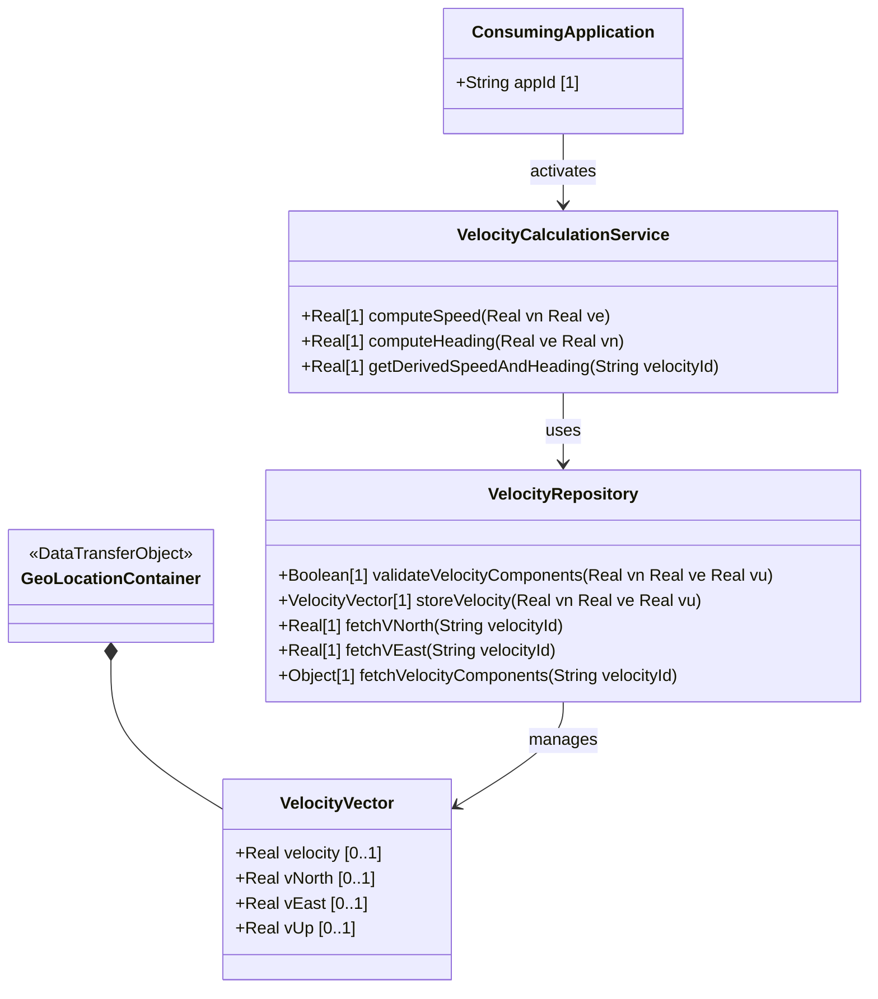

# Feature: Track Velocity Vector for Moving Objects

## Parent Epic
- [ ] #8 - Geographic Location: Position Coordinates and Motion Tracking (semantic linkage: this feature captures motion data via velocity vector components for objects in relatively stable motion)

## Description
The system MUST support tracking the velocity of moving objects using a three-dimensional velocity vector. The components v-north (speed towards true north), v-east (speed perpendicular to the right of true north), and v-up (speed away from center of mass) are provided in meters per second with 12 decimal digits of fractional precision. These values describe the motion at the time given by the timestamp. The system MAY support deriving speed and heading from v-north and v-east using the formulas: speed = sqrt(v_north^2 + v_east^2), heading = arctan(v_east / v_north).

## UML Class Diagram


## Interface Requirements
### 1. Payload Schema (JSON Example)
```json
{
  "geo-location": {
    "velocity": {
      "v-north": 10.5,
      "v-east": -3.2,
      "v-up": 0.1
    }
  }
}
```

### 2. Validation & Constraints
- `v-north`: decimal64, fraction-digits 12, units "meters per second". Speed towards true north as defined by geodetic-system. Negative values indicate southward movement.
- `v-east`: decimal64, fraction-digits 12, units "meters per second". Speed perpendicular to the right of true north. Negative values indicate westward movement.
- `v-up`: decimal64, fraction-digits 12, units "meters per second". Speed away from center of mass. Negative values indicate downward movement.
- All velocity components are optional; any subset may be provided.

### 3. Logical Operations & Interface Messages
- **PUT geo-location/velocity**: Set the velocity vector components.
- **GET geo-location/velocity**: Retrieve the current velocity vector.
- **Speed Derivation**: speed = sqrt(v_north^2 + v_east^2).
- **Heading Derivation**: heading = arctan(v_east / v_north) in degrees from true north.

### 4. Logical Exception States & Validation Failures
- Precision overflow: decimal64 with 12 fraction digits truncates excess precision.
- Single component updates: setting only one component is valid; unspecified components remain absent.
- Very slow movement tracking: the velocity vector can track continental drift for applications requiring high accuracy with infrequent updates.

## Given-When-Then Acceptance Criteria
1. Given v-north of 10.5 and v-east of -3.2, When the system derives speed, Then the speed equals sqrt(10.5^2 + (-3.2)^2) = 10.977 meters per second.
2. Given v-north of 10.5 and v-east of -3.2, When the system derives heading, Then the heading equals arctan(-3.2 / 10.5) degrees from true north.
3. Given only v-up is set to 0.1 m/s, When the system queries the velocity, Then v-north and v-east are absent/undefined.
4. Given v-north of 0.000000000001 (12 decimal places), When the system stores the value, Then it retains full 12-digit fractional precision.
5. Given a stationary object with all velocity components absent, When the system queries the velocity container, Then no movement is indicated.
6. Given v-north of -5.0, When the system interprets the value, Then it is recognized as southward movement at 5 meters per second.

## Specification Context (Verbatim)
> Support is added for objects in relatively stable motion. For objects in relatively stable motion, the grouping provides a three-dimensional vector value. The components of the vector are 'v-north', 'v-east', and 'v-up', which are all given in fractional meters per second. The values 'v-north' and 'v-east' are relative to true north as defined by the reference frame for the astronomical body; 'v-up' is perpendicular to the plane defined by 'v-north' and 'v-east', and is pointed away from the center of mass.
>
> To derive the two-dimensional heading and speed, one would use the following formulas:
> speed = sqrt(v_north^2 + v_east^2)
> heading = arctan(v_east / v_north)
>
> For some applications that demand high accuracy and where the data is infrequently updated, this velocity vector can track very slow movement such as continental drift.

## Schema Coverage
- `velocity` container — covered by this feature
- `v-north` leaf — covered by this feature
- `v-east` leaf — covered by this feature
- `v-up` leaf — covered by this feature

## 4. Source References
Structural Schema: ietf-geo-location@2022-02-11.yang — `velocity` container, `v-north` leaf, `v-east` leaf, `v-up` leaf
Normative Specification: RFC 9179 Section 2.3

## 5. Logical UI & Layout Bindings
- **Target LUI Component:** PropertyGrid
- **Target Layout Container ID:** components_table
- **Data Source Bindings:** geo-location/velocity
