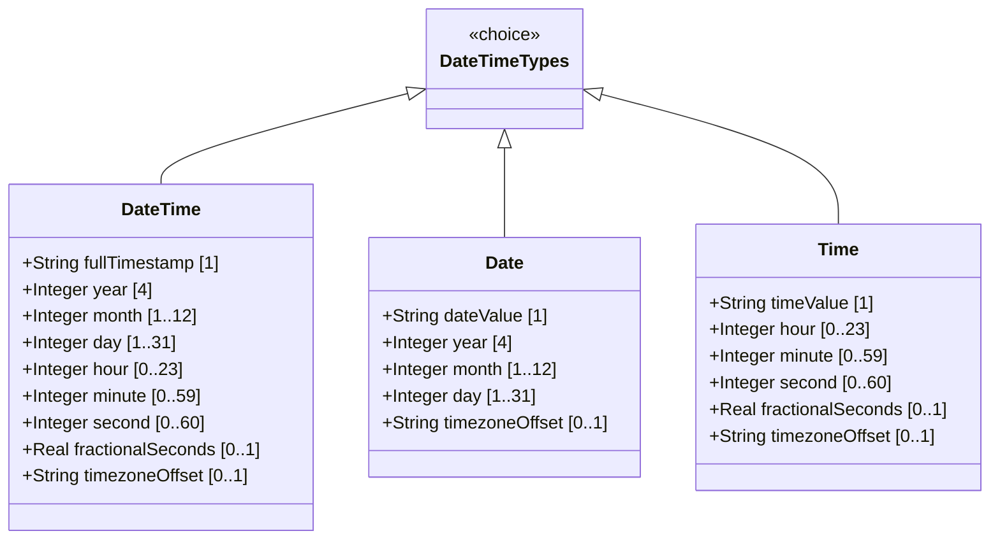

# Feature: Represent Date and Time Values with Time Zone Offset

## Parent Epic
- [ ] #38 - Common YANG Data Types: Date-Time and Timestamp Types (semantic linkage: parent epic for all date/time features)

## Description
The system must support YANG types for representing date-time instants (date-and-time), calendar dates (date), and recurring daily time instances (time). All three types include optional time zone offset information aligned with ISO 8601, RFC 3339, and RFC 9557. The date-and-time type supports leap seconds (value 60 for seconds). Time zone offset Z indicates UTC with unknown local time zone reference; +00:00 indicates UTC with known UTC reference point.

## UML Class Diagram


## Interface Requirements

### 1. Payload Schema (JSON Example)
```json
{
  "eventTimestamp": "2025-12-22T14:30:00.5Z",
  "eventTimestampWithOffset": "2025-12-22T14:30:00+01:00",
  "leapSecond": "2025-06-30T23:59:60Z",
  "eventDate": "2025-12-22Z",
  "eventDateNoZone": "2025-12-22",
  "recurringTime": "14:30:00.5Z",
  "recurringTimeNoOffset": "14:30:00"
}
```

### 2. Validation & Constraints
- **date-and-time**: Pattern `YYYY-MM-DDThh:mm:ss[.f+]Z|±hh:mm` or `±14:00`; year must be 4 digits (no negative years); second can be 60 only for leap seconds; Z = UTC, unknown local TZ; +00:00 = UTC, known local TZ is UTC; canonical format with known TZ offset uses numeric offset; DST changes may cause values to change
- **date**: Pattern `YYYY-MM-DD` with optional timezone offset; represents a 24-hour day interval; no negative years; Z indicates UTC with unknown local TZ reference
- **time**: Pattern `hh:mm:ss[.f+]` with optional timezone offset; recurs daily; second can be 60 for leap seconds
- Compatible with XML Schema dateTime/date/time types except: no negative years, Z vs +00:00 semantics
- Not equivalent to SMIv2 DateAndTime (different separator, higher resolution)

### 3. Logical Operations & Interface Messages
- **validate**: Verify string conforms to RFC 3339 profile with RFC 9557 extensions
- **parse**: Decompose timestamp into year/month/day/hour/minute/second/fraction/tz components
- **convert**: Convert between timezone offsets (canonical format)
- **compare**: Chronological comparison of two timestamps

### 4. Logical Exception States & Validation Failures
- **invalid year**: Negative year or non-4-digit year
- **invalid month**: Month not in [1, 12]
- **invalid day**: Day not valid for given month/year
- **invalid hour**: Hour not in [0, 23]
- **invalid minute**: Minute not in [0, 59]
- **invalid second**: Second > 60, or second = 60 when not a leap second
- **invalid timezone**: Timezone offset outside [-14:00, +14:00] or non-standard format
- **malformed separator**: Missing 'T' separator between date and time

## Given-When-Then Acceptance Criteria

### Date-And-Time
- Given a date-and-time value "2025-12-22T14:30:00.5Z", When validated, Then it is valid with UTC timezone
- Given a date-and-time value "2025-12-22T14:30:00+01:00", When validated, Then it is valid with +01:00 offset
- Given a date-and-time value "2025-06-30T23:59:60Z", When validated, Then it is valid (leap second)
- Given a date-and-time value "-2025-12-22T14:30:00Z", When validated, Then it fails (negative year)
- Given a date-and-time value "2025-12-22T14:30:00+15:00", When validated, Then it fails (offset > +14:00)
- Given a date-and-time value reported in UTC with unknown local TZ, When formatted canonically, Then it SHOULD use Z
- Given a date-and-time value reported in UTC with known local TZ, When formatted canonically, Then it uses +00:00

### Date
- Given a date value "2025-12-22Z", When validated, Then it is valid
- Given a date value "2025-12-22", When validated, Then it is valid (no timezone)
- Given a date value "2025-12-22+05:30", When validated, Then it is valid

### Time
- Given a time value "14:30:00.5Z", When validated, Then it is valid
- Given a time value "23:59:60", When validated, Then it is valid (leap second)
- Given a time value "24:00:00", When validated, Then it fails (hour > 23)

## Specification Context (Verbatim)

From RFC 9911, Section 3:

"The date-and-time type is a profile of the ISO 8601 standard for representation of dates and times using the Gregorian calendar. The profile is defined by the date-time production in Section 5.6 of RFC 3339 and the update defined in Section 2 of RFC 9557. The value of 60 for seconds is allowed only in the case of leap seconds."

"(a) The date-and-time type does not allow negative years. (b) The time-offset Z indicates that the date-and-time value is reported in UTC and that the local time zone reference point is unknown. The time-offset +00:00 indicates that the date-and-time value is reported in UTC and that the local time zone reference point is UTC."

"The canonical format for date-and-time values with a known time zone uses a numeric time zone offset that is calculated using the device's configured known offset to UTC time."

"The date type represents a time-interval of the length of a day, i.e., 24 hours. It includes an optional time zone offset."

"The time type represents an instance of time of zero duration that recurs every day. It includes an optional time zone offset. The value of 60 for seconds is allowed only in the case of leap seconds."

## 4. Source References
Structural Schema: ietf-yang-types.yang (typedef date-and-time, date, time)
Normative Specification: RFC 9911, Section 3

## 5. Logical UI & Layout Bindings
- **Target LUI Component:** PropertyGrid
- **Target Layout Container ID:** yang-type-editor
- **Data Source Bindings:** Date-time input with timezone selector, leap second indicator, canonical format display
