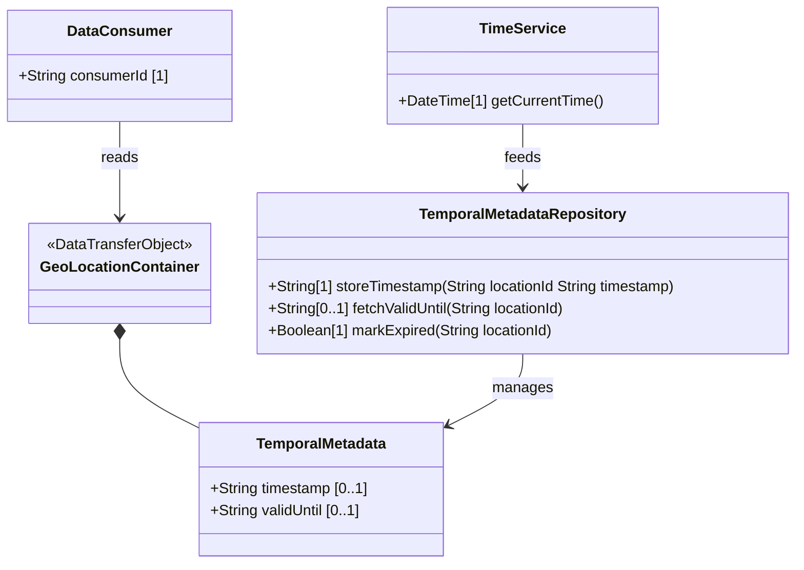

# Feature: Manage Temporal Location Lifecycle and Expiration

## Parent Epic
- [ ] #8 - Geographic Location: Position Coordinates and Motion Tracking (semantic linkage: this feature captures the recording timestamp and validity period for location data)

## Description
The system MUST support associating temporal metadata with geographic location data. The timestamp records when the location was measured/recorded. The valid-until attribute defines an expiration time after which the location data is no longer considered valid. When valid-until is unspecified, the geo-location has no specific expiration. Both values use the date-and-time type from RFC 6991.

## UML Class Diagram


## Interface Requirements
### 1. Payload Schema (JSON Example)
```json
{
  "geo-location": {
    "timestamp": "2024-01-15T10:30:00Z",
    "valid-until": "2024-01-15T11:00:00Z"
  }
}
```

### 2. Validation & Constraints
- `timestamp`: type yang:date-and-time (RFC 6991). Format: `YYYY-MM-DDThh:mm:ss[.fff]Z` or with timezone offset. Optional.
- `valid-until`: type yang:date-and-time (RFC 6991). Optional. When absent, no expiration. When present, location data is considered stale/expired after this time.

### 3. Logical Operations & Interface Messages
- **PUT geo-location/timestamp**: Set the recording timestamp.
- **PUT geo-location/valid-until**: Set the validity expiration time.
- **GET geo-location**: Retrieve timestamp and valid-until values.
- **Expiration Semantics**: When valid-until is set and the current time exceeds it, the geo-location data SHOULD be treated as stale. Systems using this grouping MAY implement automatic invalidation or refresh mechanisms.

### 4. Logical Exception States & Validation Failures
- Invalid date-and-time format: RFC 6991 type validation rejects malformed timestamps.
- valid-until before timestamp: schema allows this; application-level validation MAY warn or reject.
- Missing timestamp with valid-until: valid-until is independent; it can be set without a recording timestamp.

## Given-When-Then Acceptance Criteria
1. Given a geo-location with timestamp "2024-01-15T10:30:00Z", When the system records the location, Then the timestamp reflects the measurement time.
2. Given a geo-location with valid-until "2024-01-15T11:00:00Z", When the current time exceeds this value, Then the location data SHOULD be considered expired/stale.
3. Given a geo-location without valid-until, When the system uses the location data, Then no expiration is enforced (the location is always considered valid).
4. Given a valid-until that has expired, When a consuming system reads the location, Then the system SHOULD indicate that the location data is no longer current.
5. Given a timestamp in RFC 6991 date-and-time format with timezone offset, When the system normalizes the value, Then it stores the timestamp in a comparable format.

## Specification Context (Verbatim)
> leaf timestamp { type yang:date-and-time; description "Reference time when location was recorded."; }
> leaf valid-until { type yang:date-and-time; description "The timestamp for which this geo-location is valid until. If unspecified, the geo-location has no specific expiration time."; }

## Schema Coverage
- `timestamp` leaf — covered by this feature
- `valid-until` leaf — covered by this feature

## Realized By Use Cases
- [ ] [#18](https://github.com/gintatkinson/3dgs-011/blob/main/docs/use-cases/uc-04-manage-location-lifecycle.md) - Manage Location Lifecycle and Temporal Validity (semantic linkage: this use case manages timestamps and expiration)

## 4. Source References
Structural Schema: ietf-geo-location@2022-02-11.yang — `timestamp` leaf, `valid-until` leaf
Normative Specification: RFC 9179 Section 2.5

## 5. Logical UI & Layout Bindings
- **Target LUI Component:** PropertyGrid
- **Target Layout Container ID:** components_table
- **Data Source Bindings:** geo-location/timestamp, geo-location/valid-until
