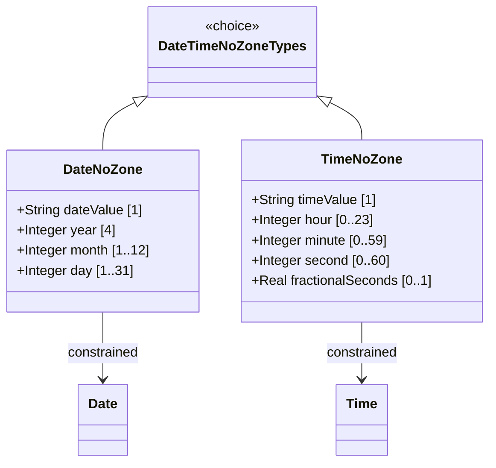

# Feature: Represent Date and Time Values Without Time Zone

## Parent Epic
- [ ] #38 - Common YANG Data Types: Date-Time and Timestamp Types (semantic linkage: parent epic for all date/time features)

## Description
The system must support YANG types for representing dates and times without time zone offset information. The date-no-zone type restricts the date type to exclude the optional timezone suffix. The time-no-zone type restricts the time type to exclude the optional timezone suffix. These types are used in contexts where time zone information is not available, not relevant, or handled separately.

## UML Class Diagram


## Interface Requirements

### 1. Payload Schema (JSON Example)
```json
{
  "effectiveDate": "2025-12-22",
  "dailyCutoff": "23:59:59.999",
  "birthDate": "1990-01-15",
  "openingTime": "09:00:00"
}
```

### 2. Validation & Constraints
- **date-no-zone**: Based on date type; pattern `YYYY-MM-DD` without timezone; inherits all date validation (year 4-digit, month 1-12, day valid for month); no negative years
- **time-no-zone**: Based on time type; pattern `hh:mm:ss[.f+]` without timezone; second can be 60 for leap seconds; inherits all time validation

### 3. Logical Operations & Interface Messages
- **validate**: Verify date/time format without timezone component
- **parse**: Decompose into date/time components

### 4. Logical Exception States & Validation Failures
- **timezone present**: Input contains timezone offset when type expects no timezone
- **invalid date components**: Month/day out of valid range
- **invalid time components**: Hour/minute/second out of valid range

## Given-When-Then Acceptance Criteria

### Date-No-Zone
- Given a date-no-zone value "2025-12-22", When validated, Then it is valid
- Given a date-no-zone value "2025-12-22Z", When validated, Then it fails (timezone present)
- Given a date-no-zone value "2025-12-22+05:00", When validated, Then it fails (timezone present)
- Given a date-no-zone value "2025-13-01", When validated, Then it fails (invalid month)

### Time-No-Zone
- Given a time-no-zone value "14:30:00.5", When validated, Then it is valid
- Given a time-no-zone value "14:30:00Z", When validated, Then it fails (timezone present)
- Given a time-no-zone value "14:30:00+01:00", When validated, Then it fails (timezone present)
- Given a time-no-zone value "23:59:60", When validated, Then it is valid (leap second)

## Specification Context (Verbatim)

From RFC 9911, Section 3:

"The date-no-zone type represents a date without the optional time zone offset information."

"The time-no-zone type represents a time without the optional time zone offset information."

## 4. Source References
Structural Schema: ietf-yang-types.yang (typedef date-no-zone, time-no-zone)
Normative Specification: RFC 9911, Section 3

## 5. Logical UI & Layout Bindings
- **Target LUI Component:** PropertyGrid
- **Target Layout Container ID:** yang-type-editor
- **Data Source Bindings:** Date-only input, time-only input, timezone-stripped display
