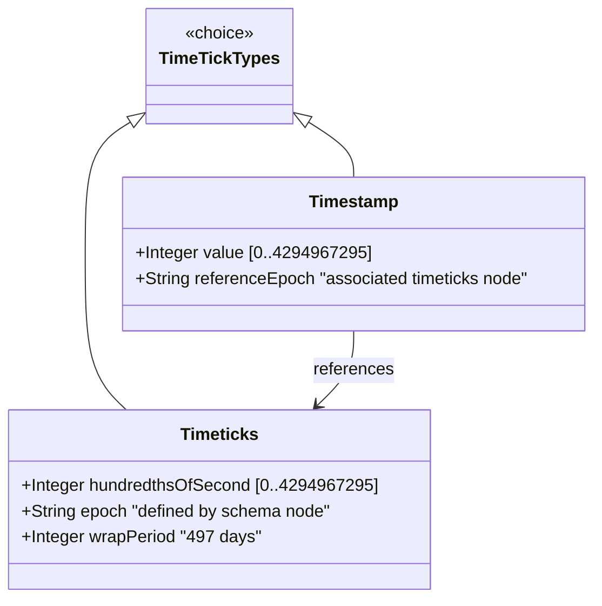

# Feature: Represent System Timeticks and Epoch Timestamps

## Parent Epic
- [ ] #38 - Common YANG Data Types: Date-Time and Timestamp Types (semantic linkage: parent epic for all date/time features)

## Description
The system must support YANG types for representing time measured in hundredths of a second modulo 2^32 (timeticks), and timestamps that capture specific occurrences relative to a timetics reference (timestamp). The timeticks type represents time between two reference epochs modulo 2^32. The timestamp type represents the value of an associated timeticks instance at which a specific occurrence happened, with automatic reset to zero on wrap-around.

## UML Class Diagram


## Interface Requirements

### 1. Payload Schema (JSON Example)
```json
{
  "sysUpTime": 3724800,
  "lastChange": 3724800,
  "ifLastChange": 0
}
```

### 2. Validation & Constraints
- **timeticks**: Base type uint32; represents time in hundredths of a second between two epochs, modulo 2^32 (4294967296); equivalent to SMIv2 TimeTicks; schema node description MUST identify both reference epochs
- **timestamp**: Base type timeticks; value of associated timeticks node at which a specific occurrence happened; occurrence MUST be defined in schema node description; value is 0 if occurrence predates last timeticks zero; all timestamp values MUST reset to 0 when associated timeticks wraps (every ~497 days); equivalent to SMIv2 TimeStamp
- Associated timeticks schema node MUST be specified in any schema node using timestamp type

### 3. Logical Operations & Interface Messages
- **read**: Retrieve current timeticks value
- **record**: Capture current timeticks as a timestamp for a specific occurrence
- **delta**: Compute time difference between two timeticks/timestamp values (accounting for wrap)
- **reset**: Zero all timestamps when associated timeticks wraps

### 4. Logical Exception States & Validation Failures
- **wrap detection**: Timeticks modulo wrap at ~497 days; all timestamps must reset to 0
- **stale timestamp**: Occurrence predates last timeticks zero; timestamp value is 0
- **orphan timestamp**: Schema node of type timestamp without specifying associated timeticks node

## Given-When-Then Acceptance Criteria

### Timeticks
- Given a timeticks schema node, When queried, Then it returns a non-negative integer in hundredths of a second modulo 2^32
- Given a timeticks value that has reached 4294967296 hundredths of a second, When the next increment occurs, Then the value wraps to 0
- Given a timeticks schema node, When its description does not identify both reference epochs, Then it violates the specification

### Timestamp
- Given a timestamp schema node, When the associated timeticks is at value 1000 and a specific occurrence happens, Then the timestamp captures value 1000
- Given a timestamp schema node, When the associated timeticks wraps from 4294967295 to 0, Then all timestamp values MUST reset to 0
- Given a timestamp value of 0, When queried, Then the occurrence either predates the last timeticks zero or is the initial state
- Given a schema node defined with type timestamp, When its description does not specify the associated timeticks node, Then it violates the specification
- Given all timestamp values, When the associated timeticks reaches 497+ days and wraps to zero, Then all timestamps become 0

## Specification Context (Verbatim)

From RFC 9911, Section 3:

"The timeticks type represents a non-negative integer that represents the time, modulo 2^32 (4294967296 decimal), in hundredths of a second between two epochs. When a schema node is defined that uses this type, the description of the schema node identifies both of the reference epochs."

"The timestamp type represents the value of an associated timeticks schema node instance at which a specific occurrence happened. The specific occurrence must be defined in the description of any schema node defined using this type. When the specific occurrence occurred prior to the last time the associated timeticks schema node instance was zero, then the timestamp value is zero.

Note that this requires all timestamp values to be reset to zero when the value of the associated timeticks schema node instance reaches 497+ days and wraps around to zero.

The associated timeticks schema node must be specified in the description of any schema node using this type."

## 4. Source References
Structural Schema: ietf-yang-types.yang (typedef timeticks, timestamp)
Normative Specification: RFC 9911, Section 3

## 5. Logical UI & Layout Bindings
- **Target LUI Component:** PropertyGrid
- **Target Layout Container ID:** yang-type-editor
- **Data Source Bindings:** Timeticks counter display, timestamp capture button, wrap indicator, delta computation display
