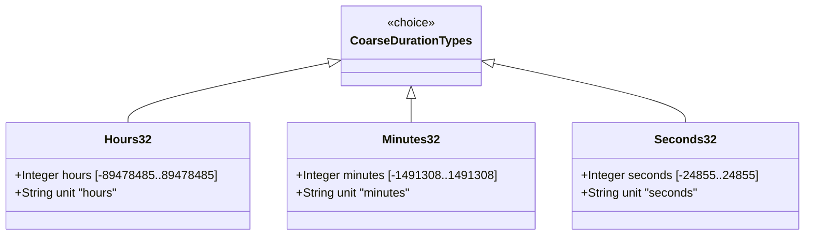

# Feature: Represent Coarse Time Duration Values

## Parent Epic
- [ ] #39 - Common YANG Data Types: Time Duration Measurement Types (semantic linkage: parent epic for all duration features)

## Description
The system must support YANG types for representing periods of time measured in coarse units: hours, minutes, and seconds. All types are based on int32 and can represent both positive and negative durations. Each type should be range-restricted in situations where only non-negative time periods are desirable.

## UML Class Diagram


## Interface Requirements

### 1. Payload Schema (JSON Example)
```json
{
  "timeToLive": 720,
  "timeoutMinutes": 30,
  "offsetSeconds": 3600,
  "negativeOffset": -3600
}
```

### 2. Validation & Constraints
- **hours32**: Base type int32; units "hours"; range [-89478485 days 08:00:00, 89478485 days 07:00:00]; int32 range [-2147483648, 2147483647]; equivalent to approx. [-89478485..89478485] days in hours
- **minutes32**: Base type int32; units "minutes"; range [-1491308 days 2:08:00, 1491308 days 2:07:00]; int32 range
- **seconds32**: Base type int32; units "seconds"; range [-24855 days 03:14:08, 24855 days 03:14:07]; int32 range
- All types should be range-restricted with `range "0..max"` when only non-negative values are desired

### 3. Logical Operations & Interface Messages
- **duration arithmetic**: Add/subtract duration values
- **unit conversion**: Convert between hours, minutes, seconds
- **range validation**: Verify value within representable duration range

### 4. Logical Exception States & Validation Failures
- **overflow**: Duration exceeds int32 range for the unit
- **negative when restricted**: Negative value used when schema node restricts to non-negative range
- **precision loss**: Converting between units may lose precision

## Given-When-Then Acceptance Criteria

### Hours32
- Given an hours32 value of 720, When validated, Then it is valid
- Given an hours32 value of 0, When validated, Then it is valid
- Given an hours32 value of 2147483647, When validated, Then it is valid
- Given an hours32 value exceeding int32 range, When validated, Then it fails
- Given an hours32 value of -1 with range "0..max", When validated, Then it fails (negative restricted)

### Minutes32
- Given a minutes32 value of 30, When validated, Then it is valid
- Given a minutes32 value of -1491308, When validated, Then it is valid (negative allowed)
- Given a minutes32 value with range "0..max", When a negative value is supplied, Then validation fails

### Seconds32
- Given a seconds32 value of 3600, When validated, Then it is valid
- Given a seconds32 value of -24855, When validated, Then it is valid
- Given a seconds32 value of 24856, When range "0..24855" is specified, When validated, Then it fails

## Specification Context (Verbatim)

From RFC 9911, Section 3:

"A period of time measured in units of hours. The maximum time period that can be expressed is in the range [-89478485 days 08:00:00 to 89478485 days 07:00:00]. This type should be range-restricted in situations where only non-negative time periods are desirable (i.e., range '0..max')."

"A period of time measured in units of minutes. The maximum time period that can be expressed is in the range [-1491308 days 2:08:00 to 1491308 days 2:07:00]. This type should be range-restricted in situations where only non-negative time periods are desirable (i.e., range '0..max')."

"A period of time measured in units of seconds. The maximum time period that can be expressed is in the range [-24855 days 03:14:08 to 24855 days 03:14:07]. This type should be range-restricted in situations where only non-negative time periods are desirable (i.e., range '0..max')."

## 4. Source References
Structural Schema: ietf-yang-types.yang (typedef hours32, minutes32, seconds32)
Normative Specification: RFC 9911, Section 3

## 5. Logical UI & Layout Bindings
- **Target LUI Component:** PropertyGrid
- **Target Layout Container ID:** yang-type-editor
- **Data Source Bindings:** Duration input with unit selector, range constraint display, human-readable duration formatting
