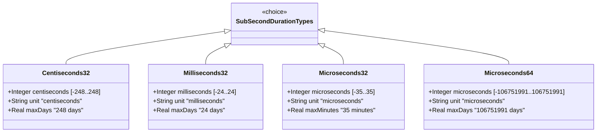

# Feature: Represent Sub-Second Time Duration Values

## Parent Epic
- [ ] #39 - Common YANG Data Types: Time Duration Measurement Types (semantic linkage: parent epic for all duration features)

## Description
The system must support YANG types for representing sub-second time durations: centiseconds (10^-2 s), milliseconds (10^-3 s), and microseconds (10^-6 s). Both int32-based types for shorter durations and int64-based for extended microsecond ranges are provided. All types should be range-restricted when only non-negative durations are desired.

## UML Class Diagram


## Interface Requirements

### 1. Payload Schema (JSON Example)
```json
{
  "responseTime": 150,
  "jitterMs": 45,
  "delayMicroseconds": 500,
  "totalDelayMicroseconds64": 3600000000
}
```

### 2. Validation & Constraints
- **centiseconds32**: Base type int32; units "centiseconds"; max range approx. [-248 days 13:13:56, 248 days 13:13:56]; equivalent to SMIv2 TimeInterval
- **milliseconds32**: Base type int32; units "milliseconds"; max range approx. [-24 days 20:31:23, 24 days 20:31:23]
- **microseconds32**: Base type int32; units "microseconds"; max range approx. [-00:35:47, 00:35:47]
- **microseconds64**: Base type int64; units "microseconds"; max range approx. [-106751991 days 04:00:54, 106751991 days 04:00:54]
- All: should be range-restricted with `range "0..max"` for non-negative contexts

### 3. Logical Operations & Interface Messages
- **duration arithmetic**: Add/subtract sub-second durations
- **unit conversion**: Convert between centiseconds, milliseconds, microseconds
- **range validation**: Verify value within representable range for the unit

### 4. Logical Exception States & Validation Failures
- **overflow**: Duration exceeds int32/int64 range for the unit
- **negative when restricted**: Negative value disallowed by range restriction
- **precision loss**: Automatic conversion between units may truncate

## Given-When-Then Acceptance Criteria

### Centiseconds32
- Given a centiseconds32 value of 150 (1.5 seconds), When validated, Then it is valid
- Given a centiseconds32 value of 2147483647, When validated, Then it is valid
- Given a centiseconds32 value with range "0..max", When a negative value is supplied, Then validation fails
- Given a centiseconds32 value of 2139359900, When converted to days, Then it represents approximately 247.6 days

### Milliseconds32
- Given a milliseconds32 value of 45, When validated, Then it is valid
- Given a milliseconds32 value of -45, When validated, Then it is valid
- Given a milliseconds32 value of 2147483647, When validated, Then it is valid (max positive)

### Microseconds32
- Given a microseconds32 value of 500, When validated, Then it is valid
- Given a microseconds32 value of 2147483647, When validated, Then it is valid
- Given a microseconds32 value of -2147483648, When validated, Then it is valid (min negative)

### Microseconds64
- Given a microseconds64 value of 3600000000 (1 hour), When validated, Then it is valid
- Given a microseconds64 value of 9223372036854775807, When validated, Then it is valid (max int64)
- Given a microseconds64 value with negative range "0..max", When validated with restriction, Then negative fails

## Specification Context (Verbatim)

From RFC 9911, Section 3:

"A period of time measured in units of 10^-2 seconds. The maximum time period that can be expressed is in the range [-248 days 13:13:56 to 248 days 13:13:56]."

"A period of time measured in units of 10^-3 seconds. The maximum time period that can be expressed is in the range [-24 days 20:31:23 to 24 days 20:31:23]."

"A period of time measured in units of 10^-6 seconds. The maximum time period that can be expressed is in the range [-00:35:47 to 00:35:47]."

"A period of time measured in units of 10^-6 seconds. The maximum time period that can be expressed is in the range [-106751991 days 04:00:54 to 106751991 days 04:00:54]."

## 4. Source References
Structural Schema: ietf-yang-types.yang (typedef centiseconds32, milliseconds32, microseconds32, microseconds64)
Normative Specification: RFC 9911, Section 3

## 5. Logical UI & Layout Bindings
- **Target LUI Component:** PropertyGrid
- **Target Layout Container ID:** yang-type-editor
- **Data Source Bindings:** Sub-second duration input with unit selector, range display, human-readable duration formatting
