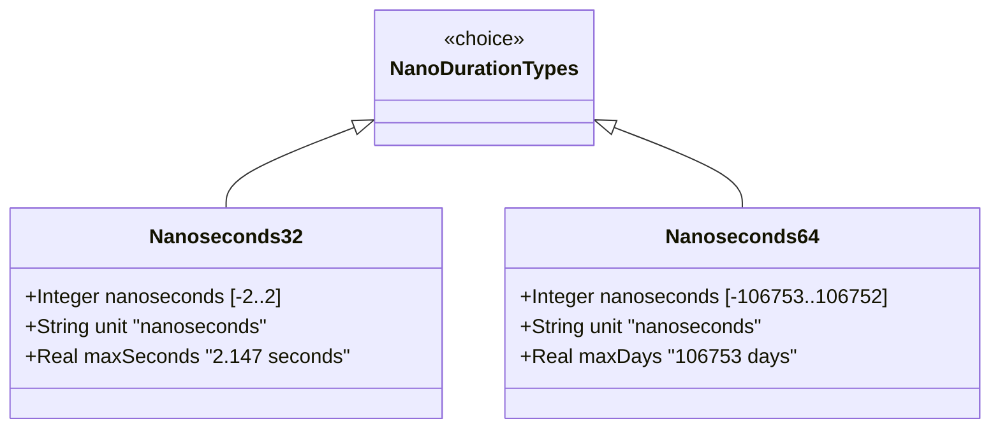

# Feature: Represent High-Resolution Nanosecond Duration Values

## Parent Epic
- [ ] #39 - Common YANG Data Types: Time Duration Measurement Types (semantic linkage: parent epic for all duration features)

## Description
The system must support YANG types for representing nanosecond-precision (10^-9 s) time durations. The nanoseconds32 type provides a compact int32-based range covering approximately ±2 seconds. The nanoseconds64 type provides an extended int64-based range covering approximately ±106753 days. Both types should be range-restricted when only non-negative durations are desired.

## UML Class Diagram


## Interface Requirements

### 1. Payload Schema (JSON Example)
```json
{
  "processingTimeNs": 500,
  "clockDriftNs": -1000,
  "cumulativeDelayNs64": 9223372036854775807
}
```

### 2. Validation & Constraints
- **nanoseconds32**: Base type int32; units "nanoseconds"; max range approx. [-00:00:02, 00:00:02] (approx. ±2.147 seconds); int32 range [-2147483648, 2147483647] nanoseconds
- **nanoseconds64**: Base type int64; units "nanoseconds"; max range approx. [-106753 days 23:12:44, 106752 days 0:47:16]; int64 range [-9223372036854775808, 9223372036854775807] nanoseconds
- Both: should be range-restricted with `range "0..max"` for non-negative contexts

### 3. Logical Operations & Interface Messages
- **duration arithmetic**: Add/subtract nanosecond durations
- **unit conversion**: Convert between nanoseconds and larger time units
- **range validation**: Verify value within representable range

### 4. Logical Exception States & Validation Failures
- **overflow**: Duration exceeds int32/int64 range
- **negative when restricted**: Negative value disallowed
- **truncation**: Converting nanoseconds to coarser units may lose precision

## Given-When-Then Acceptance Criteria

### Nanoseconds32
- Given a nanoseconds32 value of 500, When validated, Then it is valid
- Given a nanoseconds32 value of 2147483647, When validated, Then it is valid (max positive)
- Given a nanoseconds32 value of -2147483648, When validated, Then it is valid (min negative)
- Given a nanoseconds32 value with range "0..max", When a negative value is supplied, Then validation fails

### Nanoseconds64
- Given a nanoseconds64 value of 9223372036854775807, When validated, Then it is valid (max)
- Given a nanoseconds64 value of -9223372036854775808, When validated, Then it is valid (min)
- Given a nanoseconds64 value with range "0..max", When a negative value is supplied, Then validation fails
- Given a nanoseconds64 value of 86400000000000 (1 day), When converted to microseconds, Then it equals 86400000000 microseconds

## Specification Context (Verbatim)

From RFC 9911, Section 3:

"A period of time measured in units of 10^-9 seconds. The maximum time period that can be expressed is in the range [-00:00:02 to 00:00:02]."

"A period of time measured in units of 10^-9 seconds. The maximum time period that can be expressed is in the range [-106753 days 23:12:44 to 106752 days 0:47:16]."

## 4. Source References
Structural Schema: ietf-yang-types.yang (typedef nanoseconds32, nanoseconds64)
Normative Specification: RFC 9911, Section 3

## 5. Logical UI & Layout Bindings
- **Target LUI Component:** PropertyGrid
- **Target Layout Container ID:** yang-type-editor
- **Data Source Bindings:** Nanosecond precision input, range indicator, human-readable duration formatting
