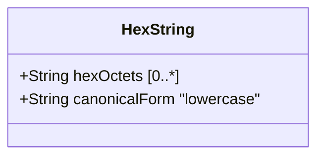

# Feature: Represent Hexadecimal String Octet Sequences

## Parent Epic
- [ ] #40 - Common YANG Data Types: String and Identifier Types (semantic linkage: parent epic for all string/identifier features)

## Description
The system must support a YANG type for representing arbitrary-length octet sequences as colon-separated hexadecimal digit pairs. The hex-string type encodes binary data in a human-readable hex form where each octet is represented by two hexadecimal digits separated by colons. Empty strings are permitted.

## UML Class Diagram


## Interface Requirements

### 1. Payload Schema (JSON Example)
```json
{
  "binaryData": "00:1a:2b:3c:4d:5e:6f:70",
  "fingerprint": "ab:cd:ef:01:23:45",
  "emptyData": ""
}
```

### 2. Validation & Constraints
- Base type: string
- Pattern: `([0-9a-fA-F]{2}(:[0-9a-fA-F]{2})*)?`
- Each octet: exactly 2 hexadecimal digits (0-9, a-f, A-F)
- Octets separated by colons
- Empty string allowed
- Canonical representation: lowercase characters

### 3. Logical Operations & Interface Messages
- **validate**: Verify hex string format
- **canonicalize**: Convert to lowercase
- **encode**: Convert binary data to hex-string
- **decode**: Convert hex-string to binary data
- **length**: Compute number of octets

### 4. Logical Exception States & Validation Failures
- **odd hex characters**: Octet not represented as exactly 2 hex digits
- **invalid character**: Non-hex character in input
- **leading/trailing colon**: Malformed separator placement
- **consecutive colons**: Double colon separator

## Given-When-Then Acceptance Criteria

- Given a hex-string value "00:1a:2b:3c", When validated, Then it is valid
- Given a hex-string value "", When validated, Then it is valid
- Given a hex-string value "0g:1a", When validated, Then it fails (invalid hex digit)
- Given a hex-string value "0:1a:2b", When validated, Then it fails (odd hex digit count)
- Given a hex-string value "00:1A:2B", When canonicalized, Then it produces "00:1a:2b"
- Given a hex-string value ":00:1a", When validated, Then it fails (leading colon)

## Specification Context (Verbatim)

From RFC 9911, Section 3:

"A hexadecimal string with octets represented as hex digits separated by colons. The canonical representation uses lowercase characters."

## 4. Source References
Structural Schema: ietf-yang-types.yang (typedef hex-string)
Normative Specification: RFC 9911, Section 3

## 5. Logical UI & Layout Bindings
- **Target LUI Component:** PropertyGrid
- **Target Layout Container ID:** yang-type-editor
- **Data Source Bindings:** Hex string input with pattern validation, binary preview, octet count display
