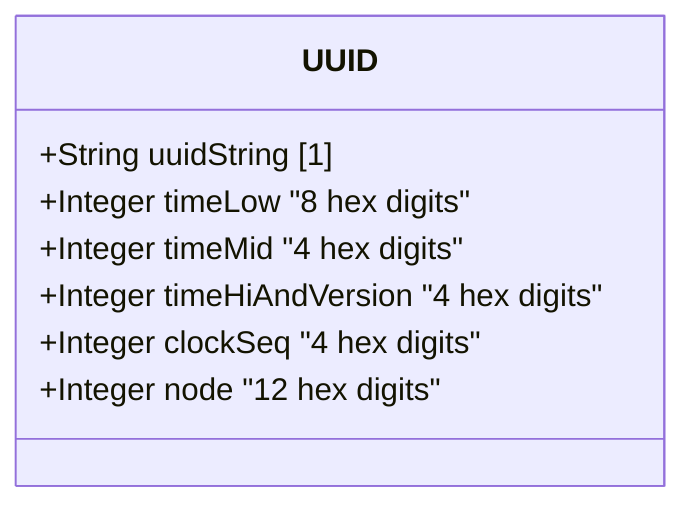

# Feature: Represent Universal Unique Identifier Values

## Parent Epic
- [ ] #40 - Common YANG Data Types: String and Identifier Types (semantic linkage: parent epic for all string/identifier features)

## Description
The system must support a YANG type for representing Universally Unique IDentifiers (UUIDs) in the string representation defined by RFC 9562. The UUID format uses 36-character hexadecimal strings with hyphens in the standard 8-4-4-4-12 pattern.

## UML Class Diagram


## Interface Requirements

### 1. Payload Schema (JSON Example)
```json
{
  "deviceId": "f81d4fae-7dec-11d0-a765-00a0c91e6bf6",
  "sessionId": "550e8400-e29b-41d4-a716-446655440000"
}
```

### 2. Validation & Constraints
- Base type: string
- Pattern: `[0-9a-fA-F]{8}-[0-9a-fA-F]{4}-[0-9a-fA-F]{4}-[0-9a-fA-F]{4}-[0-9a-fA-F]{12}`
- Format: 8 hex digits - 4 hex digits - 4 hex digits - 4 hex digits - 12 hex digits
- Total: 36 characters (32 hex digits + 4 hyphens)
- Canonical representation: lowercase characters
- Referenced standard: RFC 9562 (UUIDs)

### 3. Logical Operations & Interface Messages
- **validate**: Verify UUID string format
- **generate**: Create a new UUID
- **canonicalize**: Convert to lowercase
- **compare**: Compare two UUIDs
- **parse**: Decompose UUID into its 5 components

### 4. Logical Exception States & Validation Failures
- **invalid format**: Wrong number of hex digits or hyphens
- **wrong length**: UUID string not 36 characters
- **invalid version**: UUID version field outside valid range (implicit in validation)
- **non-hex characters**: Characters outside [0-9a-fA-F] in hex positions

## Given-When-Then Acceptance Criteria

- Given a UUID value "f81d4fae-7dec-11d0-a765-00a0c91e6bf6", When validated, Then it is valid
- Given a UUID value "550e8400-e29b-41d4-a716-446655440000", When validated, Then it is valid
- Given a UUID value "F81D4FAE-7DEC-11D0-A765-00A0C91E6BF6", When canonicalized, Then it produces "f81d4fae-7dec-11d0-a765-00a0c91e6bf6"
- Given a UUID value "f81d4fae-7dec-11d0-a765-00a0c91e6bf", When validated, Then it fails (too short)
- Given a UUID value "f81d4fae-7dec-11d0-a765-00a0c91e6bf60", When validated, Then it fails (too long)
- Given a UUID value "f81d4fae-7dec-11d0-a765-00a0c91e6bG6", When validated, Then it fails (hex character 'G' invalid)
- Given a UUID value "f81d4fae-7dec-11d0-a765-00a0c91e6b", When validated, Then it fails (fewer than 32 hex digits)

## Specification Context (Verbatim)

From RFC 9911, Section 3:

"A Universally Unique IDentifier in the string representation defined in RFC 9562. The canonical representation uses lowercase characters."

## 4. Source References
Structural Schema: ietf-yang-types.yang (typedef uuid)
Normative Specification: RFC 9911, Section 3

## 5. Logical UI & Layout Bindings
- **Target LUI Component:** PropertyGrid
- **Target Layout Container ID:** yang-type-editor
- **Data Source Bindings:** UUID input with pattern validation, generate button, canonical preview
