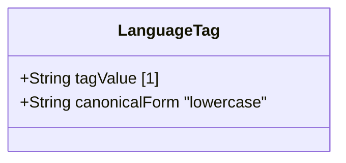

# Feature: Represent Language Tag Values

## Parent Epic
- [ ] #40 - Common YANG Data Types: String and Identifier Types (semantic linkage: parent epic for all string/identifier features)

## Description
The system must support a YANG type for representing language tags according to RFC 5646 (BCP 47). Values must be well-formed language tags. Implementations MAY further limit values to those permitted by a validating processor as defined in BCP 47. The canonical representation uses lowercase characters. This type aligns with the SMIv2 LangTag textual convention for language tags fitting the length constraints imposed by that convention.

## UML Class Diagram


## Interface Requirements

### 1. Payload Schema (JSON Example)
```json
{
  "systemLanguage": "en-US",
  "locale": "zh-Hans-CN",
  "contentLanguage": "fr-CA"
}
```

### 2. Validation & Constraints
- Base type: string (no pattern restriction in YANG type)
- Must be a well-formed language tag per RFC 5646 (BCP 47)
- Canonical representation: lowercase characters
- Equivalent to SMIv2 LangTag textual convention (LANGTAG-TC-MIB)
- Implementations MAY apply BCP 47 validating processor rules (additional restrictions)
- No length pattern constraint defined in the basic type; aligned with SMIv2 length constraints for LangTag

### 3. Logical Operations & Interface Messages
- **validate**: Verify the string is a well-formed BCP 47 language tag
- **canonicalize**: Convert to lowercase canonical form
- **parse**: Decompose into primary language, extended language, script, region, variants, extensions

### 4. Logical Exception States & Validation Failures
- **malformed tag**: String does not conform to BCP 47 well-formedness rules
- **empty tag**: Empty string is not a valid language tag
- **invalid subtag**: Subtag violates RFC 5646 syntax

## Given-When-Then Acceptance Criteria

- Given a language-tag value "en-US", When validated, Then it is a well-formed BCP 47 tag
- Given a language-tag value "EN-US", When canonicalized, Then it produces "en-us"
- Given a language-tag value "zh-Hans-CN", When validated, Then it is valid
- Given a language-tag value "en", When validated, Then it is valid
- Given a language-tag value "i-klingon", When validated, Then it is valid (grandfathered registration)
- Given a language-tag value "x-private", When validated, Then it is valid (private use)
- Given a language-tag value "", When validated, Then it fails (empty not a valid tag)
- Given a language-tag value "en_US" (underscore instead of hyphen), When validated, Then it is not a well-formed BCP 47 tag
- Given a language-tag value that fits the SMIv2 LangTag length constraints, When validated, Then it conforms to the SMIv2 textual convention

## Specification Context (Verbatim)

From RFC 9911, Section 3:

"A language tag according to RFC 5646 (BCP 47). The canonical representation uses lowercase characters.

Values of this type must be well-formed language tags, in conformance with the definition of well-formed tags in BCP 47. Implementations MAY further limit the values they accept to those permitted by a 'validating' processor, as defined in BCP 47.

The canonical representation of values of this type is aligned with the SMIv2 LangTag textual convention for language tags fitting the length constraints imposed by the LangTag textual convention."

## 4. Source References
Structural Schema: ietf-yang-types.yang (typedef language-tag)
Normative Specification: RFC 9911, Section 3

## 5. Logical UI & Layout Bindings
- **Target LUI Component:** PropertyGrid
- **Target Layout Container ID:** yang-type-editor
- **Data Source Bindings:** Language tag input with BCP 47 validation, canonicalization display
