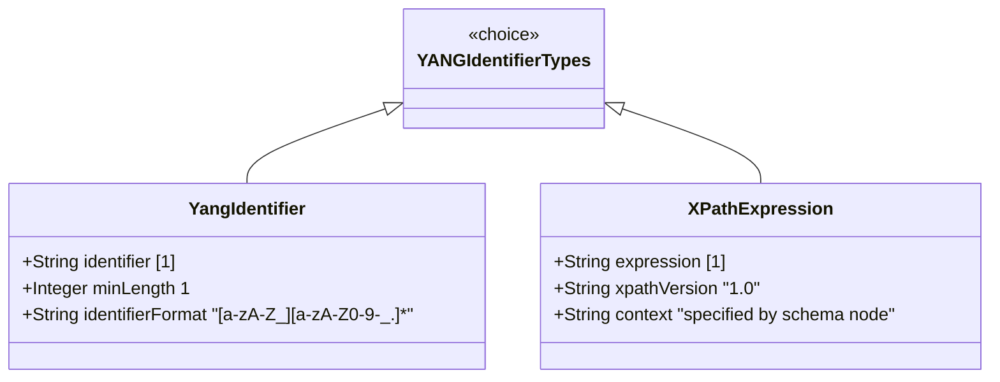

# Feature: Represent YANG Identifier and XPath Expression Values

## Parent Epic
- [ ] #40 - Common YANG Data Types: String and Identifier Types (semantic linkage: parent epic for all string/identifier features)

## Description
The system must support YANG types for YANG identifiers and XPath 1.0 expressions. The yang-identifier type represents YANG identifier strings conforming to the identifier rule in RFC 7950 Section 14, supporting alphabetic/underscore start characters followed by alphanumeric characters, underscores, hyphens, or dots. The xpath1.0 type represents XPath 1.0 expressions with the XPath context specified in the schema node description.

## UML Class Diagram


## Interface Requirements

### 1. Payload Schema (JSON Example)
```json
{
  "moduleName": "ietf-interfaces",
  "leafName": "mtu",
  "xpathFilter": "/interfaces/interface[name='eth0']/mtu",
  "xpathExpression": "if:mtu > 1500"
}
```

### 2. Validation & Constraints
- **yang-identifier**: Base type string; length "1..max"; pattern `[a-zA-Z_][a-zA-Z0-9\-_.]*`; first character must be alphabetic or underscore; subsequent characters: alphanumeric, underscore, hyphen, or dot; conforms to YANG 1.1 (RFC 7950); if used in YANG 1 context (RFC 6020), identifiers starting with 'xml' character sequence (any case) must be excluded
- **xpath1.0**: Base type string; represents XPath 1.0 expression; schema node description MUST specify the XPath context; no additional pattern restriction

### 3. Logical Operations & Interface Messages
- **validate (yang-identifier)**: Verify identifier conforms to RFC 7950 Section 14; check xml prefix exclusion for YANG 1 context
- **validate (xpath1.0)**: Parse and validate XPath 1.0 expression syntax
- **evaluate**: Evaluate XPath expression against a data tree

### 4. Logical Exception States & Validation Failures
- **empty identifier**: yang-identifier with zero length
- **invalid first character**: Identifier starts with a digit
- **invalid character**: Identifier contains character not in [a-zA-Z0-9\-_.]
- **xml prefix (YANG 1)**: Identifier starts with 'XML' case-insensitive in YANG 1 context
- **empty xpath**: Empty XPath expression
- **undefined context**: XPath expression schema node without specified context
- **malformed xpath**: XPath 1.0 syntax error

## Given-When-Then Acceptance Criteria

### YANG Identifier
- Given a yang-identifier value "ietf-interfaces", When validated, Then it is valid
- Given a yang-identifier value "_private", When validated, Then it is valid
- Given a yang-identifier value "my-leaf_ref", When validated, Then it is valid
- Given a yang-identifier value "0invalid", When validated, Then it fails (starts with digit)
- Given a yang-identifier value "", When validated, Then it fails (empty)
- Given a yang-identifier value "xml-type", When validated in YANG 1 context, Then it fails (starts with 'xml' sequence)
- Given a yang-identifier value "XML_TYPE", When validated in YANG 1 context, Then it fails
- Given a yang-identifier value "xml-type", When validated in YANG 1.1 context, Then it is valid
- Given a yang-identifier value "valid.identifier", When validated, Then it is valid (dot allowed)

### XPath 1.0
- Given an xpath1.0 value "/interfaces/interface", When validated with an appropriate context, Then it is syntactically valid
- Given an xpath1.0 value "'string' = 'string'", When validated, Then it is a valid XPath expression
- Given an xpath1.0 schema node, When its description does not specify the XPath context, Then it violates the specification
- Given an xpath1.0 value "invalid|syntax]", When validated, Then it fails (malformed XPath)

## Specification Context (Verbatim)

From RFC 9911, Section 3:

"A YANG identifier string as defined by the 'identifier' rule in Section 14 of RFC 7950. An identifier must start with an alphabetic character or an underscore followed by an arbitrary sequence of alphabetic or numeric characters, underscores, hyphens, or dots.

This definition conforms to YANG 1.1 defined in RFC 7950. In RFC 6991, this definition excluded all identifiers starting with any possible combination of the lowercase or uppercase character sequence 'xml', as required by YANG 1 defined in RFC 6020. If this type is used in a YANG 1 context, then this restriction still applies."

"This type represents an XPATH 1.0 expression. When a schema node is defined that uses this type, the description of the schema node MUST specify the XPath context in which the XPath expression is evaluated."

## 4. Source References
Structural Schema: ietf-yang-types.yang (typedef yang-identifier, xpath1.0)
Normative Specification: RFC 9911, Section 3

## 5. Logical UI & Layout Bindings
- **Target LUI Component:** PropertyGrid
- **Target Layout Container ID:** yang-type-editor
- **Data Source Bindings:** Identifier input with pattern validation, XPath input with expression syntax highlighting, context specification field
