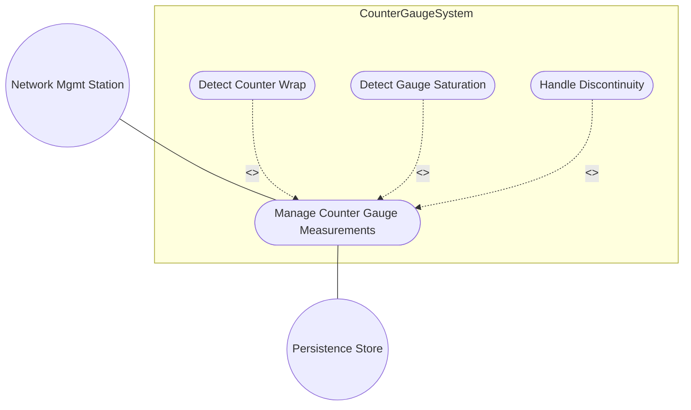
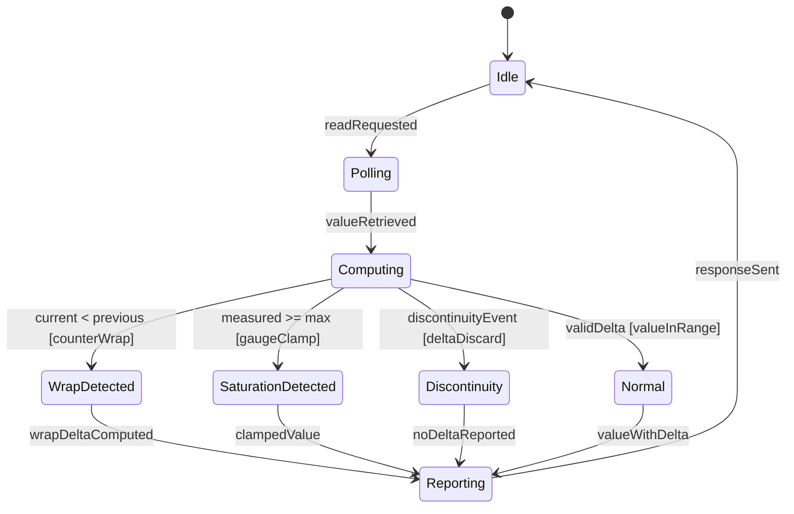

# Use Case: Manage Counter and Gauge Measurement Operations

## Parent Epic
- [#36](https://github.com/gintatkinson/3dgs-011/issues/36) - Common YANG Data Types: Counter and Gauge Measurement Types

## 1. Actors
- **Primary Actor:** Network Management Station
- **Secondary Actors:** Counter/Gauge Service, Persistence Store

## 2. Preconditions
- System has defined counter32, counter64, gauge32, gauge64 schema nodes
- Counter/gauge instances exist in the data tree
- Zero-based counter instances have been initialized to 0

## 3. Trigger
Management station polls or reads a counter/gauge schema node value.

## 4. Main Success Scenario (Basic Flow)
1. Management Station requests current value of a counter or gauge schema node.
2. Counter/Gauge Service retrieves the stored value from Persistence Store.
3. For counters: Service compares current value against previous value.
4. If current >= previous and no discontinuity, Service returns the value with normal delta.
5. For gauges: Service checks if value is at representable bounds.
6. If gauge value is within [0, max], Service returns the unclamped value.
7. Management Station receives the measurement value with status indicator.

## 5. Alternate and Exception Flows
- **5a. Counter wrap detected (Branches from Basic Flow step 3):**
  1. Counter/Gauge Service detects currentValue < previousValue (wrap occurred).
  2. Service computes wrapped delta as (maxValue - previousValue + currentValue + 1).
  3. Service appends wrapIndicator flag and returns value + delta to Management Station.
  4. Management Station records the wrap event and adjusts accumulated totals.

- **5b. Gauge saturation high (Branches from Basic Flow step 5):**
  1. Counter/Gauge Service detects measuredValue >= maxRange.
  2. Service clamps reported value to maxValue and sets saturationHigh flag.
  3. Service returns clamped value with saturation indicator.
  4. Management Station displays gauge at maximum with saturation warning.

- **5c. Counter discontinuity event (Branches from Basic Flow step 3):**
  1. Service detects discontinuityTimestamp has changed since last read.
  2. Service discards the delta computation for this interval.
  3. Service returns current value only with discontinuityFlag.
  4. Management Station records the discontinuity and does not compute delta.

- **5d. Gauge saturation low (Branches from Basic Flow step 5):**
  1. Service detects measuredValue <= minRange.
  2. Service clamps reported value to 0 and sets saturationLow flag.
  3. Service returns clamped value with underflow indicator.

- **5e. Zero-based counter initial read (Branches from Basic Flow step 3):**
  1. Service has no previousValue stored (first read after creation).
  2. Service uses initial value 0 as previousValue.
  3. Service computes delta = currentValue - 0.
  4. Service returns value and delta to Management Station.

## 6. Postconditions (Guarantees)
- **Success Guarantee:** Management Station receives accurate measurement value with appropriate wrap/saturation/discontinuity indicators. Counter delta computations account for wrap-around. Gauge values never exceed representable bounds.
- **Failure Guarantee:** If Persistence Store is unavailable, Service returns error status. No stale or incorrect values are returned.

## UML Diagrams
### Use Case Diagram

### State Machine Diagram

## 7. Operational Context
From RFC 9911, Section 3: Counters are monotonically increasing values that wrap at maximum. Gauges are non-negative integers bounded by representable range. Zero-based counters have defined initial value 0. Discontinuities invalidate delta computations between observations.

## 8. Realization Matrix
### Required User Stories
- [#41](https://github.com/gintatkinson/3dgs-011/issues/41) - Read and Monitor Counter Values with Wrap Detection (semantic linkage: core read/monitor behavior for counters)
- [#42](https://github.com/gintatkinson/3dgs-011/issues/42) - Read Gauge Values with Saturation State Awareness (semantic linkage: gauge saturation detection behavior)
- [#43](https://github.com/gintatkinson/3dgs-011/issues/43) - Compute Counter Delta Across Discontinuity Events (semantic linkage: discontinuity handling for accurate deltas)

### Required Features
- [#21](https://github.com/gintatkinson/3dgs-011/issues/21) - Represent Monotonic Counter Values with Wrap-Around (semantic linkage: structural counter types used in this UC)
- [#22](https://github.com/gintatkinson/3dgs-011/issues/22) - Represent Bounded Gauge Values with Rising and Falling Range (semantic linkage: structural gauge types used in this UC)

## Source References
Structural Schema: ietf-yang-types.yang
Normative Specification: RFC 9911, Section 3
