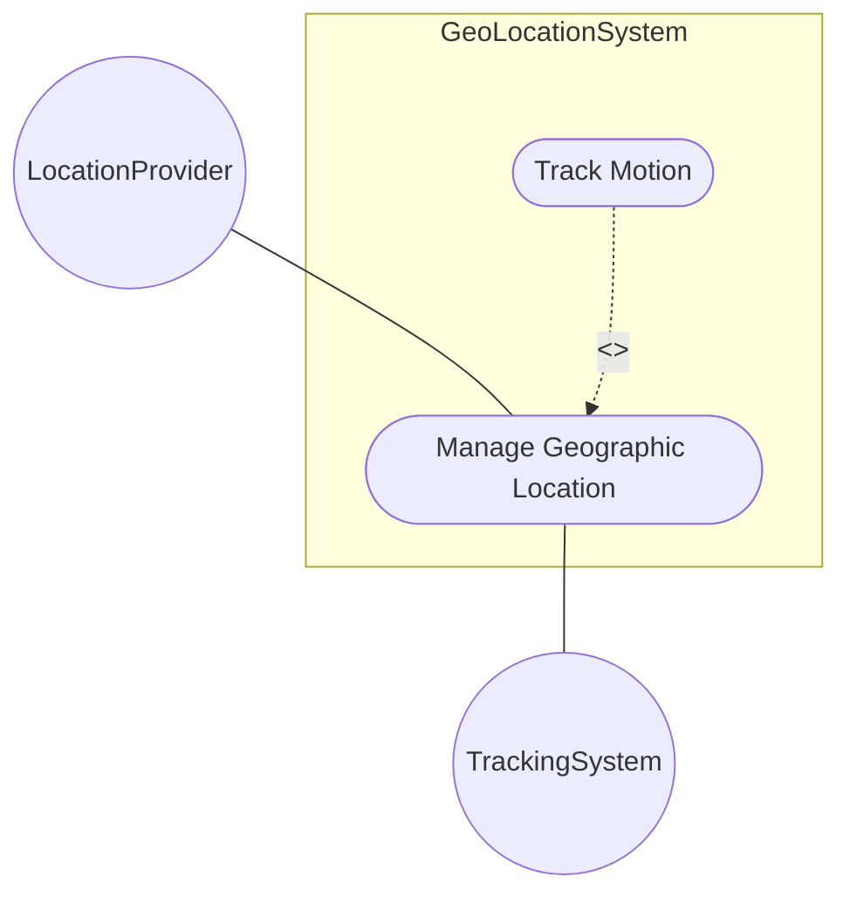
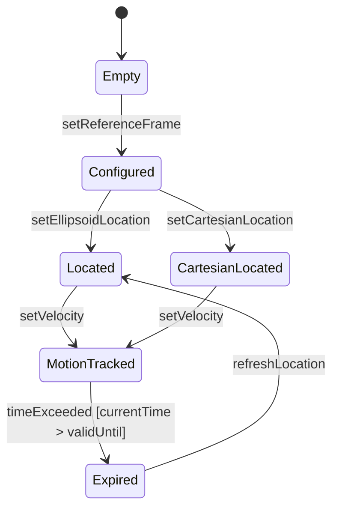

# Use Case: Manage Complete Geographic Location Record

## Parent Epic
- [ ] [#8](https://github.com/gintatkinson/3dgs-011/blob/main/docs/epics/epic-02-position-coordinates-motion-tracking.md) - Geographic Location: Position Coordinates and Motion Tracking (semantic linkage: this use case manages the complete geo-location record within the position and motion epic)

## 1. Actors
- **Primary Actor:** LocationProvider
- **Secondary Actors:** GeoLocationService, CoordinateRepository

## 2. Preconditions
- The geo-location container exists and is accessible.
- A reference frame has been configured (or defaults apply).

## 3. Trigger
A LocationProvider initiates a request to create or update a geographic location record with coordinates.

## 4. Main Success Scenario (Basic Flow)
1. LocationProvider selects a target geo-location record.
2. LocationProvider provides latitude, longitude, and optional height values.
3. GeoLocationService validates the coordinate values against the reference frame.
4. GeoLocationService stores the ellipsoidal location coordinates.
5. System confirms successful recording of the location.

## 5. Alternate and Exception Flows
- **5a. Invalid coordinate values (Branches from Basic Flow step 3):**
  1. GeoLocationService detects latitude/longitude outside valid range.
  2. GeoLocationService returns validation error to LocationProvider.
  3. LocationProvider corrects the values and retries.
- **5b. Cartesian coordinate selection (Branches from Basic Flow step 2):**
  1. LocationProvider provides X, Y, Z Cartesian values instead.
  2. GeoLocationService validates and stores Cartesian coordinates.
  3. Previous ellipsoidal coordinates are cleared per choice semantics.
  4. System confirms successful recording.
- **5c. Height value out of valid range (Branches from Basic Flow step 3):**
  1. GeoLocationService detects that the height value exceeds the valid range for the reference frame.
  2. GeoLocationService returns a validation error specifying the height constraint.
  3. LocationProvider adjusts the height value and retries.
- **5d. Reference frame not yet configured (Branches from Basic Flow step 1):**
  1. GeoLocationService detects that no reference frame has been configured.
  2. GeoLocationService returns a precondition error indicating missing reference frame.
  3. LocationProvider cancels the operation or arranges for reference frame configuration first.
- **5e. Both ellipsoid and Cartesian coordinates provided (Branches from Basic Flow step 2):**
  1. LocationProvider attempts to set both ellipsoidal and Cartesian coordinates simultaneously.
  2. GeoLocationService rejects the request per choice semantics (only one case active at a time).
  3. System returns a conflict error.
  4. LocationProvider selects one coordinate representation and retries.
- **5f. Location update while motion tracking is active (Branches from Basic Flow step 4):**
  1. GeoLocationService detects an existing velocity vector for the location.
  2. System updates the coordinates and clears the stale velocity data.
  3. System notifies the LocationProvider that velocity data was cleared.
  4. LocationProvider re-submits velocity data if needed.
- **5g. Persistent storage failure (Branches from Basic Flow step 4):**
  1. CoordinateRepository encounters a storage error while persisting the location.
  2. System rolls back the transaction and returns a server error.
  3. LocationProvider retries the operation after a delay.
- **5h. Concurrent modification conflict (Branches from Basic Flow step 3):**
  1. A concurrent update modifies the same location record during validation.
  2. GeoLocationService detects the version conflict.
  3. System returns a conflict error with the current state.
  4. LocationProvider reconciles and retries.

## 6. Postconditions (Guarantees)
- **Success Guarantee:** The geo-location record contains valid coordinates and is queryable.
- **Failure Guarantee:** No location data is modified; the system returns an error status.

## UML Diagrams
### Use Case Diagram

### State Machine Diagram

## 7. Operational Context
Location is specified using two or three coordinate values: latitude/longitude/height (ellipsoid) or X/Y/Z (Cartesian). Only one case may be active at a time. The exact meanings of all values are defined by the geodetic-datum.

## 8. Realization Matrix
### Required User Stories
- [ ] [#9](https://github.com/gintatkinson/3dgs-011/blob/main/docs/user-stories/us-01-register-reference-frame.md) - Register Geographic Location Reference Frame (semantic linkage: the reference frame must be configured before location recording)
- [ ] [#10](https://github.com/gintatkinson/3dgs-011/blob/main/docs/user-stories/us-02-record-ellipsoid-location.md) - Record Ellipsoidal Location Coordinates (semantic linkage: main success scenario uses ellipsoidal coordinates)
- [ ] [#11](https://github.com/gintatkinson/3dgs-011/blob/main/docs/user-stories/us-03-record-cartesian-location.md) - Record Cartesian Location Coordinates (semantic linkage: alternate flow uses Cartesian coordinates)
### Required Features
- [ ] [#3](https://github.com/gintatkinson/3dgs-011/blob/main/docs/features/feat-03-ellipsoid-coordinate-positioning.md) - Specify Ellipsoid Geodetic Coordinates (semantic linkage: primary coordinate method)
- [ ] [#4](https://github.com/gintatkinson/3dgs-011/blob/main/docs/features/feat-04-cartesian-coordinate-positioning.md) - Specify Cartesian Spatial Coordinates (semantic linkage: alternate coordinate method)

## Source References
Structural Schema: ietf-geo-location@2022-02-11.yang
Normative Specification: RFC 9179 Sections 2.2, 2.4
