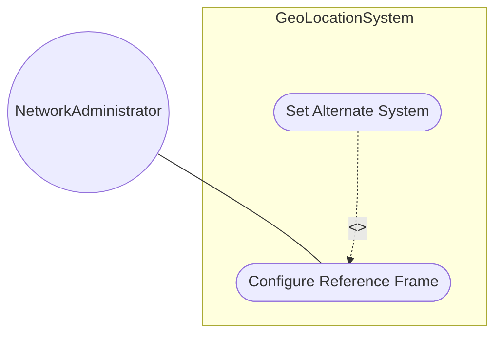
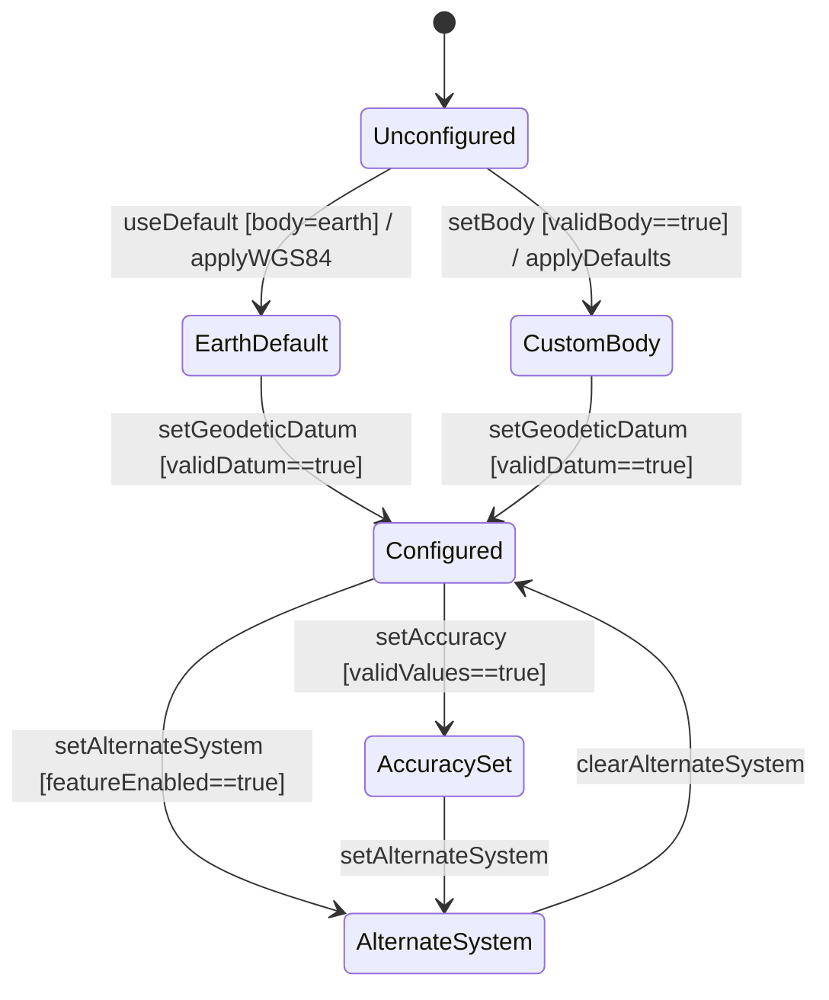

# Use Case: Configure Reference Frame and Geodetic System

## Parent Epic
- [ ] [#7](https://github.com/gintatkinson/3dgs-011/blob/main/docs/epics/epic-01-reference-frame-geodetic-system.md) - Geographic Location: Reference Frame and Geodetic System Definition (semantic linkage: this use case configures the reference frame within the reference frame epic)

## 1. Actors
- **Primary Actor:** NetworkAdministrator
- **Secondary Actors:** GeoLocationService, ReferenceFrameRepository

## 2. Preconditions
- The system supports the geo-location module.
- The NetworkAdministrator has access to reference frame configuration.

## 3. Trigger
A NetworkAdministrator needs to establish or change the coordinate reference context for location data.

## 4. Main Success Scenario (Basic Flow)
1. NetworkAdministrator specifies the astronomical body (e.g., "earth", "mars").
2. NetworkAdministrator optionally sets the geodetic-datum (defaults to "wgs-84" for Earth).
3. NetworkAdministrator optionally specifies coordinate and height accuracy.
4. GeoLocationService validates the configuration values.
5. System stores the reference frame and geodetic system configuration.
6. System confirms the reference frame is active.

## 5. Alternate and Exception Flows
- **5a. Alternate system specified (Branches from Basic Flow step 1):**
  1. NetworkAdministrator provides an alternate-system value (e.g., "virtual-reality-sim").
  2. System verifies the alternate-systems feature is enabled.
  3. System applies the alternate-system, modifying the interpretation of all coordinate values.
  4. System confirms the alternate reference frame.
- **5b. Invalid geodetic-datum (Branches from Basic Flow step 2):**
  1. NetworkAdministrator provides a geodetic-datum not in the IANA registry.
  2. System rejects the value with a validation error.
  3. NetworkAdministrator selects from valid IANA-registered options.
  4. System accepts the corrected datum.
- **5c. Invalid astronomical body value (Branches from Basic Flow step 1):**
  1. NetworkAdministrator provides an astronomical body identifier that is not recognized by the system.
  2. GeoLocationService returns a validation error with the list of supported bodies.
  3. NetworkAdministrator selects from the supported list and retries.
- **5d. Accuracy values outside acceptable range (Branches from Basic Flow step 3):**
  1. NetworkAdministrator sets coord-accuracy or height-accuracy to a negative value.
  2. GeoLocationService rejects the negative accuracy value with a validation error.
  3. NetworkAdministrator corrects the accuracy to a non-negative decimal64 value.
  4. System accepts the corrected accuracy configuration.
- **5e. Attempt to modify reference frame while locations exist (Branches from Basic Flow step 4):**
  1. GeoLocationService detects active geo-location records associated with the current reference frame.
  2. System warns that reconfiguring the reference frame may invalidate existing location interpretations.
  3. NetworkAdministrator confirms the change, and existing location data is re-interpreted under the new reference frame.
  4. System logs the reconfiguration event for audit purposes.

## 6. Postconditions (Guarantees)
- **Success Guarantee:** The reference frame and geodetic system are configured and all subsequent location data is interpreted against this context.
- **Failure Guarantee:** The reference frame remains in its previous state; no configuration is modified.

## UML Diagrams
### Use Case Diagram

### State Machine Diagram

## 7. Operational Context
The reference-frame defines what the location values refer to and their meaning. The default astronomical-body value is 'earth' and the default geodetic-datum for Earth is 'wgs-84'. The IANA "Geodetic System Values" registry defines valid datum values.

## 8. Realization Matrix
### Required User Stories
- [ ] [#9](https://github.com/gintatkinson/3dgs-011/blob/main/docs/user-stories/us-01-register-reference-frame.md) - Register Geographic Location Reference Frame (semantic linkage: primary user story for reference frame registration)
- [ ] [#16](https://github.com/gintatkinson/3dgs-011/blob/main/docs/user-stories/us-08-configure-geodetic-accuracy.md) - Configure Coordinate Accuracy and Height Accuracy (semantic linkage: accuracy configuration is part of reference frame setup)
### Required Features
- [ ] [#1](https://github.com/gintatkinson/3dgs-011/blob/main/docs/features/feat-01-celestial-body-alternate-system.md) - Define Celestial Body and Alternate System Reference (semantic linkage: identifies the celestial body)
- [ ] [#2](https://github.com/gintatkinson/3dgs-011/blob/main/docs/features/feat-02-geodetic-datum-accuracy.md) - Configure Geodetic Datum and Coordinate Accuracy (semantic linkage: geodetic system configuration)

## Source References
Structural Schema: ietf-geo-location@2022-02-11.yang
Normative Specification: RFC 9179 Sections 2.1, 6.1
