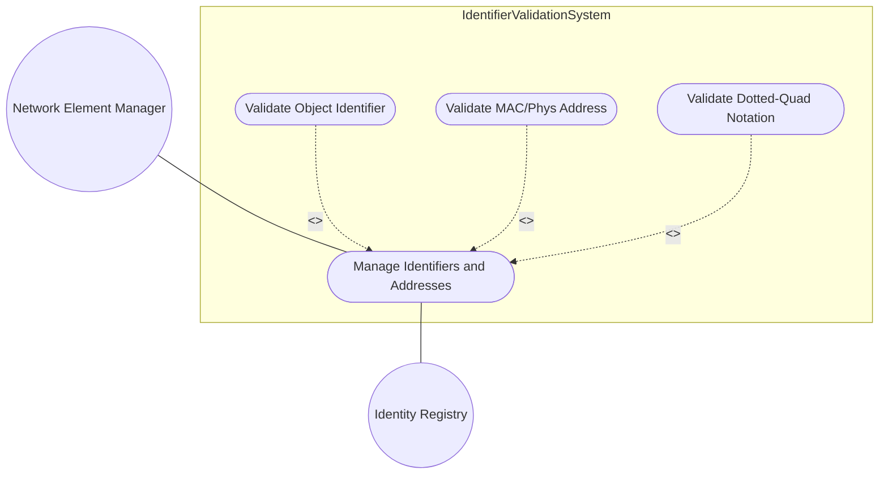
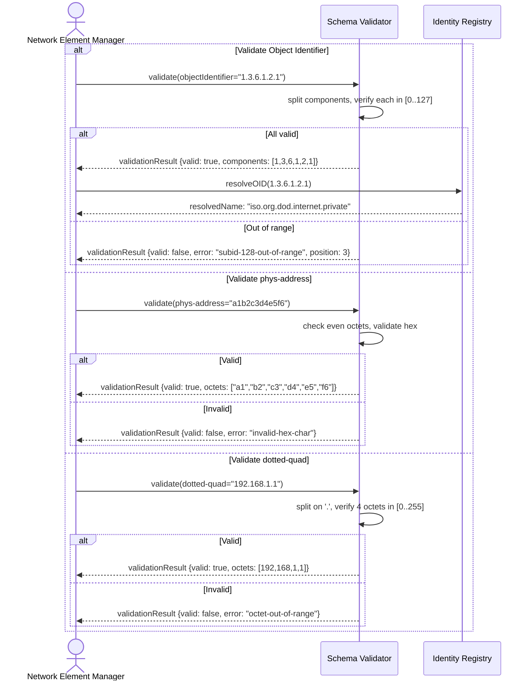

# Use Case: Manage Object Identifiers and Network Address Validation

## Parent Epic
- [#37](https://github.com/gintatkinson/3dgs-011/issues/37) - Common YANG Data Types: Identifier and Address Types

## 1. Actors
- **Primary Actor:** Network Element Manager
- **Secondary Actor:** Schema Validator, Identity Registry

## 2. Preconditions
- Object identifier (object-identifier-128) or MAC address or dotted-quad instance exists
- Authority-level schema has been loaded

## 3. Trigger
Manager submits an identifier or address value for validation or retrieval.

## 4. Main Success Scenario (Basic Flow)
1. Manager provides an identifier or address value to the system.
2. Schema Validator parses the hierarchical components.
3. For object-identifier: Validator verifies each subidentifier is in [0..127].
4. For object-identifier-128: Validator verifies each subidentifier is in [0..127].
5. For phys-address: Validator confirms even number of hex octets.
6. For dotted-quad: Validator splits on '.' and verifies 4 octets in [0..255].
7. System returns parsed components with validation pass status.

## 5. Alternate and Exception Flows
- **5a. Object identifier subidentifier out of range (Branches from step 3):**
  1. Validator finds subidentifier value >= 128.
  2. Validator returns validationError with out-of-range component index.
  3. Manager displays syntax error with component position.

- **5b. phys-address odd octet count (Branches from step 5):**
  1. Validator detects odd number of octets in hex string.
  2. Validator returns validationError: invalid-octet-count.
  3. Manager displays address format error.

- **5c. phys-address invalid hex characters (Branches from step 5):**
  1. Validator finds non-hexadecimal characters.
  2. Validator returns validationError: invalid-hex-char.
  3. Manager displays character position error.

- **5d. dotted-quad octet out of range (Branches from step 6):**
  1. Validator finds octet value > 255.
  2. Validator returns validationError: octet-out-of-range.
  3. Manager displays range violation error.

- **5e. dotted-quad format invalid (Branches from step 6):**
  1. Validator finds string does not match dotted-quad pattern.
  2. Validator returns validationError: invalid-format.
  3. Manager displays format violation error.

## 6. Postconditions (Guarantees)
- **Success Guarantee:** Identifier or address is validated and decomposed into semantic components. System returns structured representation of the validated value.
- **Failure Guarantee:** No partial validation results are persisted. Error response includes the specific violation type and position.

## UML Diagrams
### Use Case Diagram

### Sequence Diagram

## 7. Operational Context
From RFC 9911, Section 4: Types include object-identifier (32-bit subidentifiers), object-identifier-128 (7-bit subidentifiers), phys-address (even-octet hex string), and dotted-quad (IPv4 address notation). All types require strict format validation before use.

## 8. Realization Matrix
### Required User Stories
- [#46](https://github.com/gintatkinson/3dgs-011/issues/46) - Validate Object Identifier Hierarchical Format (semantic linkage: OID validation core behavior)
- [#48](https://github.com/gintatkinson/3dgs-011/issues/48) - Validate MAC and Physical Address Format (semantic linkage: phys-address format validation)
- [#50](https://github.com/gintatkinson/3dgs-011/issues/50) - Parse and Validate Dotted-Quad Notation (semantic linkage: dotted-quad validation)

### Required Features
- [#23](https://github.com/gintatkinson/3dgs-011/issues/23) - Represent Object Identifier Values (semantic linkage: structural OID type)
- [#24](https://github.com/gintatkinson/3dgs-011/issues/24) - Represent Physical and MAC Address Values (semantic linkage: structural phys-address type)
- [#25](https://github.com/gintatkinson/3dgs-011/issues/25) - Represent Dotted-Quad Notation Values (semantic linkage: structural dotted-quad type)

## Source References
Structural Schema: ietf-yang-types.yang
Normative Specification: RFC 9911, Section 4
