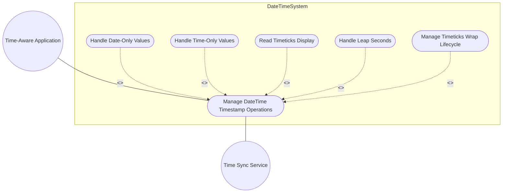
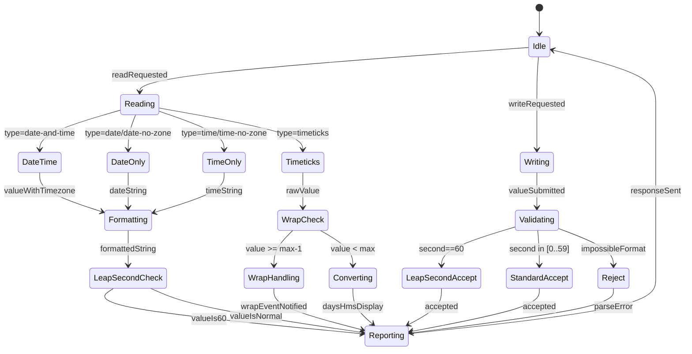

# Use Case: Manage Date-Time and Timestamp Operations

## Parent Epic
- [#38](https://github.com/gintatkinson/3dgs-011/issues/38) - Common YANG Data Types: Date-Time and Timestamp Types

## 1. Actors
- **Primary Actor:** Time-Aware Application
- **Secondary Actors:** Time Sync Service, Timestamp Monitor

## 2. Preconditions
- date-and-time, timeticks, date, time, date-no-zone, time-no-zone schema nodes are defined
- Time sync service provides authoritative clock source

## 3. Trigger
Application reads or writes a date-time or timestamp value.

## 4. Main Success Scenario (Basic Flow)
1. Application requests current date-and-time value from system.
2. Time Sync Service provides authoritative timestamp with timezone offset.
3. System formats as complete date-time string: YYYY-MM-DDThh:mm:ss±hh:mm.
4. Application receives fully-qualified date-time with timezone offset.

## 5. Alternate and Exception Flows
- **5a. Date-only value (Branches from step 1):**
  1. Application requests date-only value (date or date-no-zone type).
  2. System returns date-only string in YYYY-MM-DD format.
  3. If date-no-zone, no timezone offset is appended.

- **5b. Time-only value (Branches from step 1):**
  1. Application requests time-only value (time or time-no-zone type).
  2. System returns time-only string in hh:mm:ss[.fff] format.
  3. If time-no-zone, no timezone offset is appended.

- **5c. Timeticks read (Branches from step 1):**
  1. Application reads a timeticks node (hundredths of a second since epoch).
  2. System converts timeticks to TimeSpan with days:hours:minutes:seconds.hundredths.
  3. Application receives the formatted TimeSpan display.

- **5d. Timeticks wrap at max (Branches from step 1):**
  1. Timestamp Monitor detects timeticks value near 2^32-1 (max).
  2. System raises wrap-warning notification.
  3. Application prepares for timeticks reset to 0 on next increment.
  4. After wrap, system records the wrap event with timestamp.

- **5e. Leap second insertion (Branches from step 4):**
  1. Time Sync Service signals positive leap second (23:59:60).
  2. System inserts :60 second value in date-and-time string.
  3. Application processes the leap second value without error.
  4. On next tick, system returns :00 with incremented minute.

- **5f. Timezone-unaware date/time (Branches from step 5a/b):**
  1. Application uses date-no-zone or time-no-zone type.
  2. System validates format without timezone constraint.
  3. Application receives date-only/time-only string.

- **5g. Timeticks reset lifecycle (Branches from step 5d after wrap):**
  1. System tracks timeticks wrap counter (increments on each wrap).
  2. Application reads both current timeticks value and wrap counter.
  3. Application computes elapsed time: wrapCounter * maxTimeticks + currentTimeticks.
  4. System logs the wrap event with occurrence timestamp.

## 6. Postconditions (Guarantees)
- **Success Guarantee:** Date-time values are formatted with correct timezone offset. Leap seconds are accepted as valid :60 values. Timeticks display includes days:hh:mm:ss.hundredths format with wrap lifecycle tracking.
- **Failure Guarantee:** Invalid date-time formats (out-of-range month/day, impossible time) return parse errors. No ambiguous timezone data is persisted.

## UML Diagrams
### Use Case Diagram

### State Machine Diagram

## 7. Operational Context
From RFC 9911, Section 5: date-and-time includes timezone offset; date and date-no-zone are date-only; time and time-no-zone are time-only. Leap seconds are represented as :60. timeticks is hundredths of a second since SNMP epoch with wrap at 2^32-1. RFC 9911 adds date, date-no-zone, time, time-no-zone types (from RFC 6991).

## 8. Realization Matrix
### Required User Stories
- [#51](https://github.com/gintatkinson/3dgs-011/issues/51) - Parse and Format DateTime Values with Timezone Offset (semantic linkage: date-and-time parse/format behavior)
- [#54](https://github.com/gintatkinson/3dgs-011/issues/54) - Handle Leap Seconds in Timestamp Processing (semantic linkage: leap second handling)
- [#55](https://github.com/gintatkinson/3dgs-011/issues/55) - Detect and Manage Timeticks Wrap and Timestamp Reset Lifecycle (semantic linkage: timeticks wrap lifecycle)
- [#58](https://github.com/gintatkinson/3dgs-011/issues/58) - Validate Date and Time Values Without Timezone Offset (semantic linkage: date-no-zone/time-no-zone validation)

### Required Features
- [#26](https://github.com/gintatkinson/3dgs-011/issues/26) - Represent Date and Time Values with Timezone Offset (semantic linkage: date-and-time structural type)
- [#27](https://github.com/gintatkinson/3dgs-011/issues/27) - Represent Date and Time Values Without Timezone (semantic linkage: date-no-zone/time-no-zone structural types)
- [#28](https://github.com/gintatkinson/3dgs-011/issues/28) - Represent SNMP Timeticks as Time Span Values (semantic linkage: timeticks structural type)

## Source References
Structural Schema: ietf-yang-types.yang
Normative Specification: RFC 9911, Section 5
