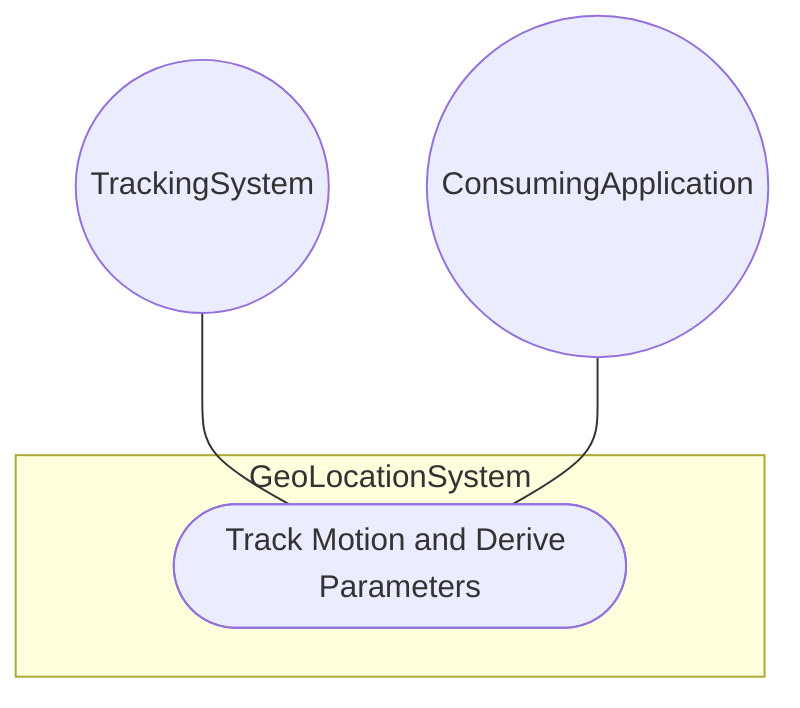
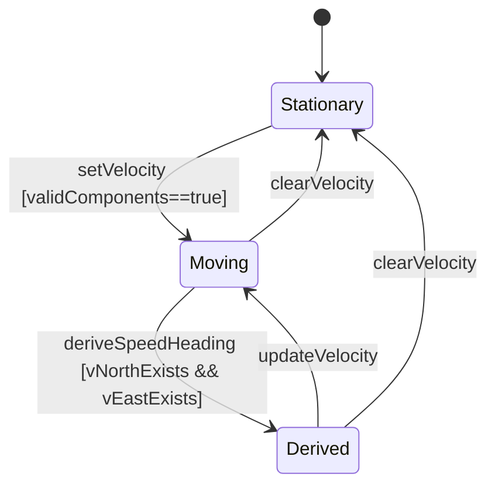

# Use Case: Track Motion and Derive Movement Parameters

## Parent Epic
- [ ] [#8](https://github.com/gintatkinson/3dgs-011/blob/main/docs/epics/epic-02-position-coordinates-motion-tracking.md) - Geographic Location: Position Coordinates and Motion Tracking (semantic linkage: this use case tracks motion and derives parameters within the position and motion epic)

## 1. Actors
- **Primary Actor:** TrackingSystem
- **Secondary Actors:** GeoLocationService, VelocityRepository, VelocityCalculationService

## 2. Preconditions
- A geo-location record exists with a known position.
- The velocity container is available for storing motion data.

## 3. Trigger
A TrackingSystem captures new velocity data for an object at a known location.

## 4. Main Success Scenario (Basic Flow)
1. TrackingSystem captures v-north, v-east, and v-up velocity components.
2. TrackingSystem submits the velocity vector to GeoLocationService.
3. GeoLocationService validates the velocity components.
4. GeoLocationService stores the velocity vector associated with the location.
5. TrackingSystem requests derived speed and heading.
6. VelocityCalculationService computes speed = sqrt(v_north^2 + v_east^2) and heading = arctan(v_east / v_north).
7. System returns the speed and heading values.

## 5. Alternate and Exception Flows
- **5a. Zero v-north component (Branches from Basic Flow step 6):**
  1. VelocityCalculationService detects v-north = 0.
  2. Heading is determined solely by the sign of v-east (90 or 270 degrees).
  3. System returns heading with an indicator of the edge case.
- **5b. Negative velocity detection (Branches from Basic Flow step 3):**
  1. GeoLocationService detects negative v-north or v-east values.
  2. System accepts negative values as valid (indicating southward/westward movement).
  3. VelocityCalculationService correctly handles signs in the derivation formulas.
- **5c. Missing horizontal velocity components (Branches from Basic Flow step 1):**
  1. TrackingSystem captures only v-up without v-north or v-east.
  2. GeoLocationService stores the available v-up component.
  3. VelocityCalculationService cannot derive speed or heading without horizontal components.
  4. System returns speed and heading as undefined.
- **5d. No location record exists for velocity association (Branches from Basic Flow step 2):**
  1. TrackingSystem attempts to set velocity without a prior location record.
  2. GeoLocationService rejects the velocity update.
  3. System returns a precondition error indicating location must be set first.
  4. TrackingSystem establishes the location first, then retries velocity submission.

## 6. Postconditions (Guarantees)
- **Success Guarantee:** The velocity vector is stored, and derived speed/heading values are computed and returned.
- **Failure Guarantee:** No velocity data is stored; an error is returned indicating the validation failure.

## UML Diagrams
### Use Case Diagram

### State Machine Diagram

## 7. Operational Context
The three-dimensional velocity vector represents motion at the time given by the timestamp. V-north and v-east are relative to true north as defined by the reference frame. The formulas for deriving speed and heading from the velocity components are defined in RFC 9179 Section 2.3.

## 8. Realization Matrix
### Required User Stories
- [ ] [#13](https://github.com/gintatkinson/3dgs-011/blob/main/docs/user-stories/us-04-track-velocity-vector.md) - Track Velocity Vector for Moving Object (semantic linkage: primary story for velocity tracking)
- [ ] [#12](https://github.com/gintatkinson/3dgs-011/blob/main/docs/user-stories/us-05-derive-speed-heading.md) - Derive Speed and Heading from Velocity Components (semantic linkage: algorithmic derivation)
### Required Features
- [ ] [#5](https://github.com/gintatkinson/3dgs-011/blob/main/docs/features/feat-05-velocity-vector-tracking.md) - Track Velocity Vector for Moving Objects (semantic linkage: velocity vector feature)

## Source References
Structural Schema: ietf-geo-location@2022-02-11.yang
Normative Specification: RFC 9179 Section 2.3
