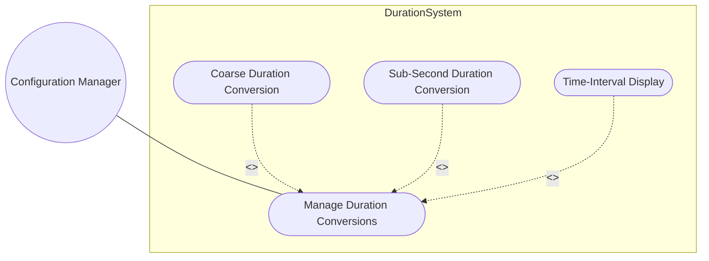
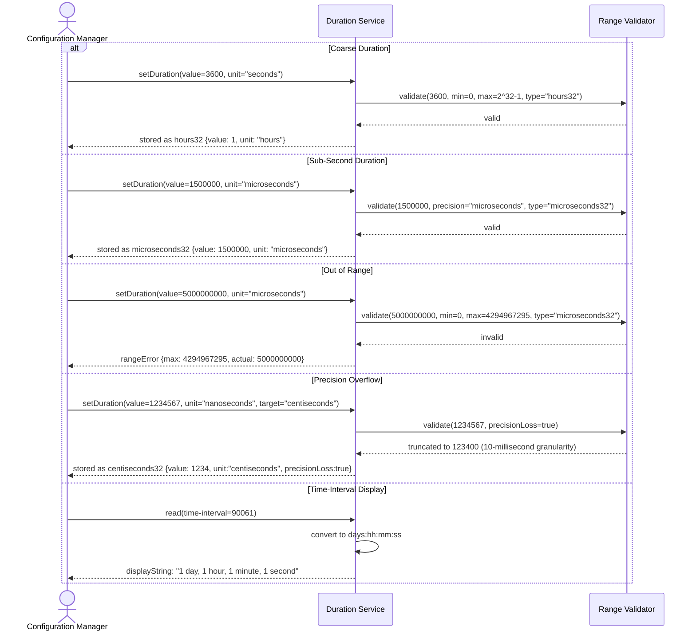

# Use Case: Manage Time Duration Conversion and Validation

## Parent Epic
- [#39](https://github.com/gintatkinson/3dgs-011/issues/39) - Common YANG Data Types: Duration Types

## 1. Actors
- **Primary Actor:** Configuration Manager
- **Secondary Actor:** Performance Analyzer

## 2. Preconditions
- time-interval or duration schema node is defined
- Duration value has been accepted from external source or user input

## 3. Trigger
Manager submits a duration value for validation or the system reads a stored duration for display.

## 4. Main Success Scenario (Basic Flow)
1. Configuration Manager submits a duration expressed in seconds to the system.
2. System maps the duration value to the appropriate duration type.
3. System validates the duration value against the type's range constraints.
4. If valid, system stores or returns the duration.

## 5. Alternate and Exception Flows
- **5a. Coarse duration conversion (Branches from step 2):**
  1. Value is large enough for coarse-grained representation.
  2. System selects appropriate coarse type: hours32, minutes32, seconds32.
  3. System verifies value fits within the type's range (e.g., hours32: 0..~2^32-1 hours).
  4. System converts and stores the duration in the selected unit.

- **5b. Sub-second duration conversion (Branches from step 2):**
  1. Value requires sub-second precision.
  2. System selects appropriate sub-second type: centiseconds32, milliseconds32, microseconds32, microseconds64, nanoseconds32.
  3. System verifies value fits the type's range and precision.
  4. System converts and stores the duration in the selected unit.

- **5c. Duration out of range (Branches from steps 3/4):**
  1. Submitted value exceeds the maximum representable value for the target type.
  2. System returns rangeError: value-out-of-bounds.
  3. Manager displays the valid range and requests corrected input.

- **5d. Precision overflow (Branches from step 5b step 3):**
  1. Submitted value has finer granularity than target type supports.
  2. System truncates lower-order digits and logs precisionLoss warning.
  3. System stores the truncated duration value.

- **5e. Time-interval alternate representation (Branches from step 2):**
  1. System reads a time-interval value.
  2. System converts to human-readable format: days:hh:mm:ss.
  3. Manager receives the formatted duration display.

## 6. Postconditions (Guarantees)
- **Success Guarantee:** Duration value is stored in the appropriate type with validated range constraints. Conversions between units preserve magnitude within representable precision.
- **Failure Guarantee:** Out-of-range durations are rejected with explicit range boundaries. Precision truncation is logged as a warning; no silent data loss occurs.

## UML Diagrams
### Use Case Diagram

### Sequence Diagram

## 7. Operational Context
From RFC 9911, Section 6: Coarse types (hours32, minutes32, seconds32) from RFC 6991 provide second-level granularity. Sub-second types (centiseconds32, milliseconds32, microseconds32, microseconds64, nanoseconds32) are new in RFC 9911. Each type has defined range based on its bit width (32 or 64 bits) and unit granularity.

## 8. Realization Matrix
### Required User Stories
- [#56](https://github.com/gintatkinson/3dgs-011/issues/56) - Convert and Validate Coarse Time Duration Units (semantic linkage: coarse duration conversion behavior)
- [#57](https://github.com/gintatkinson/3dgs-011/issues/57) - Convert and Validate Sub-Second Time Duration Units (semantic linkage: sub-second duration conversion behavior)

### Required Features
- [#29](https://github.com/gintatkinson/3dgs-011/issues/29) - Represent Hour-Granularity Time Duration (semantic linkage: hours32 structural type)
- [#30](https://github.com/gintatkinson/3dgs-011/issues/30) - Represent Minute-Granularity and Second-Granularity Duration (semantic linkage: minutes32, seconds32 structural types)
- [#31](https://github.com/gintatkinson/3dgs-011/issues/31) - Represent Sub-Second Granularity Duration Values (semantic linkage: centiseconds32, milliseconds32, microseconds32/64, nanoseconds32 structural types)

## Source References
Structural Schema: ietf-yang-types.yang
Normative Specification: RFC 9911, Section 6
