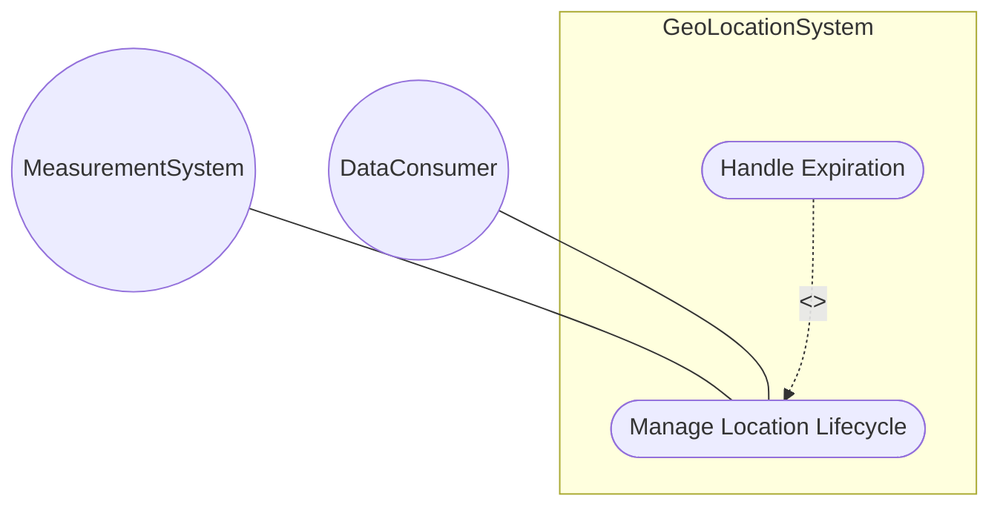
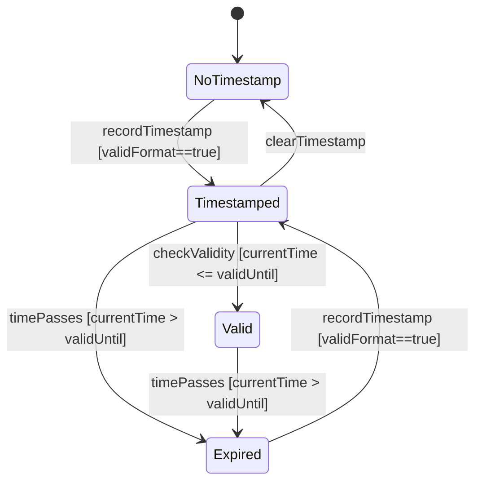

# Use Case: Manage Location Lifecycle and Temporal Validity

## Parent Epic
- [ ] [#8](https://github.com/gintatkinson/3dgs-011/blob/main/docs/epics/epic-02-position-coordinates-motion-tracking.md) - Geographic Location: Position Coordinates and Motion Tracking (semantic linkage: this use case manages the temporal lifecycle within the position and motion epic)

## 1. Actors
- **Primary Actor:** MeasurementSystem
- **Secondary Actors:** GeoLocationService, TemporalMetadataRepository, DataConsumer

## 2. Preconditions
- A geo-location record exists that can accept temporal metadata.
- The system clock is synchronized for accurate time comparisons.

## 3. Trigger
A MeasurementSystem records a new location measurement with a timestamp, or a DataConsumer queries for location data.

## 4. Main Success Scenario (Basic Flow)
1. MeasurementSystem captures location coordinates and a reference timestamp.
2. MeasurementSystem submits timestamp "2024-01-15T10:30:00Z" to GeoLocationService.
3. GeoLocationService validates the timestamp format per RFC 6991 date-and-time.
4. GeoLocationService stores the timestamp associated with the location.
5. DataConsumer requests the location at a later time.
6. System checks the current time against valid-until.
7. If current time <= valid-until, system returns valid location data.
8. System returns location data with temporal metadata.

## 5. Alternate and Exception Flows
- **5a. Expired location data (Branches from Basic Flow step 7):**
  1. System detects current time > valid-until.
  2. System marks the geo-location as expired.
  3. System returns the location data with an expiration indicator.
  4. DataConsumer triggers a refresh mechanism.
- **5b. Invalid timestamp format (Branches from Basic Flow step 3):**
  1. GeoLocationService validates the timestamp string.
  2. The timestamp does not conform to RFC 6991 date-and-time format.
  3. System rejects the timestamp with a format validation error.
  4. MeasurementSystem corrects and resubmits the timestamp.

## 6. Postconditions (Guarantees)
- **Success Guarantee:** The timestamp is stored, and expired locations are correctly identified and flagged.
- **Failure Guarantee:** No temporal data is stored; the system returns a validation error.

## UML Diagrams
### Use Case Diagram

### State Machine Diagram

## 7. Operational Context
The timestamp defines the reference time when the location was recorded using yang:date-and-time format. The valid-until leaf defines the expiration time for the geo-location. If unspecified, the geo-location has no expiration. The W3C Geolocation API timestamp comparison shows YANG date-and-time can represent all standard timestamp values.

## 8. Realization Matrix
### Required User Stories
- [ ] [#15](https://github.com/gintatkinson/3dgs-011/blob/main/docs/user-stories/us-07-record-timestamp.md) - Record Location Measurement Timestamp (semantic linkage: primary story for timestamp recording)
- [ ] [#14](https://github.com/gintatkinson/3dgs-011/blob/main/docs/user-stories/us-06-handle-expired-location.md) - Detect and Handle Expired Geo-Location Data (semantic linkage: handles expiration lifecycle)
### Required Features
- [ ] [#6](https://github.com/gintatkinson/3dgs-011/blob/main/docs/features/feat-06-temporal-location-lifecycle.md) - Manage Temporal Location Lifecycle and Expiration (semantic linkage: temporal metadata feature)

## Source References
Structural Schema: ietf-geo-location@2022-02-11.yang
Normative Specification: RFC 9179 Sections 2.5, 5.1.2
