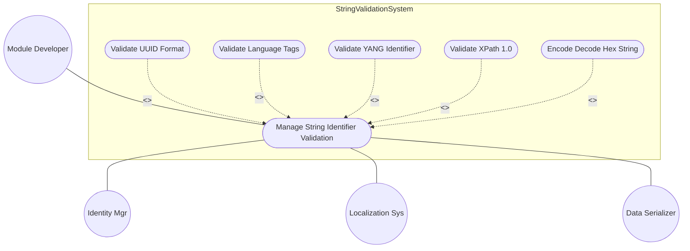

# Use Case: Manage String and Identifier Validation

## Parent Epic
- [#40](https://github.com/gintatkinson/3dgs-011/issues/40) - Common YANG Data Types: String and Identifier Types

## 1. Actors
- **Primary Actor:** Module Developer
- **Secondary Actors:** Identity Manager, Localization System, Data Serializer

## 2. Preconditions
- String/identifier schema nodes are defined
- External values (UUIDs, language tags, identifiers, XPath expressions, hex strings) are available for validation

## 3. Trigger
Developer submits a string value for validation against a YANG string type.

## 4. Main Success Scenario (Basic Flow)
1. Developer submits a string value for type validation.
2. System identifies the target YANG type from the schema node.
3. System applies the type's pattern constraint and length restriction.
4. If value matches the pattern and length constraint, system accepts value.

## 5. Alternate and Exception Flows
- **5a. UUID validation (Branches from step 2):**
  1. Target type is yang:uuid.
  2. System verifies format: 8-4-4-4-12 hex digits with hyphens (hex816hex12).
  3. System verifies version 4 variant bits are set correctly.
  4. If valid, system returns validation pass with UUID components.

- **5b. Language tag validation (Branches from step 2):**
  1. Target type is yang:language-tag (BCP 47).
  2. System parses primary language, extended language, script, region, variant subtags.
  3. System validates each subtag against IANA registry patterns.
  4. If valid, system returns structured language tag representation.

- **5c. YANG identifier validation (Branches from step 2):**
  1. Target type is yang:yang-identifier.
  2. System verifies starts with [a-zA-Z_] and contains [a-zA-Z0-9_.-]*.
  3. System verifies length is within max 64 characters.
  4. If valid, system returns parsed identifier components.

- **5d. XPath 1.0 expression validation (Branches from step 2):**
  1. Target type is yang:xpath1.0.
  2. System tokenizes the expression into path components.
  3. System applies XPath 1.0 grammar validation.
  4. If syntactically valid, system returns parsed expression tree.

- **5e. Hex string encoding/decoding (Branches from step 2):**
  1. Target type is yang:hex-string.
  2. For encoding: System accepts binary data and produces colon-separated hex pairs.
  3. For validation: System accepts hex string and verifies each pair is valid hex.
  4. For decoding: System produces binary from hex pairs.

- **5f. UUID format mismatch (Branches from step 5a step 2):**
  1. Submitted string does not match 8-4-4-4-12 hex pattern.
  2. System returns validationError: uuid-format-mismatch.
  3. Developer displays format violation with expected pattern.

- **5g. Language tag unknown subtag (Branches from step 5b step 3):**
  1. System cannot recognize a language subtag.
  2. System returns validationWarning: unknown-subtag with subtag value.
  3. Developer reviews subtag for correctness.

- **5h. XPath syntax error (Branches from step 5d step 3):**
  1. XPath expression contains syntax violation.
  2. System returns parseError with position and expected token.
  3. Developer corrects the expression.

- **5i. Hex string odd nibbles (Branches from step 5e step 3):**
  1. Hex string has odd number of hex characters.
  2. System returns validationError: odd-nibble-count.
  3. Developer pads with leading zero or corrects input.

## 6. Postconditions (Guarantees)
- **Success Guarantee:** String value is validated against the type's pattern and length constraints. UUID, language tag, identifier, and XPath values are structurally validated with component extraction.
- **Failure Guarantee:** Invalid values are rejected with specific error types indicating the exact violation. Hex string encoding/decoding preserves binary fidelity. No SQL injection or XPath injection vectors are introduced.

## UML Diagrams
### Use Case Diagram


### Activity Diagram
```mermaid
flowchart TD
    Start([Developer submits string value]) --> Identify{Identify YANG type}

    Identify --> |uuid| UUID[Parse UUID format]
    UUID --> UUID_Check{Matches 8-4-4-4-12?}
    UUID_Check --> |Yes| UUID_Version{Version 4 variant?}
    UUID_Version --> |Yes| Accept[Accept UUID]
    UUID_Version --> |No| Reject[Reject: not RFC 9562]
    UUID_Check --> |No| Reject

    Identify --> |language-tag| Lang[Parse BCP 47 subtags]
    Lang --> Lang_Check{All subtags valid?}
    Lang_Check --> |Yes| Accept_L[Accept language tag]
    Lang_Check --> |No| Warn_L[Warn: unknown subtag]

    Identify --> |yang-identifier| YID[Parse identifier]
    YID --> YID_Check{Starts with [a-zA-Z_]? Contains [a-zA-Z0-9_.-]?}
    YID_Check --> |Yes| YID_Len{Length <= 64?}
    YID_Len --> |Yes| Accept_YID[Accept identifier]
    YID_Len --> |No| Reject
    YID_Check --> |No| Reject

    Identify --> |xpath1.0| XP[Tokenize expression]
    XP --> XP_Check{XPath 1.0 grammar valid?}
    XP_Check --> |Yes| Accept_XP[Accept expression]
    XP_Check --> |No| Reject_XP[Reject: syntax error at position N]

    Identify --> |hex-string| Hex{Operation?}
    Hex --> |encode| Enc[Binary to hex pairs]
    Enc --> Accept_H[Accept hex string]
    Hex --> |decode| Dec[Hex pairs to binary]
    Dec --> Dec_Check{Even nibbles?}
    Dec_Check --> |Yes| Accept_HX[Accept binary]
    Dec_Check --> |No| Reject
    Hex --> |validate| Val[Check hex pattern]
    Val --> Val_Check{Each pair valid?}
    Val_Check --> |Yes| Accept_H
    Val_Check --> |No| Reject

    Accept --> Done([Done])
    Accept_L --> Done
    Accept_YID --> Done
    Accept_XP --> Done
    Accept_H --> Done
    Accept_HX --> Done
    Warn_L --> Done
    Reject --> Done
    Reject_XP --> Done
```

## 7. Operational Context
From RFC 9911, Section 7: New types in RFC 9911 include uuid (RFC 9562) and language-tag (BCP 47). Existing types include yang-identifier, xpath1.0, and hex-string. Each string type has a specific pattern constraint defined in the YANG module. UUID validation includes version/variant bit checking per RFC 9562 Section 5.2.

## 8. Realization Matrix
### Required User Stories
- [#59](https://github.com/gintatkinson/3dgs-011/issues/59) - Validate Language Tag Compliance with BCP 47 (semantic linkage: language-tag validation behavior)
- [#60](https://github.com/gintatkinson/3dgs-011/issues/60) - Validate UUID Format Compliance with RFC 9562 (semantic linkage: UUID validation behavior)
- [#61](https://github.com/gintatkinson/3dgs-011/issues/61) - Validate YANG Identifier and XPath Expression Format (semantic linkage: yang-identifier and xpath1.0 validation)
- [#62](https://github.com/gintatkinson/3dgs-011/issues/62) - Encode and Decode Hexadecimal String Octet Sequences (semantic linkage: hex-string encode/decode behavior)

### Required Features
- [#32](https://github.com/gintatkinson/3dgs-011/issues/32) - Represent UUID Values Conforming to RFC 9562 (semantic linkage: uuid structural type)
- [#33](https://github.com/gintatkinson/3dgs-011/issues/33) - Represent Language Tag Values Conforming to BCP 47 (semantic linkage: language-tag structural type)
- [#34](https://github.com/gintatkinson/3dgs-011/issues/34) - Represent YANG Identifier and XPath Expression Values (semantic linkage: yang-identifier, xpath1.0 structural types)
- [#35](https://github.com/gintatkinson/3dgs-011/issues/35) - Represent Hexadecimal String Octet Sequence Values (semantic linkage: hex-string structural type)

## Source References
Structural Schema: ietf-yang-types.yang
Normative Specification: RFC 9911, Section 7
