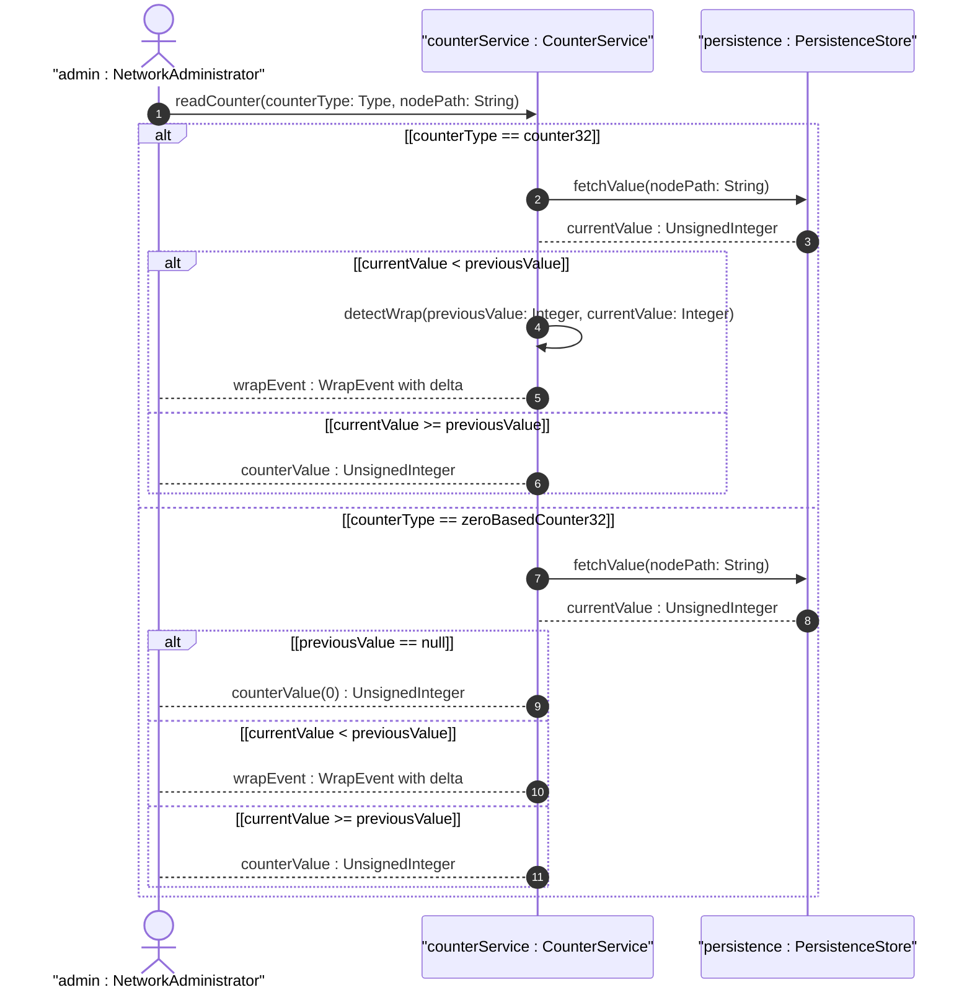

# User Story: Read and Monitor Counter Values with Wrap Detection

## Parent Epic
- [ ] #36 - Common YANG Data Types: Counter and Gauge Measurement Types (semantic linkage: parent epic for counter features)

## Domain Object Mapping
- **Primary Domain Objects:** counter32, counter64, zero-based-counter32, zero-based-counter64
- **Actor/Role:** Management Station / Network Administrator

## BDD Scenario (OOA/OOD Realization)
**As a** Network Administrator
**I want to** read counter values and detect wrap-around events
**So that** I can accurately compute traffic deltas and detect counter discontinuities

## UML Sequence Diagram

## Operational Context
From RFC 9911, Section 3: Counters monotonically increase to maximum then wrap to zero. Zero-based counters have initial value 0 on creation. Discontinuities must be recorded for accurate delta computation.

## Required Features Matrix
- [ ] #21 - Represent Monotonic Counter Values with Wrap-Around (semantic linkage: this story exercises counter wrap behavior)
- [ ] #22 - Represent Bounded Gauge Values with Rising and Falling Range (semantic linkage: companion type for measurement monitoring)

## Source References
Structural Schema: ietf-yang-types.yang
Normative Specification: RFC 9911, Section 3
