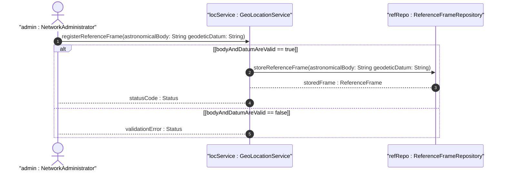

# User Story: Register Geographic Location Reference Frame

## Parent Epic
- [ ] [#7](https://github.com/gintatkinson/3dgs-011/blob/main/docs/epics/epic-01-reference-frame-geodetic-system.md) - Geographic Location: Reference Frame and Geodetic System Definition (semantic linkage: this user story exercises the reference frame configuration workflow within the reference frame epic)

## Domain Object Mapping
- **Primary Domain Objects:** ReferenceFrame, AstronomicalBody, GeodeticSystem
- **Actor/Role:** NetworkAdministrator

## BDD Scenario (OOA/OOD Realization)
**As a** NetworkAdministrator
**I want to** register a geo-location reference frame specifying the astronomical body and optional geodetic system
**So that** subsequent location coordinates are properly interpreted within the correct spatial context

**Given** a new geo-location with no reference frame configured
**When** the NetworkAdministrator sets the astronomical-body to "mars" and geodetic-datum to "me"
**Then** the system stores the reference frame with astronomical-body "mars" and geodetic-datum "me", applying the mean earth/polar axis lunar datum

## UML Sequence Diagram

## Operational Context
The reference-frame defines what the location values refer to and their meaning. The referred-to object can be any astronomical body. The default astronomical-body value is 'earth'. The default geodetic-datum for Earth is 'wgs-84'.

## Required Features Matrix
- [ ] [#1](https://github.com/gintatkinson/3dgs-011/blob/main/docs/features/feat-01-celestial-body-alternate-system.md) - Define Celestial Body and Alternate System Reference (semantic linkage: the reference frame requires astronomical body identification)
- [ ] [#2](https://github.com/gintatkinson/3dgs-011/blob/main/docs/features/feat-02-geodetic-datum-accuracy.md) - Configure Geodetic Datum and Coordinate Accuracy (semantic linkage: the reference frame includes geodetic system configuration)

## Source References
Structural Schema: ietf-geo-location@2022-02-11.yang
Normative Specification: RFC 9179 Section 2.1
