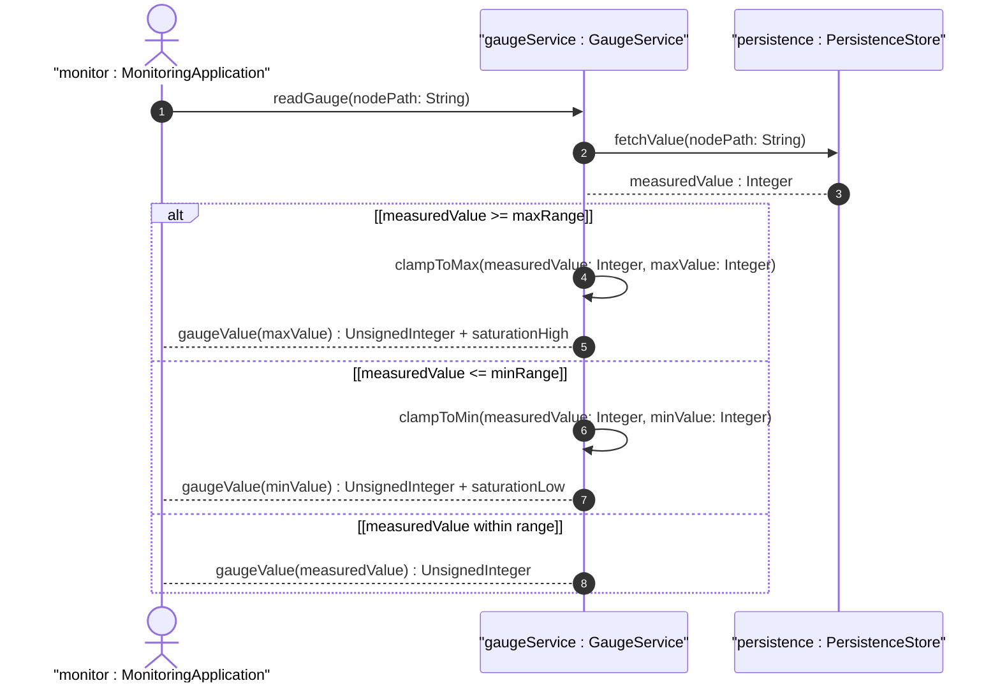

# User Story: Read Gauge Values with Saturation State Awareness

## Parent Epic
- [ ] #36 - Common YANG Data Types: Counter and Gauge Measurement Types

## Domain Object Mapping
- **Primary Domain Objects:** gauge32, gauge64
- **Actor/Role:** Management Station / Monitoring Application

## BDD Scenario
**As a** Monitoring Application
**I want to** read gauge values and detect saturation states
**So that** I can determine when the measured quantity exceeds representable range

## UML Sequence Diagram

## Required Features Matrix
- [ ] #22 - Represent Bounded Gauge Values with Rising and Falling Range (semantic linkage: this story exercises gauge saturation behavior)

## Source References
Structural Schema: ietf-yang-types.yang
Normative Specification: RFC 9911, Section 3
