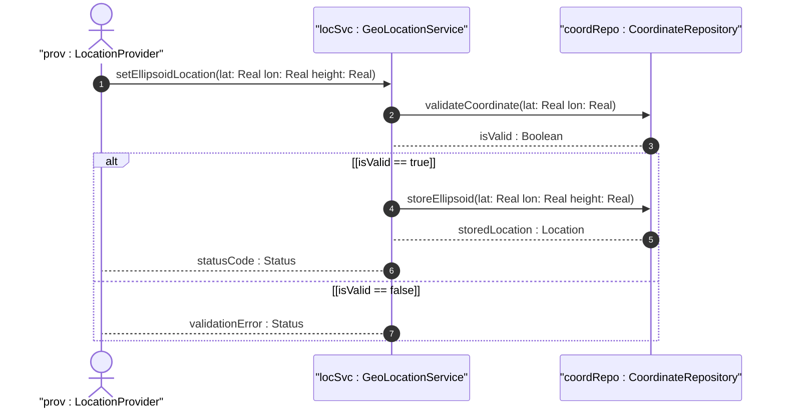

# User Story: Record Ellipsoidal Location Coordinates

## Parent Epic
- [ ] [#8](https://github.com/gintatkinson/3dgs-011/blob/main/docs/epics/epic-02-position-coordinates-motion-tracking.md) - Geographic Location: Position Coordinates and Motion Tracking (semantic linkage: this user story exercises ellipsoidal coordinate recording within the position and motion epic)

## Domain Object Mapping
- **Primary Domain Objects:** Location, EllipsoidLocation, Latitude, Longitude, Height
- **Actor/Role:** LocationProvider

## BDD Scenario (OOA/OOD Realization)
**As a** LocationProvider
**I want to** record the geographic position of an asset using latitude, longitude, and optional height
**So that** the asset location is precisely known within the defined reference frame

**Given** a geo-location instance with a configured reference frame
**When** the LocationProvider sets latitude to 48.8566, longitude to 2.3522, and height to 35.0
**Then** the system stores the ellipsoidal location coordinates with the specified precision

## UML Sequence Diagram

## Operational Context
Location is specified using two or three coordinate values. For the standard location choice, latitude and longitude are specified as decimal degrees, and the height value is in fractions of meters. The exact meanings of all values are defined by the geodetic-datum.

## Required Features Matrix
- [ ] [#3](https://github.com/gintatkinson/3dgs-011/blob/main/docs/features/feat-03-ellipsoid-coordinate-positioning.md) - Specify Ellipsoid Geodetic Coordinates (semantic linkage: this user story directly exercises the ellipsoidal coordinate feature)

## Source References
Structural Schema: ietf-geo-location@2022-02-11.yang
Normative Specification: RFC 9179 Section 2.2
