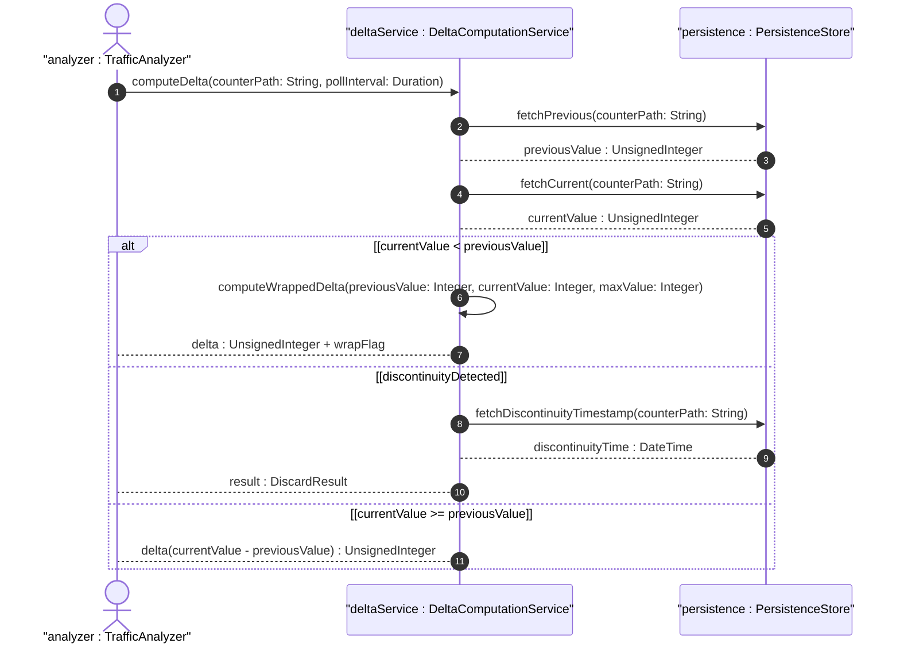

# User Story: Compute Counter Delta Across Discontinuity Events

## Parent Epic
- [ ] #36 - Common YANG Data Types: Counter and Gauge Measurement Types

## Domain Object Mapping
- **Primary Domain Objects:** counter32, counter64, zero-based-counter32, zero-based-counter64
- **Actor/Role:** Traffic Analyzer / Billing System

## BDD Scenario
**As a** Traffic Analyzer
**I want to** compute accurate counter deltas even when wrap-around or discontinuities occur
**So that** I can calculate correct traffic volumes and rates

## UML Sequence Diagram

## Required Features Matrix
- [ ] #21 - Represent Monotonic Counter Values with Wrap-Around (semantic linkage: algorithmic story for wrap delta computation)

## Source References
Structural Schema: ietf-yang-types.yang
Normative Specification: RFC 9911, Section 3
