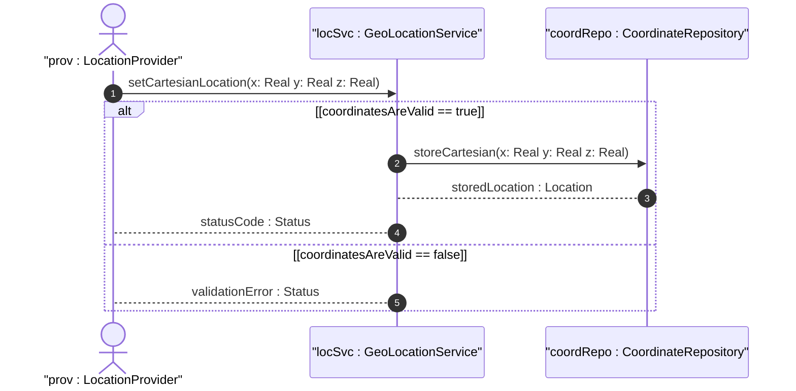

# User Story: Record Cartesian Location Coordinates

## Parent Epic
- [ ] [#8](https://github.com/gintatkinson/3dgs-011/blob/main/docs/epics/epic-02-position-coordinates-motion-tracking.md) - Geographic Location: Position Coordinates and Motion Tracking (semantic linkage: this user story exercises cartesian coordinate recording within the position and motion epic)

## Domain Object Mapping
- **Primary Domain Objects:** Location, CartesianLocation, X, Y, Z
- **Actor/Role:** LocationProvider

## BDD Scenario (OOA/OOD Realization)
**As a** LocationProvider
**I want to** record the spatial position using Cartesian X, Y, Z coordinates
**So that** three-dimensional positions are expressed independent of geodetic latitude/longitude models

**Given** a geo-location instance with a configured reference frame
**When** the LocationProvider sets X to 123456.789, Y to 987654.321, and Z to 5000.0
**Then** the system stores the Cartesian location coordinates with the specified precision

## UML Sequence Diagram

## Operational Context
For the Cartesian choice, X, Y, and Z are in fractions of meters. In both coordinate choices, the exact meanings of all the values are defined by the geodetic-datum. Only one location case may be active at a time.

## Required Features Matrix
- [ ] [#4](https://github.com/gintatkinson/3dgs-011/blob/main/docs/features/feat-04-cartesian-coordinate-positioning.md) - Specify Cartesian Spatial Coordinates (semantic linkage: this user story directly exercises the cartesian coordinate feature)

## Source References
Structural Schema: ietf-geo-location@2022-02-11.yang
Normative Specification: RFC 9179 Section 2.2
