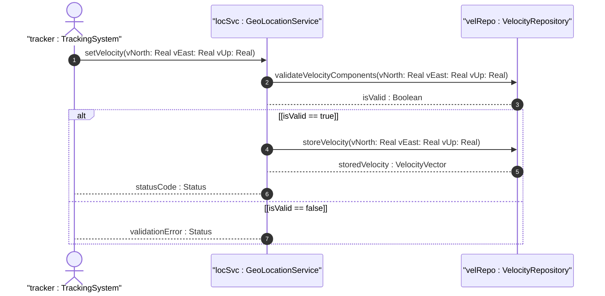

# User Story: Track Velocity Vector for Moving Object

## Parent Epic
- [ ] [#8](https://github.com/gintatkinson/3dgs-011/blob/main/docs/epics/epic-02-position-coordinates-motion-tracking.md) - Geographic Location: Position Coordinates and Motion Tracking (semantic linkage: this user story exercises velocity tracking within the position and motion epic)

## Domain Object Mapping
- **Primary Domain Objects:** VelocityVector, V-North, V-East, V-Up
- **Actor/Role:** TrackingSystem

## BDD Scenario (OOA/OOD Realization)
**As a** TrackingSystem
**I want to** record the three-dimensional velocity vector of a moving object
**So that** the object's speed and direction of travel are captured at the measurement time

**Given** an object at a known geo-location
**When** the TrackingSystem sets v-north to 10.5, v-east to -3.2, and v-up to 0.1 meters per second
**Then** the system stores the velocity vector components with 12-digit fractional precision

## UML Sequence Diagram

## Operational Context
The three-dimensional velocity vector represents motion at the time given by the timestamp. Values are given in fractional meters per second. V-north and v-east are relative to true north; v-up is perpendicular and pointed away from the center of mass.

## Required Features Matrix
- [ ] [#5](https://github.com/gintatkinson/3dgs-011/blob/main/docs/features/feat-05-velocity-vector-tracking.md) - Track Velocity Vector for Moving Objects (semantic linkage: this user story directly exercises the velocity tracking feature)

## Source References
Structural Schema: ietf-geo-location@2022-02-11.yang
Normative Specification: RFC 9179 Section 2.3
