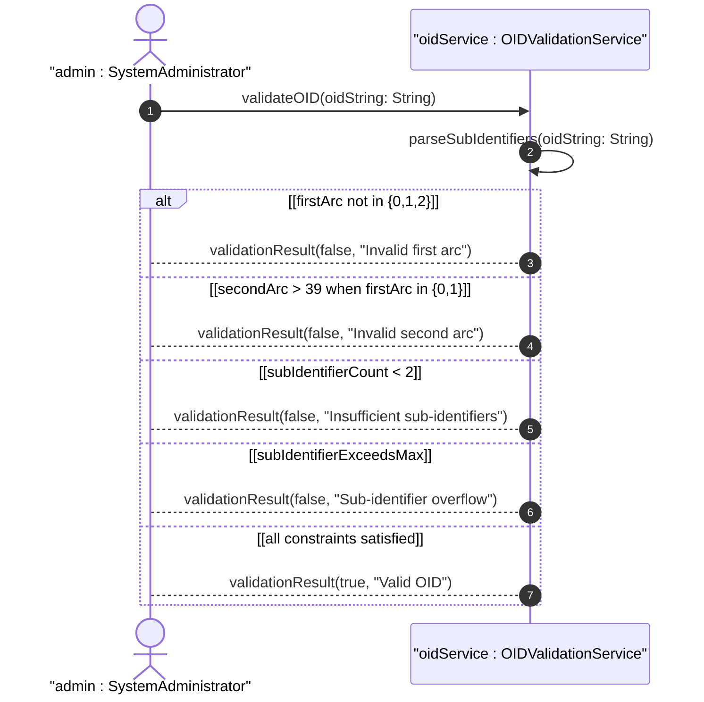

# User Story: Validate Object Identifier Hierarchical Format

## Parent Epic
- [ ] #37 - Common YANG Data Types: Object Identifier and Network Address Types

## Domain Object Mapping
- **Primary Domain Objects:** object-identifier, object-identifier-128
- **Actor/Role:** System Administrator / YANG Schema Validator

## BDD Scenario
**As a** System Administrator
**I want to** validate object identifier values against ASN.1 hierarchical constraints
**So that** I ensure OID values conform to the registration tree rules

## UML Sequence Diagram

## Required Features Matrix
- [ ] #23 - Represent Object Identifier Registration Hierarchy (semantic linkage: behavioral validation of OID format)

## Source References
Structural Schema: ietf-yang-types.yang
Normative Specification: RFC 9911, Section 3
