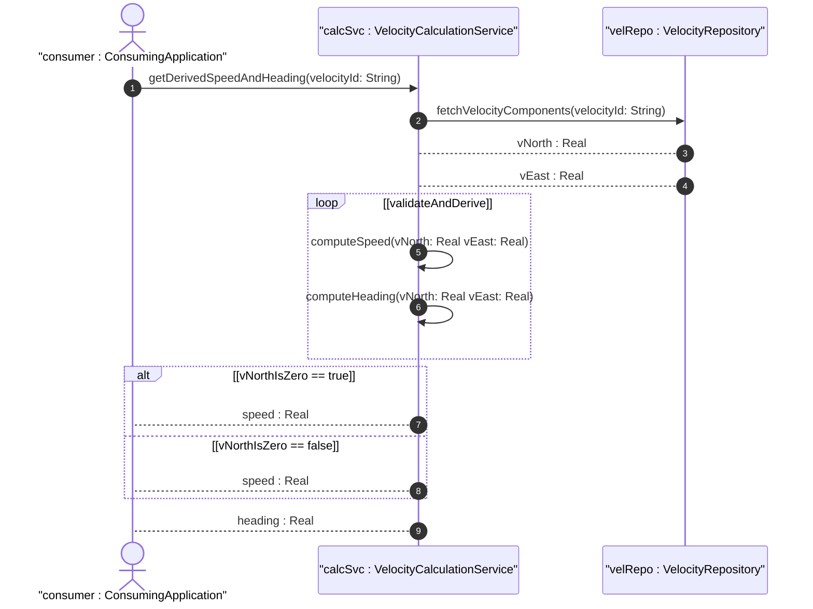
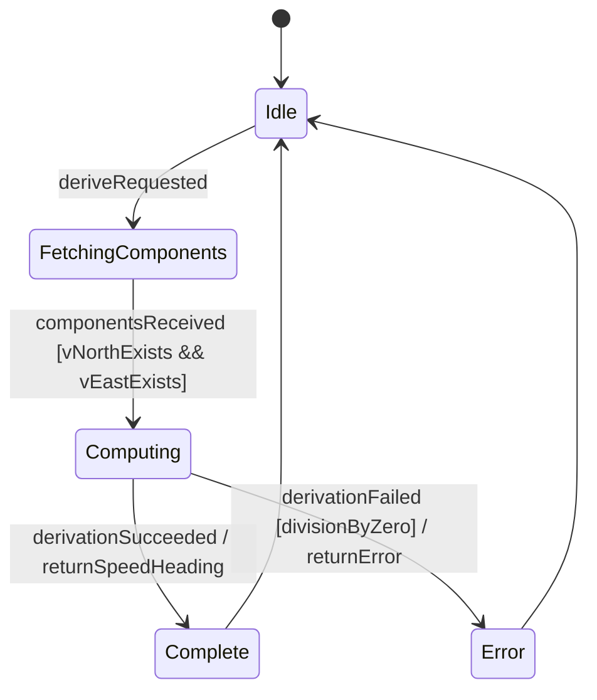

# User Story: Derive Speed and Heading from Velocity Components

## Parent Epic
- [ ] [#8](https://github.com/gintatkinson/3dgs-011/blob/main/docs/epics/epic-02-position-coordinates-motion-tracking.md) - Geographic Location: Position Coordinates and Motion Tracking (semantic linkage: this algorithmic story derives speed/heading from velocity components within the position and motion epic)

## Domain Object Mapping
- **Primary Domain Objects:** VelocityVector
- **Actor/Role:** ConsumingApplication
- **Algorithmic Formula:** speed = sqrt(v_north^2 + v_east^2); heading = arctan(v_east / v_north)

## BDD Scenario (OOA/OOD Realization)
**As a** ConsumingApplication
**I want to** derive the two-dimensional speed and heading from stored velocity components
**So that** I can determine the object's ground speed and direction of travel without manual calculation

**Given** a velocity vector with v-north = 10.0 and v-east = 10.0
**When** the system derives speed and heading
**Then** the computed speed is sqrt(100 + 100) = 14.142 meters per second and the heading is arctan(10.0 / 10.0) = 45 degrees from true north

## UML Sequence Diagram

## UML State Machine Diagram

## Operational Context
To derive the two-dimensional heading and speed, one would use the following formulas:
speed = sqrt(v_north^2 + v_east^2)
heading = arctan(v_east / v_north)

These formulas define the algorithmic derivation from the velocity vector. For v_north = 0, heading is +/-90 degrees depending on the sign of v_east.

## Required Features Matrix
- [ ] [#5](https://github.com/gintatkinson/3dgs-011/blob/main/docs/features/feat-05-velocity-vector-tracking.md) - Track Velocity Vector for Moving Objects (semantic linkage: derives speed and heading from the velocity vector components)

## Source References
Structural Schema: ietf-geo-location@2022-02-11.yang — `velocity` container
Normative Specification: RFC 9179 Section 2.3
