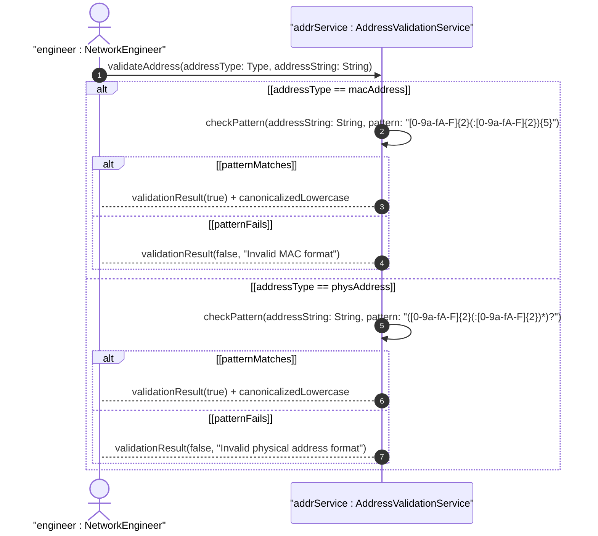

# User Story: Validate MAC and Physical Address Format

## Parent Epic
- [ ] #37 - Common YANG Data Types: Object Identifier and Network Address Types

## Domain Object Mapping
- **Primary Domain Objects:** mac-address, phys-address
- **Actor/Role:** Network Engineer / Device Configuration Tool

## BDD Scenario
**As a** Network Engineer
**I want to** validate MAC and physical address format
**So that** I ensure address values conform to IEEE 802 and hex-string specifications

## UML Sequence Diagram

## Required Features Matrix
- [ ] #24 - Represent Physical and MAC Address Values (semantic linkage: behavioral validation of address formats)

## Source References
Structural Schema: ietf-yang-types.yang
Normative Specification: RFC 9911, Section 3
