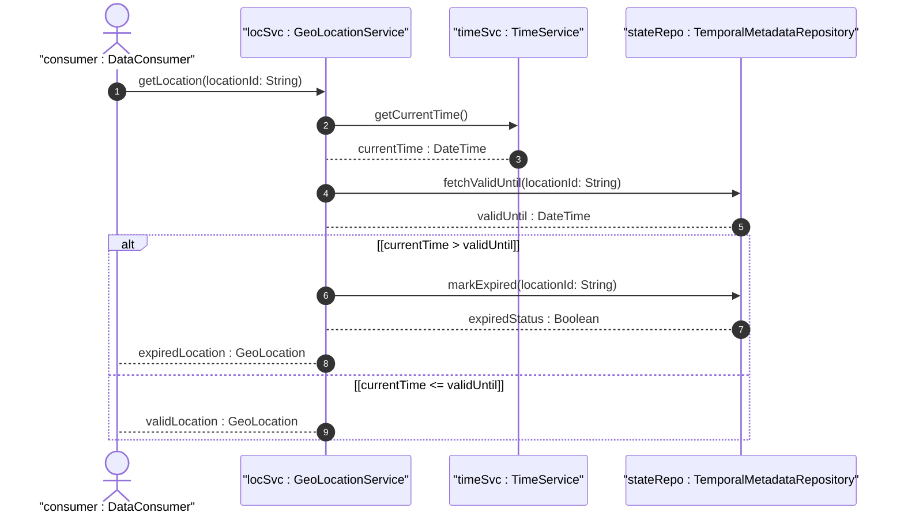
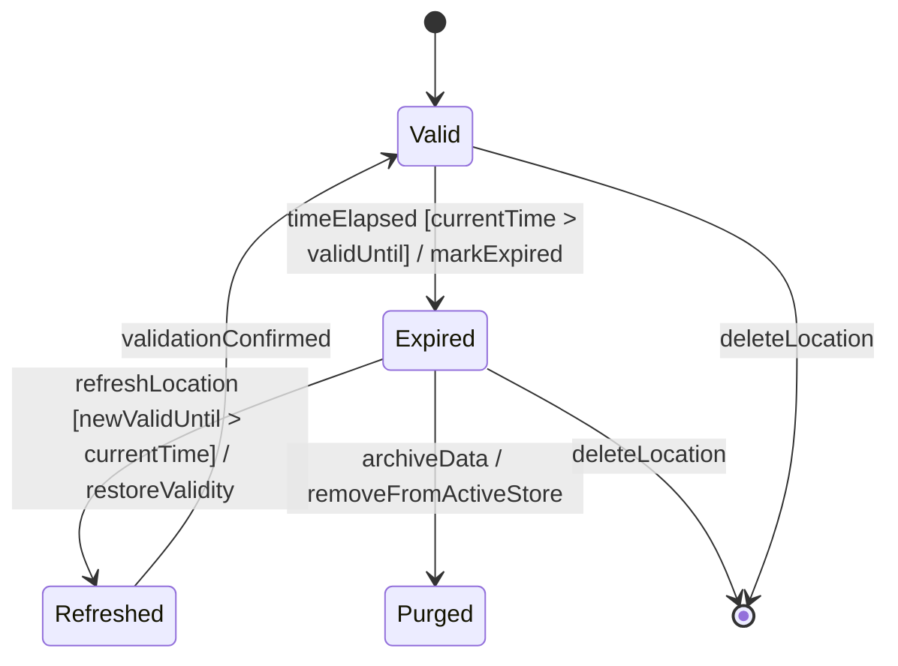

# User Story: Detect and Handle Expired Geo-Location Data

## Parent Epic
- [ ] [#8](https://github.com/gintatkinson/3dgs-011/blob/main/docs/epics/epic-02-position-coordinates-motion-tracking.md) - Geographic Location: Position Coordinates and Motion Tracking (semantic linkage: this temporal lifecycle story handles geo-location expiration within the position and motion epic)

## Domain Object Mapping
- **Primary Domain Objects:** TemporalMetadata, ValidUntil, Timestamp
- **Actor/Role:** DataConsumer
- **Lifecycle:** valid-until expiration triggers stale state

## BDD Scenario (OOA/OOD Realization)
**As a** DataConsumer
**I want to** detect when geo-location data has expired based on the valid-until timestamp
**So that** I can avoid using stale location data and trigger a refresh or alert

**Given** a geo-location record with valid-until set to "2024-01-15T11:00:00Z"
**When** the current time exceeds the valid-until value
**Then** the system SHOULD mark the geo-location as expired and indicate it is no longer current

## UML Sequence Diagram

## UML State Machine Diagram

## Operational Context
The valid-until leaf defines "The timestamp for which this geo-location is valid until. If unspecified, the geo-location has no specific expiration time." When valid-until is set and the current time exceeds it, consuming applications should treat the data as stale and consider refreshing the location data.

## Required Features Matrix
- [ ] [#6](https://github.com/gintatkinson/3dgs-011/blob/main/docs/features/feat-06-temporal-location-lifecycle.md) - Manage Temporal Location Lifecycle and Expiration (semantic linkage: the valid-until attribute directly enables expiration detection)
- [ ] [#3](https://github.com/gintatkinson/3dgs-011/blob/main/docs/features/feat-03-ellipsoid-coordinate-positioning.md) - Specify Ellipsoid Geodetic Coordinates (semantic linkage: expired location data may require re-acquisition of ellipsoidal coordinates)

## Source References
Structural Schema: ietf-geo-location@2022-02-11.yang — `valid-until` leaf, `timestamp` leaf
Normative Specification: RFC 9179 Section 2.5
