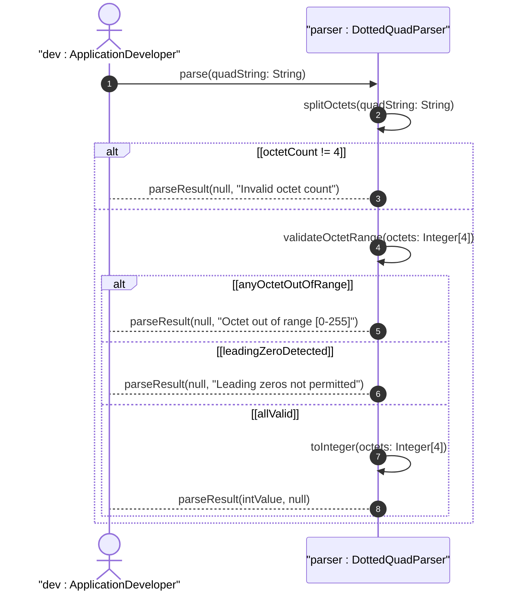

# User Story: Parse and Validate Dotted-Quad Notation

## Parent Epic
- [ ] #37 - Common YANG Data Types: Object Identifier and Network Address Types

## Domain Object Mapping
- **Primary Domain Objects:** dotted-quad
- **Actor/Role:** Application Developer / Network Tool

## BDD Scenario
**As a** Application Developer
**I want to** parse and validate dotted-quad notation values
**So that** I can convert between string notation and 32-bit integer representations

## UML Sequence Diagram

## Required Features Matrix
- [ ] #25 - Represent Dotted-Quad Network Notation Values (semantic linkage: behavioral validation of dotted-quad format)

## Source References
Structural Schema: ietf-yang-types.yang
Normative Specification: RFC 9911, Section 3
