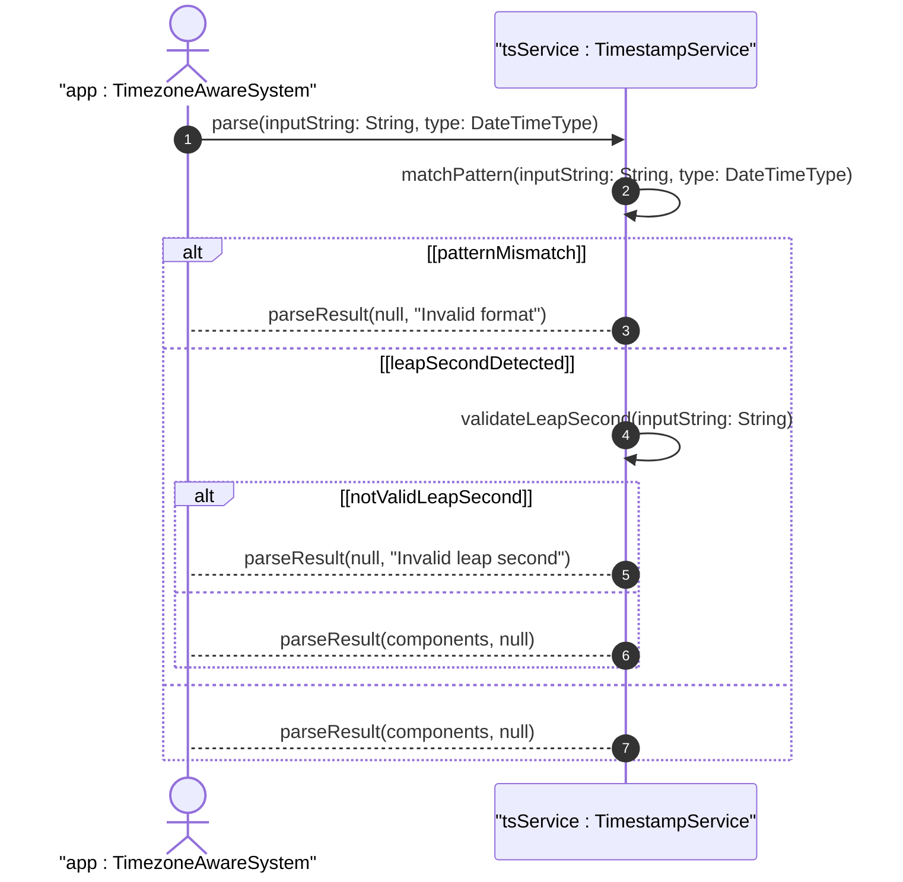

# User Story: Parse and Format DateTime Values with Timezone Offset

## Parent Epic
- [ ] #38 - Common YANG Data Types: Date-Time and Timestamp Types

## Domain Object Mapping
- **Primary Domain Objects:** date-and-time, date, time
- **Actor/Role:** Application / Timezone-Aware System

## BDD Scenario
**As a** Timezone-Aware System
**I want to** parse and format date-time values with timezone offsets per RFC 3339 and RFC 9557
**So that** I can represent timestamps correctly across different timezone contexts

## UML Sequence Diagram

## Required Features Matrix
- [ ] #26 - Represent Date and Time Values with Time Zone Offset (semantic linkage: behavioral parsing of datetime with timezone)

## Source References
Structural Schema: ietf-yang-types.yang
Normative Specification: RFC 9911, Section 3
